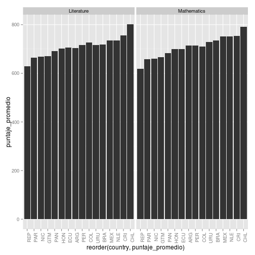

# Comparación de resultados generales: Panamá vs. Otros
## Loading y subsetting de datos

```r
library(foreign)
library(ggplot2)
```

```
## Loading required package: methods
```

```r
library(plyr)
library(reshape2)
pm6 <- read.spss('./data/Puntajes_Alumnos/PM6_all_TERCE.sav', to.data.frame=T)
pm3 <- read.spss('./data/Puntajes_Alumnos/PM3_all_TERCE.sav', to.data.frame=T)
pc6 <- read.spss('./data/Puntajes_Alumnos/PC6_all_TERCE.sav', to.data.frame=T)
pl6 <- read.spss('./data/Puntajes_Alumnos/PL6_all_TERCE.sav', to.data.frame=T)
pl3 <- read.spss('./data/Puntajes_Alumnos/PL3_all_TERCE.sav', to.data.frame=T)
```
## 3er Grado:


```r
# seleccionar la variable de pais y el puntaje del examen de matemáticas de 3er grado
dat_math <- cbind(pm3['country'],pm3['puntaje_estandar'])
# seleccionar la variable de pais y el puntaje del examen de literatura de 3er grado
dat_lit <- cbind(pl3['country'],pl3['puntaje_estandar'])
# Omit N/As
newdat_math <- na.omit(dat_math)
newdat_lit <- na.omit(dat_lit)
# Puntaje promedio por país
avg_per_country_math <- ddply(newdat_math,~country,summarise,puntaje_promedio=mean(puntaje_estandar))
avg_per_country_lit <- ddply(newdat_lit,~country,summarise,puntaje_promedio=mean(puntaje_estandar))
avg_per_country_math[3] <- "Mathematics"
avg_per_country_lit[3] <- "Literature"
# Sumar ambos resultados
data <- rbind(avg_per_country_lit,avg_per_country_math)
data.m <- ddply(data,~country,puntaje_promedio=mean(puntaje_promedio))
```
### Gráfica - Resultados promedio totales de 3er grado por país.

```r
# Crear bar chart
ggplot(data.m, aes(reorder(country,puntaje_promedio),puntaje_promedio))+geom_bar(stat = "identity")
```

 

### Gráfica - Resultados promedio de 3er grado por país por asignatura.

```r
# Crear bar chart
ggplot(data.m, aes(reorder(country,puntaje_promedio),puntaje_promedio)) + geom_bar(stat = "identity") + facet_grid(. ~ V3)+theme(axis.text.x = element_text(angle = 90, hjust = 1))
```

 
