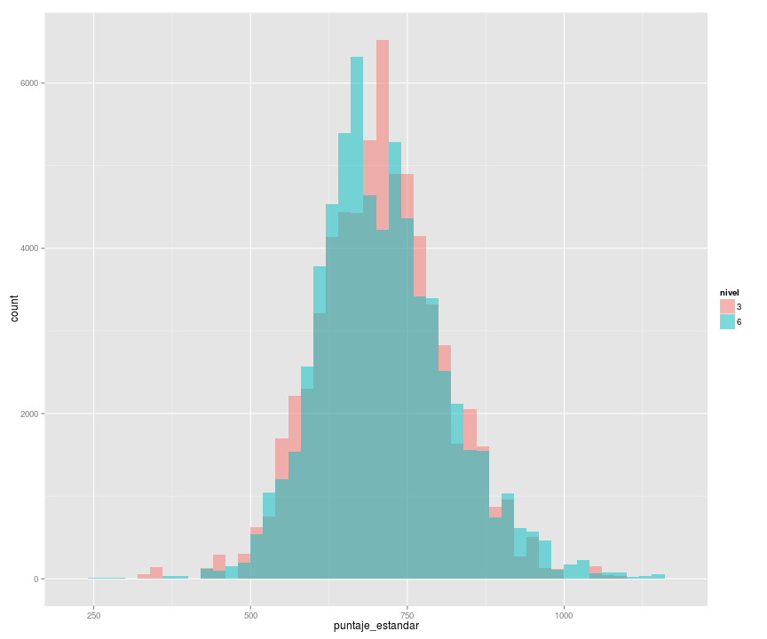
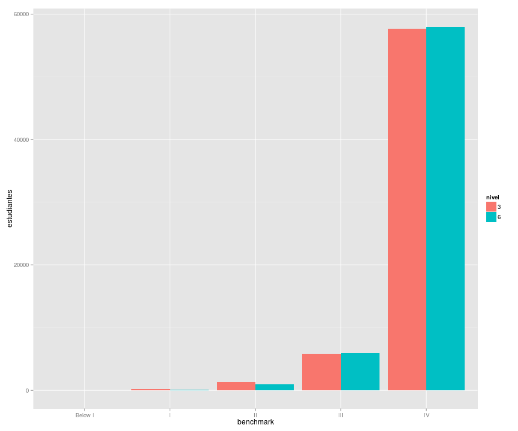
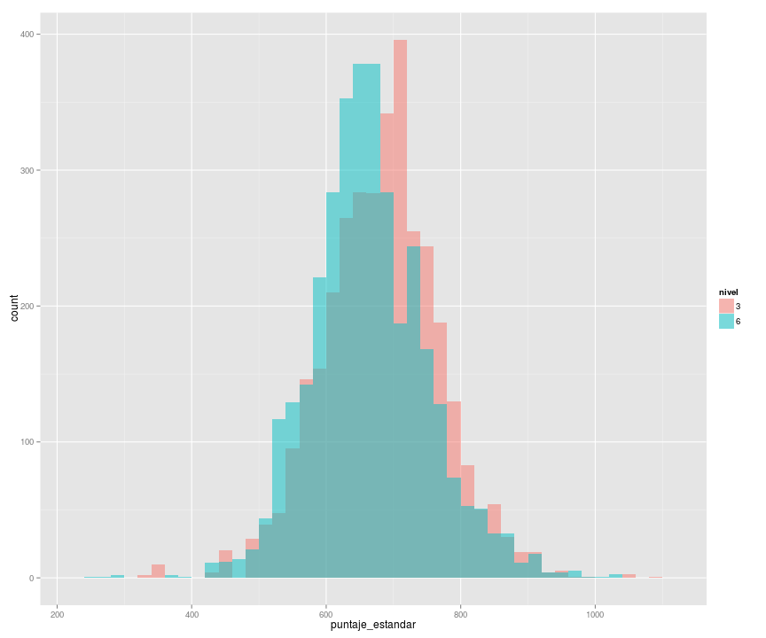
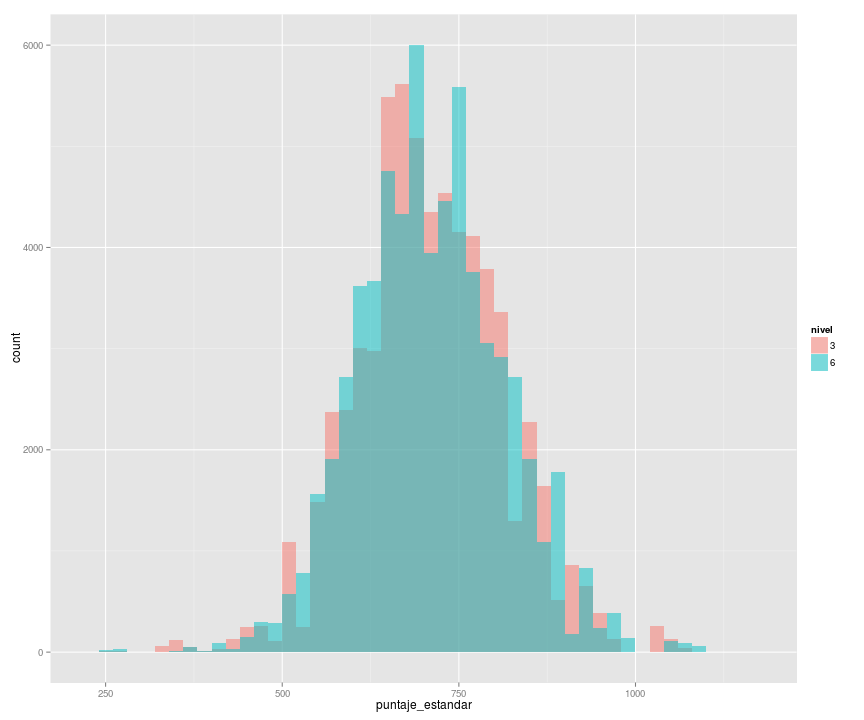
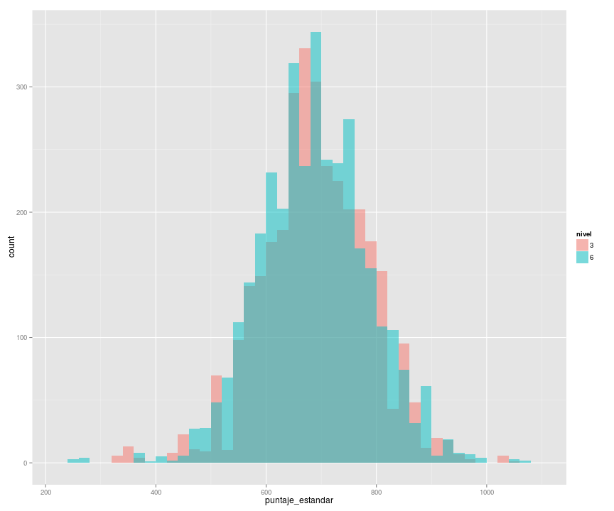

# Distribuciones de Resultados del TERCE

Esta es una analisis de las distrubuciones resultados de las pruebas TERCE. El analisis fue hecho con R y las graficas con ggplot2.
Para los histogramas se usarons bins de 20.

## Loading y subsetting de datos

```r
library(foreign)
library(ggplot2)
```

```
## Loading required package: methods
```

```r
pm6 <- read.spss('PM6_TERCE.SAV', to.data.frame=T)
pm3 <- read.spss('PM3_TERCE.SAV', to.data.frame=T)
pm6$nivel <- '6'
pm3$nivel <- '3'
prueba_mat <- rbind(pm6[,c("nivel","country","puntaje_estandar")],pm3[,c("nivel","country","puntaje_estandar")])
prueba_mat_panama <- prueba_mat[prueba_mat$country == 'PAN',]

pl6 <- read.spss('PL6_TERCE.SAV', to.data.frame=T)
pl3 <- read.spss('PL3_TERCE.SAV', to.data.frame=T)
pl6$nivel <- '6'
pl3$nivel <- '3'
prueba_lec <- rbind(pl6[,c("nivel","country","puntaje_estandar")],pl3[,c("nivel","country","puntaje_estandar")])
prueba_lec_panama <- prueba_lec[prueba_lec$country == 'PAN',]
```

## Calculo de Nivel de Competencia (benchmark)
Para calcular el nivel de benchmark se utilizo la siguiente funcion:

```r
benchmark <- function(x) {
    if (x < 299.59) {
        return('Below I')
    } else if (x < 424.54) {
        return('I')
    } else if (x < 513.66) {
        return('II')
    } else if (x < 593.59) {
        return('III')
    } else {
        return('IV')
    }
}
```


## Prueba de Matematica
### Histograma de Resultados Globales (incluyendo Panama)

```r
ggplot(prueba_mat, aes(x=puntaje_estandar, fill=nivel)) + geom_histogram(alpha=.5, position="identity",binwidth=20)
```

 

```r
summary(prueba_mat$puntaje_estandar)
```

```
##    Min. 1st Qu.  Median    Mean 3rd Qu.    Max. 
##   250.0   641.8   703.3   710.6   775.3  1150.0
```

### Benchmark de Resultados Globales (incluyendo Panama)

```r
ggplot(bench_mat, aes(x=benchmark,y=estudiantes, fill=nivel)) + geom_bar(stat="identity", position=position_dodge())
```

 

```r
summary(prueba_mat$puntaje_estandar)
```

```
##    Min. 1st Qu.  Median    Mean 3rd Qu.    Max. 
##   250.0   641.8   703.3   710.6   775.3  1150.0
```

### Resultados de Panama

```r
ggplot(prueba_mat_panama, aes(x=puntaje_estandar, fill=nivel)) + geom_histogram(alpha=.5, position="identity",binwidth=20)
```

 

```r
summary(prueba_mat_panama$puntaje_estandar)
```

```
##    Min. 1st Qu.  Median    Mean 3rd Qu.    Max. 
##   250.6   617.6   669.3   673.5   727.5  1090.0
```

## Prueba de Lectura
### Resultados Globales (incluyendo Panama)

```r
ggplot(prueba_lec, aes(x=puntaje_estandar, fill=nivel)) + geom_histogram(alpha=.5, position="identity",binwidth=20)
```

 

```r
summary(prueba_lec$puntaje_estandar)
```

```
##    Min. 1st Qu.  Median    Mean 3rd Qu.    Max. 
##   250.0   641.7   710.8   710.8   775.0  1147.0
```

### Resultados de Panama

```r
ggplot(prueba_lec_panama, aes(x=puntaje_estandar, fill=nivel)) + geom_histogram(alpha=.5, position="identity",binwidth=20)
```

 

```r
summary(prueba_lec_panama$puntaje_estandar)
```

```
##    Min. 1st Qu.  Median    Mean 3rd Qu.    Max. 
##   258.3   625.4   690.7   689.3   752.9  1079.0
```
