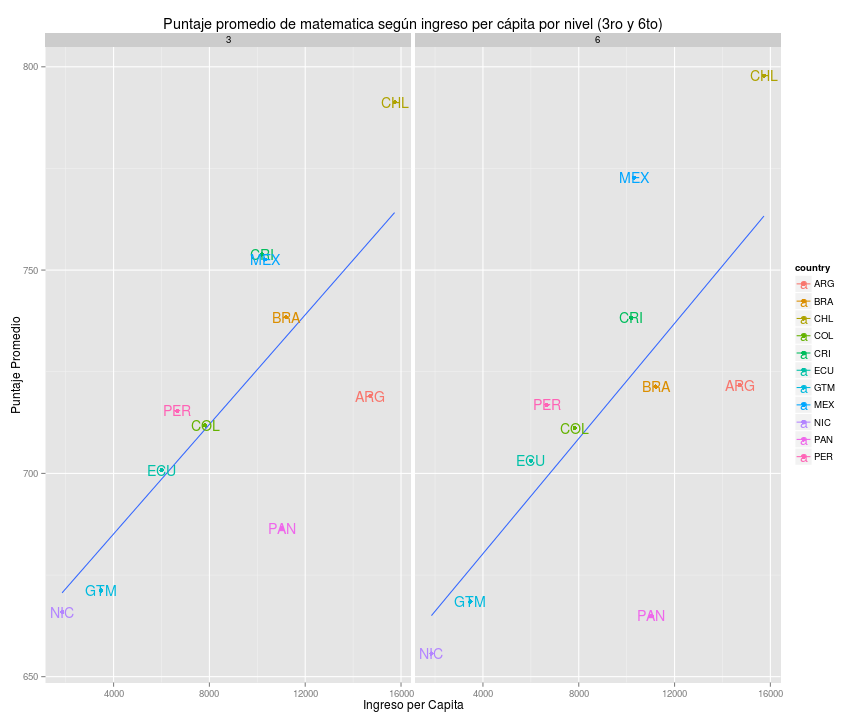
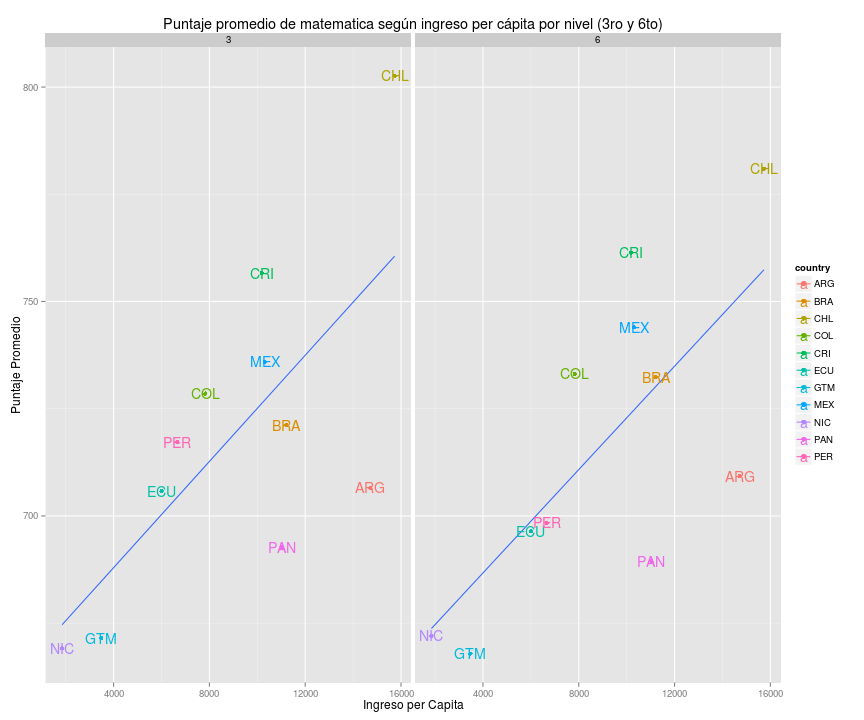
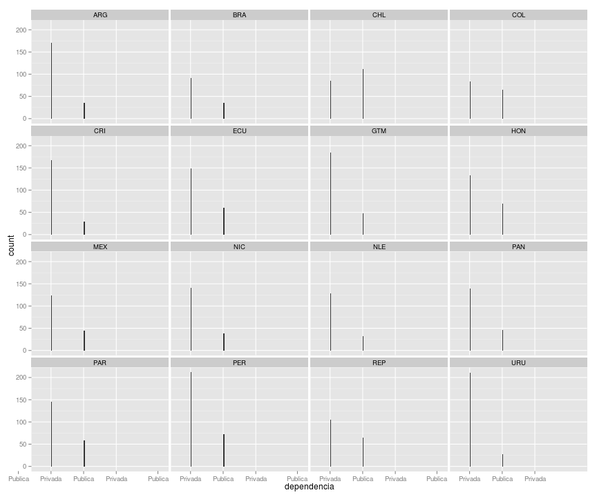
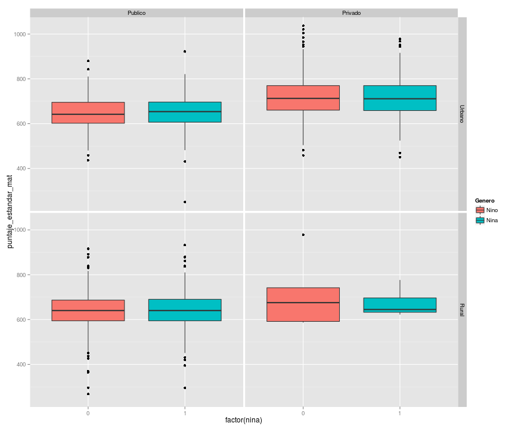

# Distribuciones de Resultados del TERCE

Esta es una analisis de las distrubuciones resultados de las pruebas TERCE. El analisis fue hecho con R y las graficas con ggplot2.

## Loading y subsetting de datos


## Puntaje promedio según ingreso per cápita

### Matematica
 

### Lectura
 


## Distribucion de Muestras

### ¿Como se ve la distribucion de escuelas en terminos de privada y publica?
#### Escuelas de Estudiantes de 3er Grado
 
#### Escuelas de Estudiantes de 3er Grado
 

### ¿Como se ve la distribucion de estudiantes en terminos de edad y genero?
#### Estudiantes de 3er Grado
 
#### Estudiantes de 6to Grado
 

### Distribucion de puntaje por ruralidad, dependencia y genero
#### Estudiantes de 6to Grado

```
## stat_bin: binwidth defaulted to range/30. Use 'binwidth = x' to adjust this.
## stat_bin: binwidth defaulted to range/30. Use 'binwidth = x' to adjust this.
## stat_bin: binwidth defaulted to range/30. Use 'binwidth = x' to adjust this.
## stat_bin: binwidth defaulted to range/30. Use 'binwidth = x' to adjust this.
```

 

## Factores Asociados (Sexto Grado)

### Distribucion de Puntaje Estandar por Tipo de pisos en casa
 

### Distribucion de Puntaje Estandar por Repeticion de Cursos
 

### Distribucion de Puntaje Estandar por Conexion a Internet
 

### Puntaje Estandar de Matematicas vs Indice de uso recreacional de PC
 

### Puntaje Estandar de Matematicas vs Indice de Condiciones de estudio en el hogar 
 

### Puntaje Estandar de Matematicas vs Indice de uso de libros en el hogar
 

### Puntaje Estandar de Matematicas vs Indice de actividades recreativas del hogar 
 

### Puntaje Estandar de Matematicas vs Indice de Asistencia del Docente 
 
