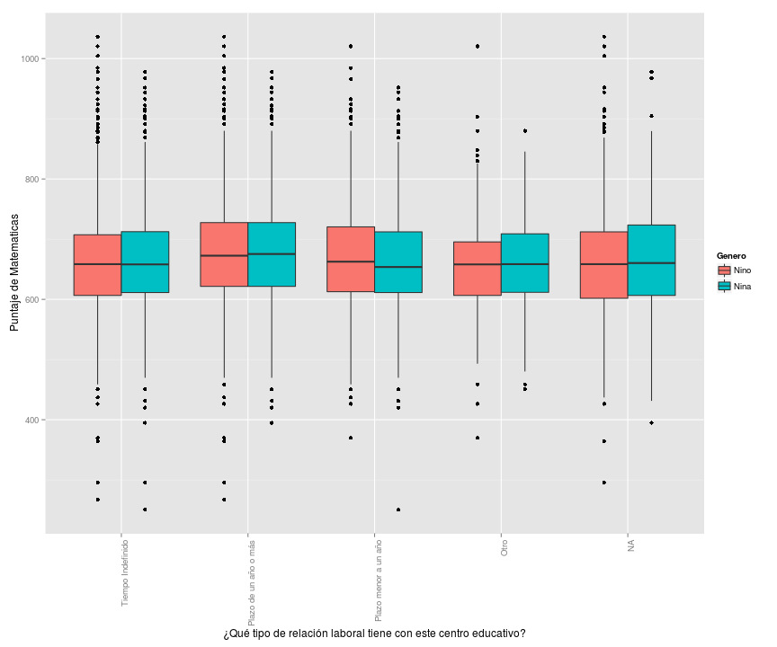
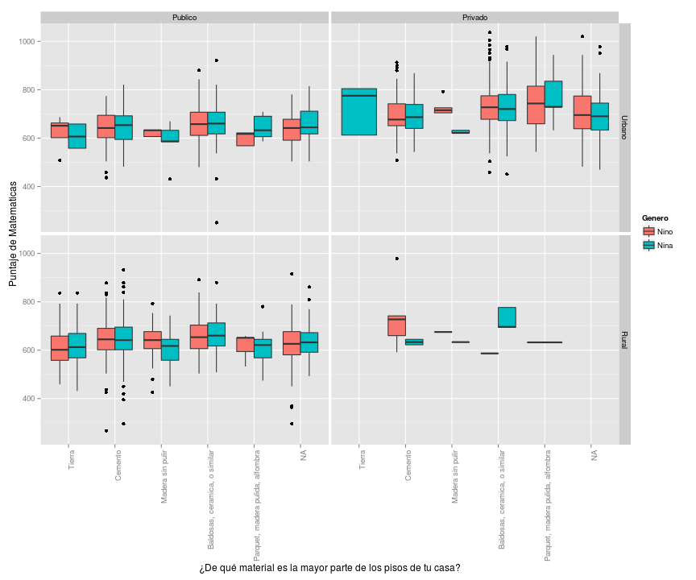
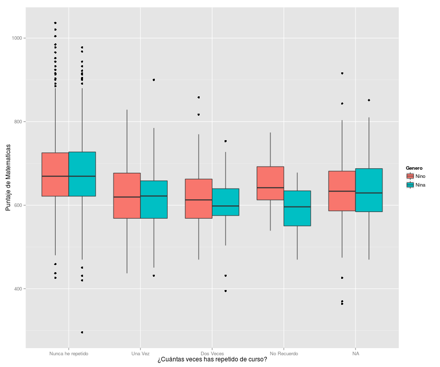
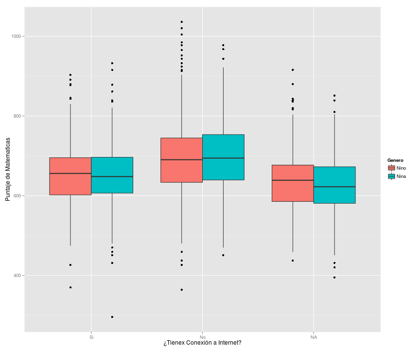
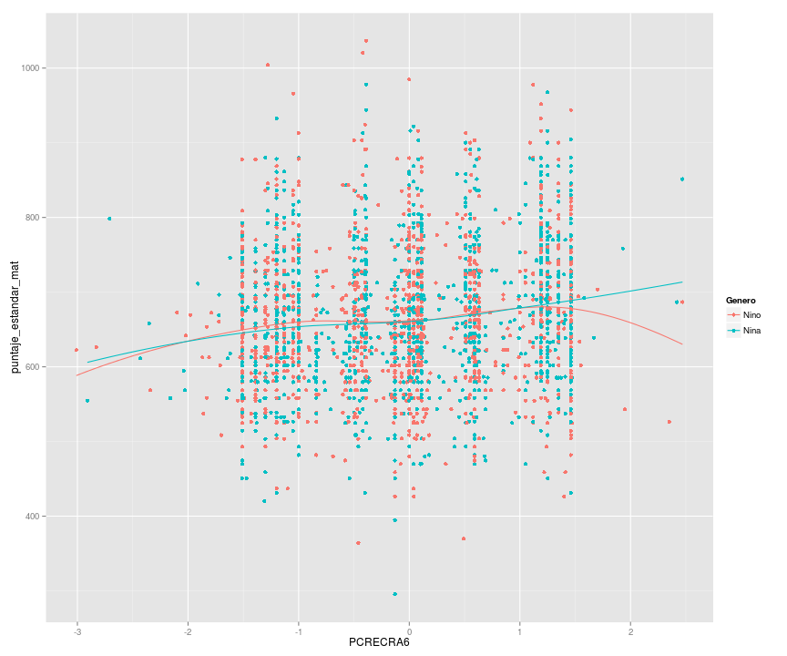
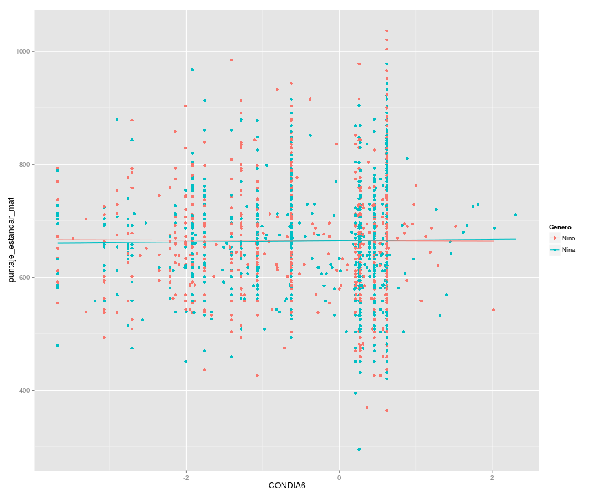
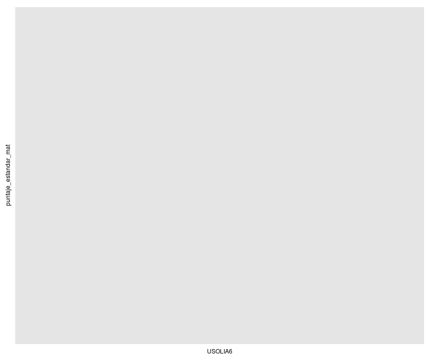
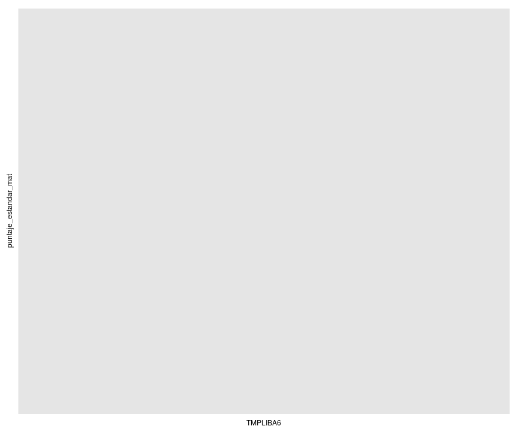
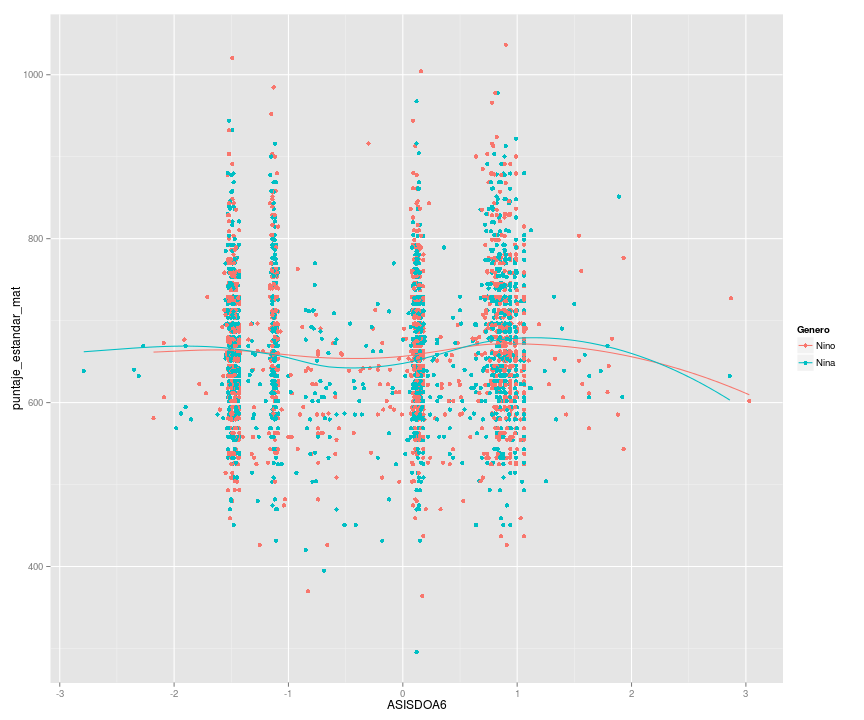

# Distribuciones de Resultados del TERCE

Esta es una analisis de las distrubuciones resultados de las pruebas TERCE. El analisis fue hecho con R y las graficas con ggplot2.

## Loading y subsetting de datos

```
## Loading required package: methods
```
## Puntaje promedio por pais

```
## Error in ggplot(alumnos, aes(x = nivel_grado, y = puntaje_estandar_mat, : object 'alumnos' not found
```

```
## Error in ggplot(alumnos, aes(x = nivel_grado, y = puntaje_estandar_lec, : object 'alumnos' not found
```

```
## Error in multiplot(mat, lec): object 'mat' not found
```


## Puntaje promedio según ingreso per cápita

### Matematica


### Lectura


## Distribucion de Muestras

### ¿Como se ve la distribucion de estudiantes en terminos de edad y genero?
#### Estudiantes de 3er Grado

```
## Error in exists(name, envir = env, mode = mode): argument "env" is missing, with no default
```
#### Estudiantes de 6to Grado

```
## Error in exists(name, envir = env, mode = mode): argument "env" is missing, with no default
```

### Distribucion de puntaje por ruralidad, dependencia y genero
#### Estudiantes de 6to Grado

```
## Error in `[.data.frame`(base, names(rows)): undefined columns selected
```

## Factores Asociados (Sexto Grado)
### Distribucion de Puntaje Estandar por tipo de relación laboral tiene con este centro educativo (profesor)
 

### Distribucion de Puntaje Estandar por Tipo de pisos en casa
 

### Distribucion de Puntaje Estandar por Repeticion de Cursos
 

### Distribucion de Puntaje Estandar por Conexion a Internet
 

### Puntaje Estandar de Matematicas vs Indice de uso recreacional de PC
 

### Puntaje Estandar de Matematicas vs Indice de Condiciones de estudio en el hogar 
 

### Puntaje Estandar de Matematicas vs Indice de uso de libros en el hogar
 

### Puntaje Estandar de Matematicas vs Indice de actividades recreativas del hogar 
 

### Puntaje Estandar de Matematicas vs Indice de Asistencia del Docente 
 
