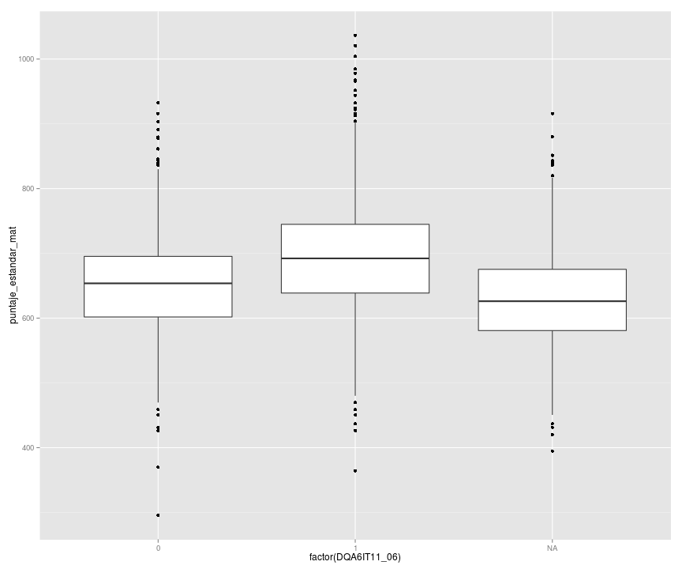

# Distribuciones de Resultados del TERCE

Esta es una analisis de las distrubuciones resultados de las pruebas TERCE. El analisis fue hecho con R y las graficas con ggplot2.
Para los histogramas se usarons bins de 20.

## Loading y subsetting de datos

```r
library(foreign)
library(ggplot2)
```

```
## Loading required package: methods
```

```r
director6 <- read.spss('QD6.SAV', to.data.frame=T)
director3 <- read.spss('QD3.SAV', to.data.frame=T)

alumnos6 <- read.spss('QA6.SAV', to.data.frame=T)
alumnos3 <- read.spss('QA3.SAV', to.data.frame=T)

pm6 <- read.spss('PM6_TERCE.SAV', to.data.frame=T)
pm3 <- read.spss('PM3_TERCE.SAV', to.data.frame=T)

pm6 <- pm6[,c("sID","puntaje_estandar")]
pm3 <- pm3[,c("sID","puntaje_estandar")]
names(pm6) <- c("sID","puntaje_estandar_mat")
names(pm3) <- c("sID","puntaje_estandar_mat")

pl6 <- read.spss('PL6_TERCE.SAV', to.data.frame=T)
pl3 <- read.spss('PL3_TERCE.SAV', to.data.frame=T)
pl6 <- pl6[,c("sID","puntaje_estandar")]
pl3 <- pl3[,c("sID","puntaje_estandar")]
names(pl6) <- c("sID","puntaje_estandar_lec")
names(pl3) <- c("sID","puntaje_estandar_lec")

alumnos6 <- merge(alumnos6,pm6,by="sID")
alumnos6 <- merge(alumnos6,pl6,by="sID")


alumnos6$nivel <- '6'
alumnos3$nivel <- '3'

alumnos6_panama <- alumnos6[alumnos6$country == 'PAN',]
alumnos3_panama <- alumnos3[alumnos3$country == 'PAN',]


alumnos6_panama$DQA6IT01 <- as.factor(alumnos6_panama$DQA6IT01)
alumnos3_panama$DQA3IT01 <- as.factor(alumnos3_panama$DQA3IT01)

alumnos6_panama$DQA6IT02 <- as.factor(alumnos6_panama$DQA6IT02)
alumnos3_panama$DQA3IT02 <- as.factor(alumnos3_panama$DQA3IT02)
```

## ¿Como se ve la distribucion de escuelas en terminos de privada y publica?
### Escuelas de Estudiantes de 3er Grado
 

## ¿Cuál de estos servicios tienes en tu hogar?_Conexión a Internet
### Estudiantes de 6to Grado
 

## Puntaje Estandar de Matematicas vs Indice de uso recreacional de PC
### Estudiantes de 6to Grado
 


## ¿Como se ve la distribucion de estudiantes en terminos de edad y genero?
### Estudiantes de 3er Grado
 
### Estudiantes de 6to Grado
 

## En tu sala, ¿hay un estante o caja con libros para que ustedes lean?

