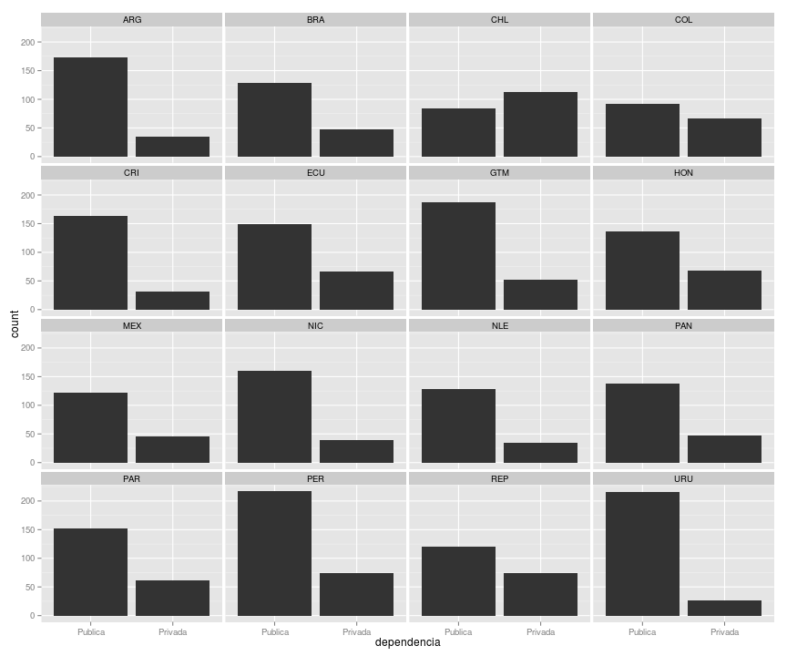
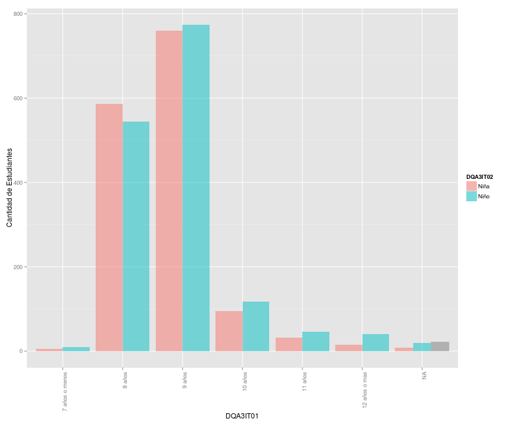
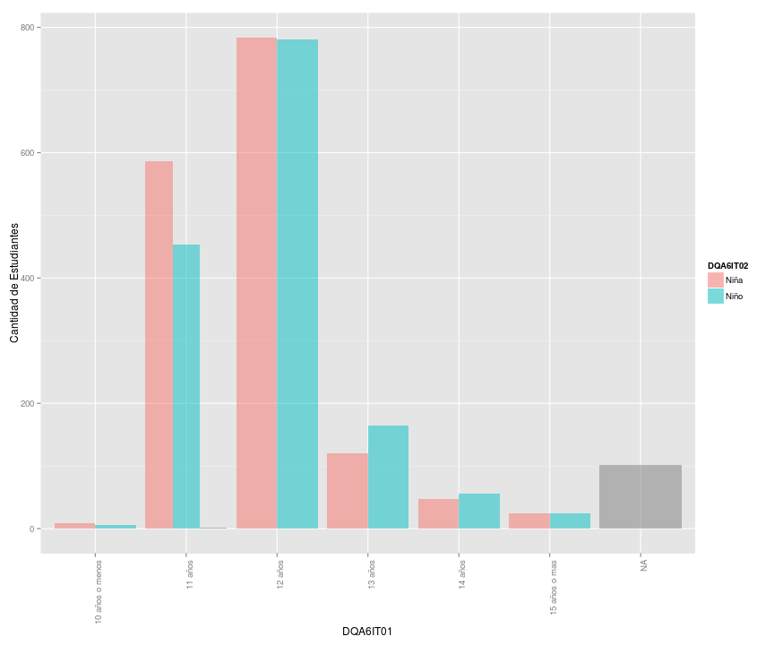

# Distribuciones de Resultados del TERCE

Esta es una analisis de las distrubuciones resultados de las pruebas TERCE. El analisis fue hecho con R y las graficas con ggplot2.
Para los histogramas se usarons bins de 20.

## Loading y subsetting de datos

```r
library(foreign)
library(ggplot2)

director6 <- read.spss('QD6.SAV', to.data.frame=T)
director3 <- read.spss('QD3.SAV', to.data.frame=T)

alumnos6 <- read.spss('QA6.SAV', to.data.frame=T)
alumnos3 <- read.spss('QA3.SAV', to.data.frame=T)


alumnos6$nivel <- '6'
alumnos3$nivel <- '3'

alumnos6_panama <- alumnos6[alumnos6$country == 'PAN',]
alumnos3_panama <- alumnos3[alumnos3$country == 'PAN',]


alumnos6_panama$DQA6IT01 <- as.factor(alumnos6_panama$DQA6IT01)
alumnos3_panama$DQA3IT01 <- as.factor(alumnos3_panama$DQA3IT01)
```

## ¿Como se ve la distribucion de escuelas en terminos de privada y publica?
### Escuelas de Estudiantes de 3er Grado
 

## ¿Como se ve la distribucion de estudiantes en terminos de edad y genero?
### Estudiantes de 3er Grado

```r
ggplot(alumnos3_panama, aes(x=DQA3IT01, fill=DQA3IT02)) + geom_histogram(alpha=.5, position="dodge") + scale_x_discrete(labels=c("7 años o menos","8 años","9 años", "10 años", "11 años", "12 años o mas", "NA")) + theme(axis.text.x = element_text(angle = 90, hjust = 1)) + scale_fill_discrete(labels=c("Niña","Niño")) + ylab("Cantidad de Estudiantes")
```

 
### Estudiantes de 6to Grado

```r
ggplot(alumnos6_panama, aes(x=DQA6IT01, fill=DQA6IT02)) + geom_histogram(alpha=.5, position="dodge") + scale_x_discrete(labels=c("10 años o menos","11 años","12 años", "13 años", "14 años", "15 años o mas", "NA")) + theme(axis.text.x = element_text(angle = 90, hjust = 1)) + scale_fill_discrete(labels=c("Niña","Niño")) + ylab("Cantidad de Estudiantes")
```

 

## En tu sala, ¿hay un estante o caja con libros para que ustedes lean?

