# Diferencias segun etnia originaria

 

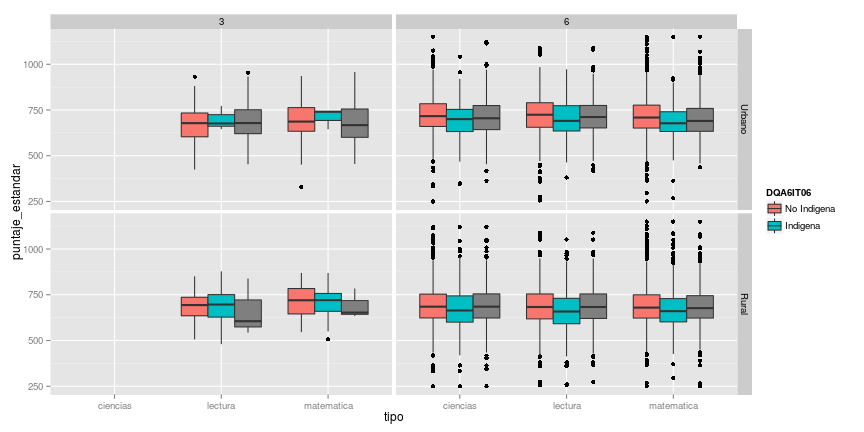 

# Diferencias Segun Genero

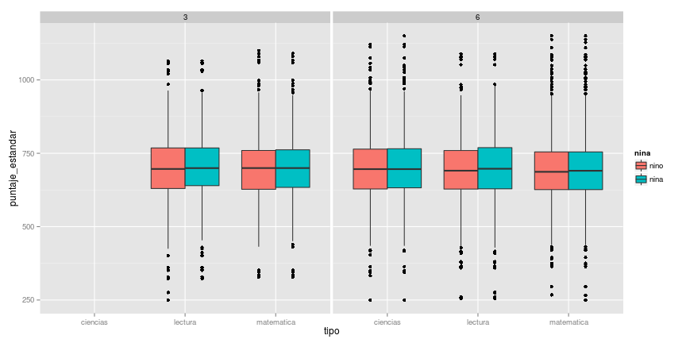 

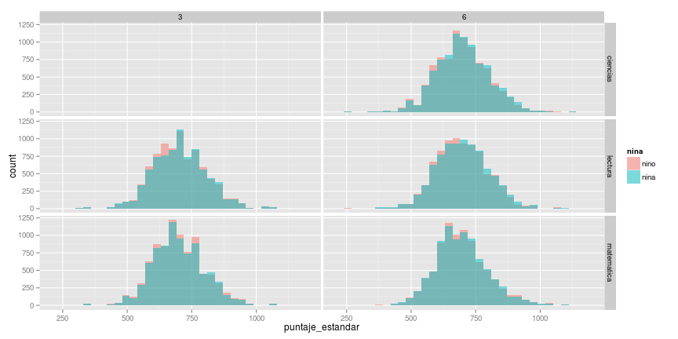 

# Analisis de Factores Asociado del Alumno

## Índice de condiciones de estudio en el hogar (CONDIA6)

### Puntaje por asignatura
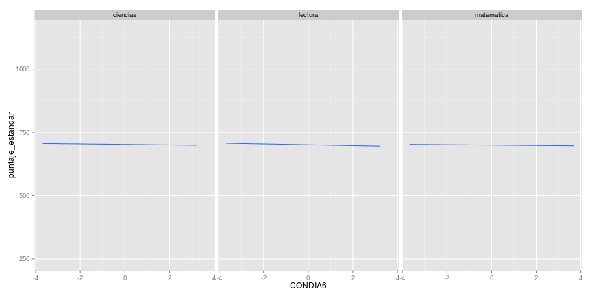 

### Puntaje por asignatura y genero
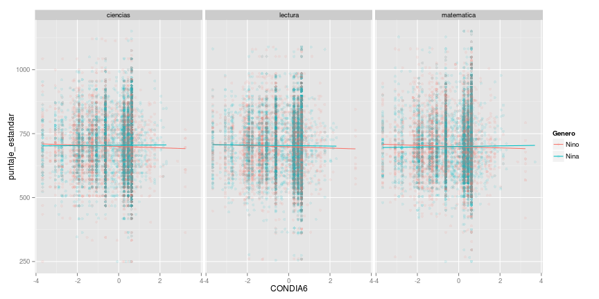 

### Puntaje por asignatura, dependencia y genero
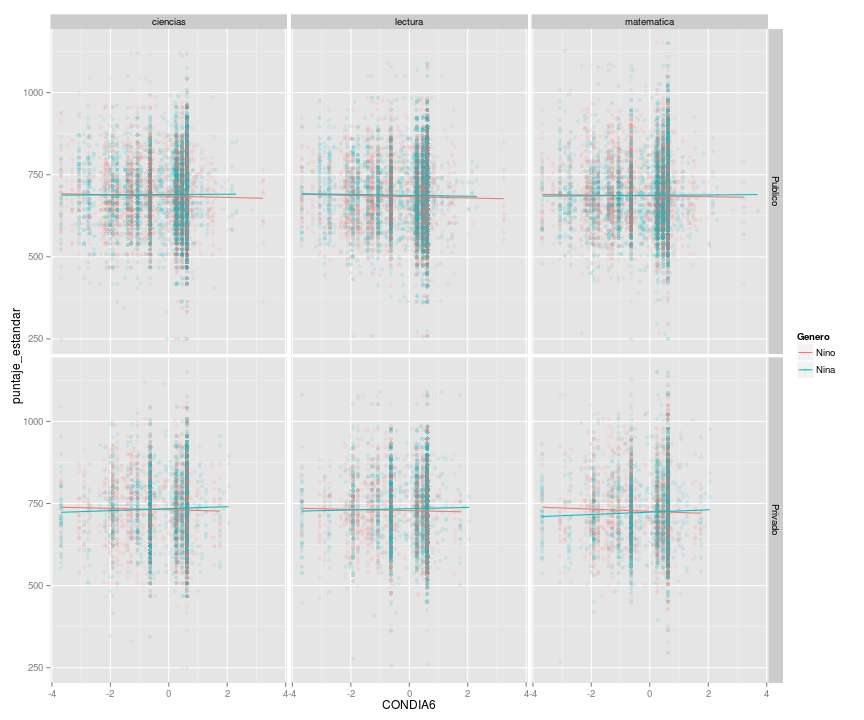 

## Índice del uso de libros en el hogar (USOLIA6)

### Puntaje por asignatura
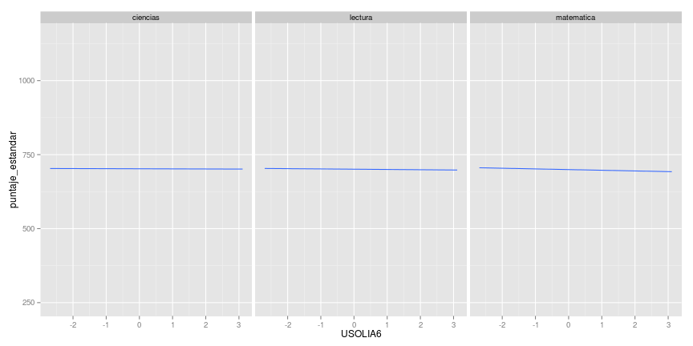 

### Puntaje por asignatura y genero
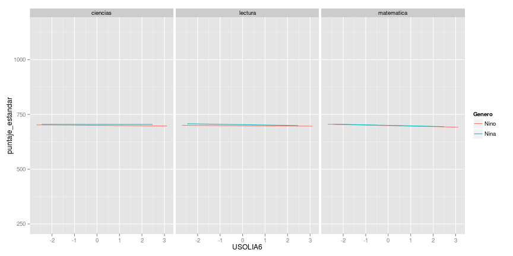 

### Puntaje por asignatura, dependencia y genero
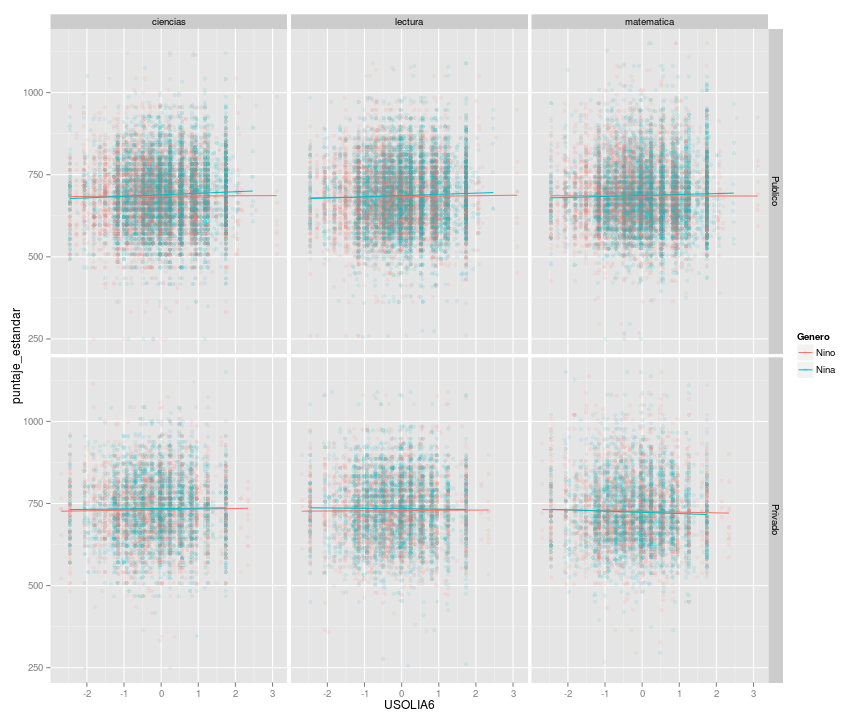 

## Índice de actividades recreativas en el hogar (TMPLIBA6)

### Puntaje por asignatura
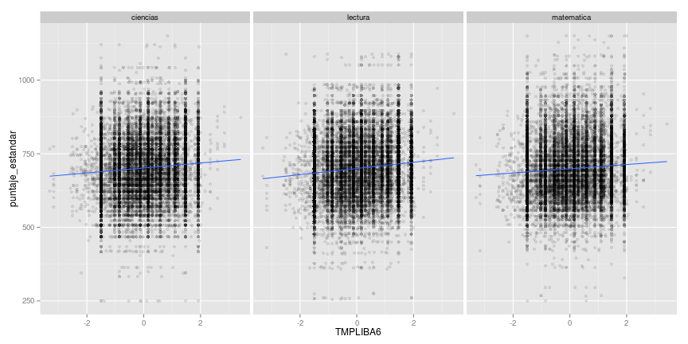 

### Puntaje por asignatura y genero
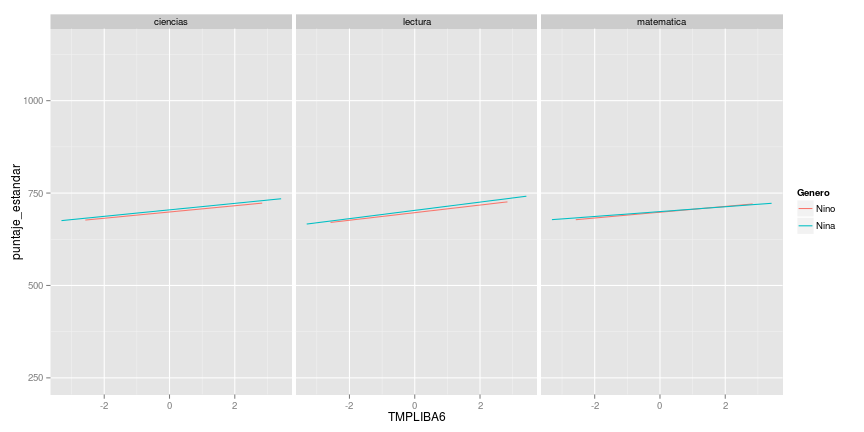 

### Puntaje por asignatura, dependencia y genero
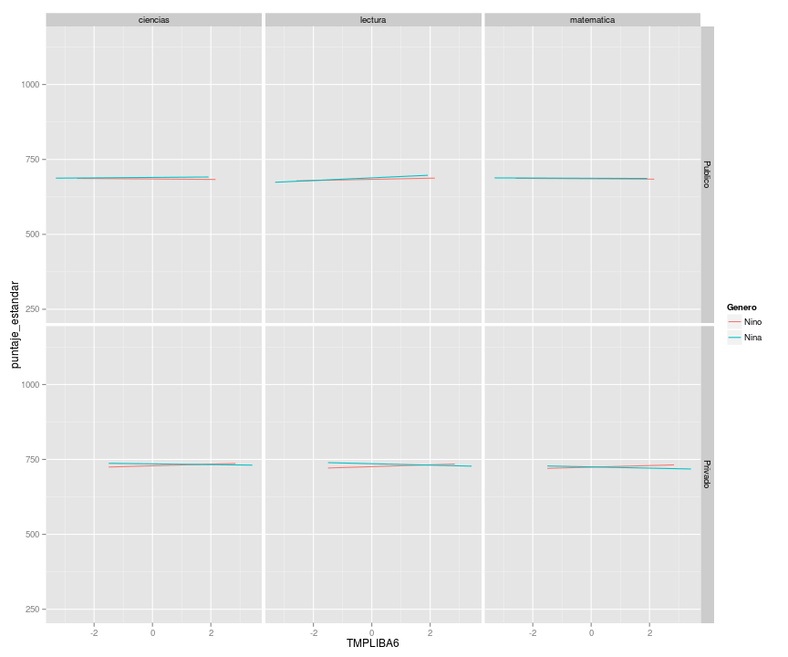 

