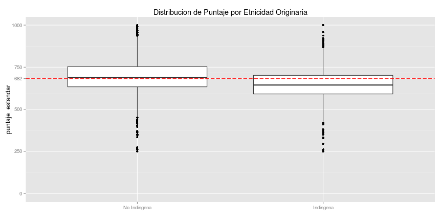
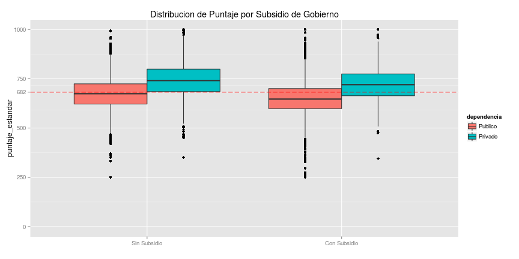
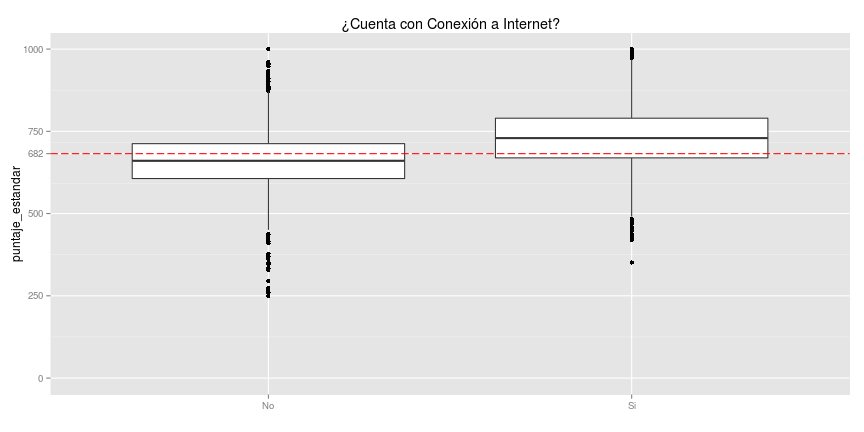
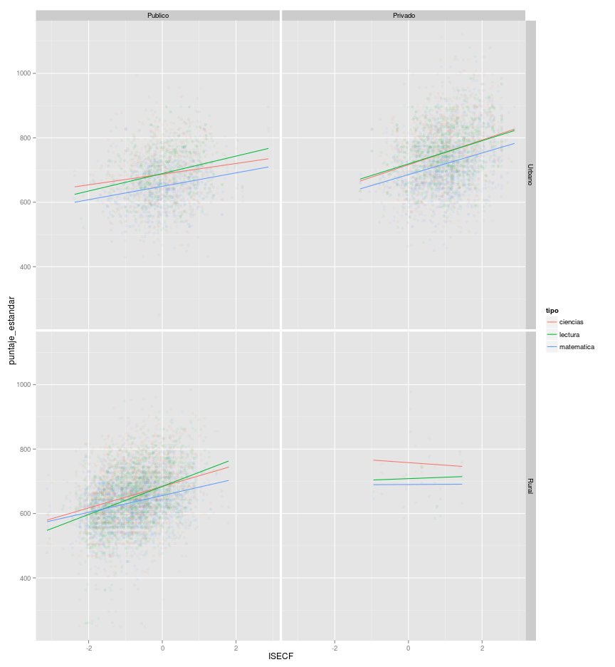
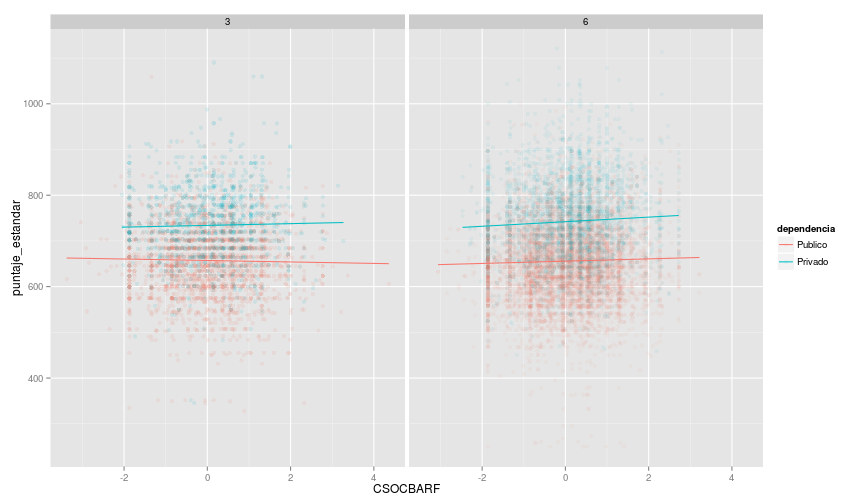
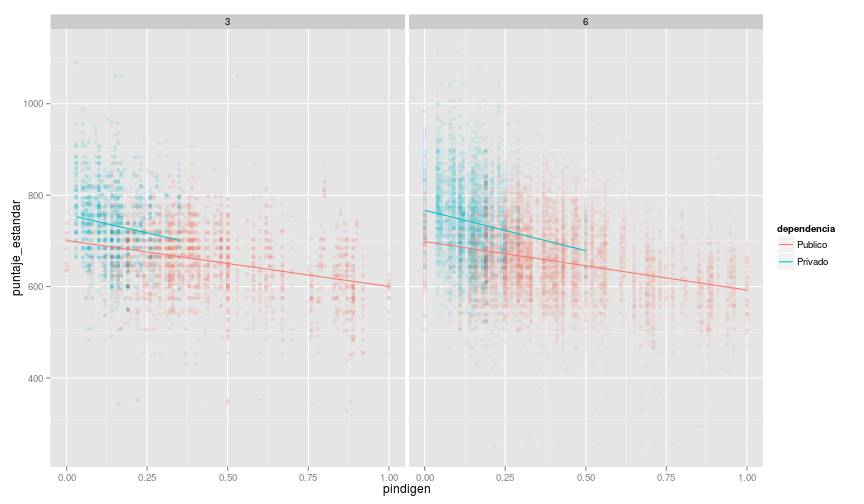
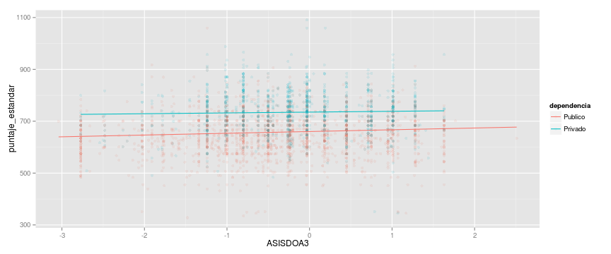

# Factores Asociados

 

 

 

 

 
 

 

 

 

# Carnaval de Indices (publico vs privado)
## Índice de estatus socioeconómico y cultural (ISECF)

 

 

## Índice de involucramiento de los padres en la escuela

 

## Índice de apoyo social en el barrio

 

## Índice de violencia en el barrio

 

## Índice de motivación de lectura en el hogar

 

##  Índice de control y supervisión de estudios en el hogar

 

## Porcentaje de niños indígenas

 

## Índice de asistencia y puntualidad docente

#### Tercer Grado
 

#### Sexto Grado
 

