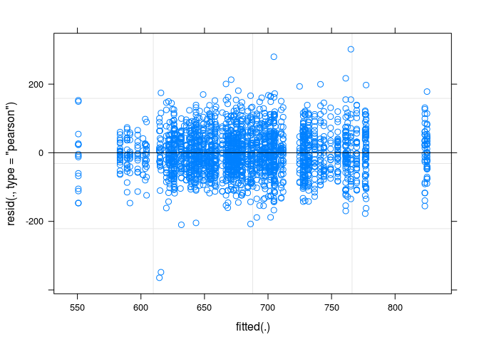

Multilevel modeling with R and lme4
-----------------------------------

The purpose of this document is to explore a few models that attempt to
describe how school level variables affect student's test scores for the
2013 TERCE study.

### Preparing the data

First we need to load the data into R from the SAV files. This dataset
contains individual question/answers and we will drop those columns (and
a few more) so that we have a new dataframe with only the data that we
need.

    # load sexto grado puntajes
    pm6 <- read.spss('./data/Puntajes_Alumnos/PM6_all_TERCE.sav', to.data.frame=T)
    pc6 <- read.spss('./data/Puntajes_Alumnos/PC6_all_TERCE.sav', to.data.frame=T)
    pl6 <- read.spss('./data/Puntajes_Alumnos/PL6_all_TERCE.sav', to.data.frame=T)

    pm6 <- pm6[,c('idstud',"puntaje_estandar","idschool","country")]
    pl6 <- pl6[,c('idstud',"puntaje_estandar","idschool","country")]
    pc6 <- pc6[,c('idstud',"puntaje_estandar","idschool","country")]

    # merge matematica, lectura y ciencias
    pm6$tipo <- 'matematica'
    pl6$tipo <- 'lectura'
    pc6$tipo <- 'ciencias'
    p6 <- rbind.fill(pm6,pl6,pc6)

We will also drop anything that is not PANAMA

    p6 <- p6[p6$country == 'PAN',]

This data has scores for math, science and reading. A single student
will be represented by 3 rows in the dataframe. We will average the
scores across the three tests for each student so that each student is a
single row in the data frame.

    p6 <- aggregate(puntaje_estandar ~ idstud + idschool + country , p6, mean)

Now we load the data from the schools and make sure R reads them as
FACTOR variables for when it is necesary.

    # load factores directores (escuelas)
    qd <- read.spss('./data/Directores/QD6.SAV', to.data.frame=T)
    qd <- qd[qd$country == 'PAN',]

    #prep factores
    qd$DQDIT14_01 <- as.factor(qd$DQDIT14_01)
    qd$DQDIT15_01 <- as.factor(qd$DQDIT15_01)
    qd$DQDIT16_01 <- as.factor(qd$DQDIT16_01)
    qd$DQDIT16_02 <- as.factor(qd$DQDIT16_02)
    qd$DQDIT17_01 <- as.factor(qd$DQDIT17_01)
    qd$DQDIT17_01 <- as.factor(qd$DQDIT17_07)
    qd$DQDIT17_01 <- as.factor(qd$DQDIT17_09)
    qd$DQDIT18_01 <- as.factor(qd$DQDIT18_01)
    qd$DQDIT18_02 <- as.factor(qd$DQDIT18_02)
    qd$DQDIT18_03 <- as.factor(qd$DQDIT18_03)
    qd$DQDIT18_04 <- as.factor(qd$DQDIT18_04)
    qd$DQDIT19_01 <- as.factor(qd$DQDIT19_01)
    qd$DQDIT21a <- as.factor(qd$DQDIT21a)
    qd$DQDIT22_01 <- as.factor(qd$DQDIT22_01)
    qd$DQDIT22_02 <- as.factor(qd$DQDIT22_02)
    qd$DQDIT23 <- as.factor(qd$DQDIT23)
    qd$DQDIT24_02<- as.factor(qd$DQDIT24_02)
    qd$DQDIT25_02 <- as.factor(qd$DQDIT25_02)
    qd$DQDIT27a <- as.factor(qd$DQDIT27a)
    qd$hrsescue <- as.factor(qd$hrsescue)
    qd$dependencia <- as.factor(qd$dependencia)
    qd$ruralidad <- as.factor(qd$ruralidad)
    levels(qd$dependencia) <- c("Oficial","Particular")
    levels(qd$ruralidad) <- c("Urbano","Rural")

Now we will merge this data to the student score data using the field
"idschool".

    pe <- merge(p6,qd,by='idschool')
    pe$idschool <- factor(pe$idschool)
    pe$idstud <- factor(pe$idstud)

Lastly, we need to remove missing data for the columns that we are going
to look at

    fofit <- na.omit(pe[,c("puntaje_estandar",'idstud','idschool',"dependencia","ruralidad","DQDIT01","DQDIT14_01","DQDIT15_01","DQDIT16_01","DQDIT17_01","DQDIT16_02","DQDIT17_07","DQDIT17_09","DQDIT18_01","DQDIT18_02","DQDIT18_03","DQDIT18_04","DQDIT19_01","DQDIT21a","DQDIT22_01","DQDIT22_02","DQDIT23","DQDIT24_02","DQDIT25_02","DQDIT27a",'INFRAD','VIOLEND','CSOCIALD','AUTOADD','AUTOACD','CLAMBLD','hrsescue')])

### Building the models

First we will build the null model with a random effects grouping
structure but no fixed predictors, we will compare all other models to
this.

    fit.lmer_null <- lmer(puntaje_estandar ~ 1 + (1|idschool), data=fofit)
    summary(fit.lmer_null)

    ## Linear mixed model fit by REML ['lmerMod']
    ## Formula: puntaje_estandar ~ 1 + (1 | idschool)
    ##    Data: fofit
    ## 
    ## REML criterion at convergence: 26015.2
    ## 
    ## Scaled residuals: 
    ##     Min      1Q  Median      3Q     Max 
    ## -5.5977 -0.6504 -0.0369  0.6111  4.6114 
    ## 
    ## Random effects:
    ##  Groups   Name        Variance Std.Dev.
    ##  idschool (Intercept) 2636     51.34   
    ##  Residual             4240     65.11   
    ## Number of obs: 2300, groups:  idschool, 111
    ## 
    ## Fixed effects:
    ##             Estimate Std. Error t value
    ## (Intercept)  679.050      5.093   133.3

We will also build a similar model but with dependencia (public/private)
and ruralidad (urban/rural) nested at the school level and also at the
subject (student) level.

    fit.lmer_null_nest <- lmer(puntaje_estandar ~ 1 + dependencia + ruralidad + (dependencia + ruralidad |idschool), data=fofit)
    summary(fit.lmer_null_nest)

    ## Linear mixed model fit by REML ['lmerMod']
    ## Formula: puntaje_estandar ~ 1 + dependencia + ruralidad + (dependencia +  
    ##     ruralidad | idschool)
    ##    Data: fofit
    ## 
    ## REML criterion at convergence: 25920.1
    ## 
    ## Scaled residuals: 
    ##     Min      1Q  Median      3Q     Max 
    ## -5.6175 -0.6390 -0.0426  0.6210  4.5816 
    ## 
    ## Random effects:
    ##  Groups   Name                  Variance Std.Dev. Corr       
    ##  idschool (Intercept)            539.7   23.23               
    ##           dependenciaParticular 1400.7   37.43    -0.47      
    ##           ruralidadRural        1117.3   33.43    -0.17 -0.79
    ##  Residual                       4240.2   65.12               
    ## Number of obs: 2300, groups:  idschool, 111
    ## 
    ## Fixed effects:
    ##                       Estimate Std. Error t value
    ## (Intercept)            670.049      6.190  108.25
    ## dependenciaParticular   74.102      8.498    8.72
    ## ruralidadRural         -16.048      7.535   -2.13
    ## 
    ## Correlation of Fixed Effects:
    ##             (Intr) dpndnP
    ## dpndncPrtcl -0.632       
    ## ruraliddRrl -0.767  0.433

Lets compare the two real quick....

    anova(fit.lmer_null,fit.lmer_null_nest)

    ## Data: fofit
    ## Models:
    ## fit.lmer_null: puntaje_estandar ~ 1 + (1 | idschool)
    ## fit.lmer_null_nest: puntaje_estandar ~ 1 + dependencia + ruralidad + (dependencia + 
    ## fit.lmer_null_nest:     ruralidad | idschool)
    ##                    Df   AIC   BIC logLik deviance  Chisq Chi Df Pr(>Chisq)
    ## fit.lmer_null       3 26026 26044 -13010    26020                         
    ## fit.lmer_null_nest 10 25956 26014 -12968    25936 84.154      7  1.953e-15
    ##                       
    ## fit.lmer_null         
    ## fit.lmer_null_nest ***
    ## ---
    ## Signif. codes:  0 '***' 0.001 '**' 0.01 '*' 0.05 '.' 0.1 ' ' 1

Next we will build a model using the INFRAD as a fixed-effect predictor.
We choose to test this variable first because it is tightly related to
the socioeconomic factor.

    fit.lmer_infrad <- lmer(puntaje_estandar ~ INFRAD + (1|idschool), data=fofit)
    summary(fit.lmer_infrad)

    ## Linear mixed model fit by REML ['lmerMod']
    ## Formula: puntaje_estandar ~ INFRAD + (1 | idschool)
    ##    Data: fofit
    ## 
    ## REML criterion at convergence: 25923.6
    ## 
    ## Scaled residuals: 
    ##     Min      1Q  Median      3Q     Max 
    ## -5.5911 -0.6362 -0.0459  0.6209  4.6764 
    ## 
    ## Random effects:
    ##  Groups   Name        Variance Std.Dev.
    ##  idschool (Intercept) 1070     32.71   
    ##  Residual             4240     65.12   
    ## Number of obs: 2300, groups:  idschool, 111
    ## 
    ## Fixed effects:
    ##             Estimate Std. Error t value
    ## (Intercept)  668.471      3.571  187.19
    ## INFRAD        41.024      3.556   11.53
    ## 
    ## Correlation of Fixed Effects:
    ##        (Intr)
    ## INFRAD -0.276

Lets look at a model with more predictors

    fit.lmer_full_fact <- lmer(puntaje_estandar ~ dependencia + ruralidad + DQDIT01 + DQDIT14_01 + DQDIT15_01 + DQDIT16_01 + DQDIT17_01 + DQDIT18_01 + DQDIT18_02 + DQDIT18_03 + DQDIT18_04 + DQDIT19_01 + DQDIT21a + DQDIT27a + DQDIT16_02 + DQDIT17_07 + DQDIT17_09 + DQDIT23 + DQDIT22_01 + DQDIT22_02 + DQDIT27a + INFRAD + VIOLEND + CSOCIALD + AUTOADD + AUTOACD + CLAMBLD + hrsescue + (1|idschool), data=fofit)
    summary(fit.lmer_full_fact)

    ## Linear mixed model fit by REML ['lmerMod']
    ## Formula: 
    ## puntaje_estandar ~ dependencia + ruralidad + DQDIT01 + DQDIT14_01 +  
    ##     DQDIT15_01 + DQDIT16_01 + DQDIT17_01 + DQDIT18_01 + DQDIT18_02 +  
    ##     DQDIT18_03 + DQDIT18_04 + DQDIT19_01 + DQDIT21a + DQDIT27a +  
    ##     DQDIT16_02 + DQDIT17_07 + DQDIT17_09 + DQDIT23 + DQDIT22_01 +  
    ##     DQDIT22_02 + DQDIT27a + INFRAD + VIOLEND + CSOCIALD + AUTOADD +  
    ##     AUTOACD + CLAMBLD + hrsescue + (1 | idschool)
    ##    Data: fofit
    ## 
    ## REML criterion at convergence: 25634.6
    ## 
    ## Scaled residuals: 
    ##     Min      1Q  Median      3Q     Max 
    ## -5.5687 -0.6385 -0.0447  0.6168  4.6567 
    ## 
    ## Random effects:
    ##  Groups   Name        Variance Std.Dev.
    ##  idschool (Intercept) 1017     31.90   
    ##  Residual             4240     65.12   
    ## Number of obs: 2300, groups:  idschool, 111
    ## 
    ## Fixed effects:
    ##                         Estimate Std. Error t value
    ## (Intercept)           748.507569  78.578834   9.526
    ## dependenciaParticular  72.323876  48.030656   1.506
    ## ruralidadRural         13.497980  14.688418   0.919
    ## DQDIT01                 0.126943   0.474692   0.267
    ## DQDIT14_011             7.800825  13.502793   0.578
    ## DQDIT15_012            32.700219  26.494222   1.234
    ## DQDIT15_013             4.945086  25.917947   0.191
    ## DQDIT15_014             7.000984  26.596170   0.263
    ## DQDIT15_015            20.097545  30.715095   0.654
    ## DQDIT16_012             8.050085  32.862429   0.245
    ## DQDIT16_013           -20.035509  25.914868  -0.773
    ## DQDIT16_014           -28.044986  23.315916  -1.203
    ## DQDIT17_011             0.001957  10.855137   0.000
    ## DQDIT18_011            -7.689512  18.942204  -0.406
    ## DQDIT18_021           -13.398757  47.085732  -0.285
    ## DQDIT18_031            25.426454  18.123572   1.403
    ## DQDIT18_041             5.231381   8.619271   0.607
    ## DQDIT19_011            17.772057  17.401890   1.021
    ## DQDIT21a2              26.271042  20.311278   1.293
    ## DQDIT21a6              11.370532  12.164788   0.935
    ## DQDIT27a2              -6.460477  23.262451  -0.278
    ## DQDIT27a6              -3.562898  22.909951  -0.156
    ## DQDIT16_023           -59.050328  30.529763  -1.934
    ## DQDIT16_024           -56.956338  30.871056  -1.845
    ## DQDIT17_07            -14.409756  25.323523  -0.569
    ## DQDIT232              -10.223095  11.926489  -0.857
    ## DQDIT233               -7.744793  11.687576  -0.663
    ## DQDIT22_012           -29.191384  43.927332  -0.665
    ## DQDIT22_013           -30.795520  44.615709  -0.690
    ## DQDIT22_014           -32.965072  48.532964  -0.679
    ## DQDIT22_022           -12.033716  11.649530  -1.033
    ## DQDIT22_023            -5.977024  17.230091  -0.347
    ## DQDIT22_024           -41.627849  30.083264  -1.384
    ## INFRAD                 31.383492  12.509262   2.509
    ## VIOLEND                -2.146483   4.174912  -0.514
    ## CSOCIALD                1.248061   5.097443   0.245
    ## AUTOADD                 7.792008   8.958888   0.870
    ## AUTOACD                 0.251631   5.093809   0.049
    ## CLAMBLD                 6.809174   4.342279   1.568
    ## fit warnings:
    ## fixed-effect model matrix is rank deficient so dropping 2 columns / coefficients

Now lets compare those models using anova

    anova(fit.lmer_null,fit.lmer_infrad,fit.lmer_full_fact)

    ## Data: fofit
    ## Models:
    ## fit.lmer_null: puntaje_estandar ~ 1 + (1 | idschool)
    ## fit.lmer_infrad: puntaje_estandar ~ INFRAD + (1 | idschool)
    ## fit.lmer_full_fact: puntaje_estandar ~ dependencia + ruralidad + DQDIT01 + DQDIT14_01 + 
    ## fit.lmer_full_fact:     DQDIT15_01 + DQDIT16_01 + DQDIT17_01 + DQDIT18_01 + DQDIT18_02 + 
    ## fit.lmer_full_fact:     DQDIT18_03 + DQDIT18_04 + DQDIT19_01 + DQDIT21a + DQDIT27a + 
    ## fit.lmer_full_fact:     DQDIT16_02 + DQDIT17_07 + DQDIT17_09 + DQDIT23 + DQDIT22_01 + 
    ## fit.lmer_full_fact:     DQDIT22_02 + DQDIT27a + INFRAD + VIOLEND + CSOCIALD + AUTOADD + 
    ## fit.lmer_full_fact:     AUTOACD + CLAMBLD + hrsescue + (1 | idschool)
    ##                    Df   AIC   BIC logLik deviance  Chisq Chi Df Pr(>Chisq)
    ## fit.lmer_null       3 26026 26044 -13010    26020                         
    ## fit.lmer_infrad     4 25940 25963 -12966    25932 88.012      1    < 2e-16
    ## fit.lmer_full_fact 41 25964 26199 -12941    25882 50.739     37    0.06564
    ##                       
    ## fit.lmer_null         
    ## fit.lmer_infrad    ***
    ## fit.lmer_full_fact .  
    ## ---
    ## Signif. codes:  0 '***' 0.001 '**' 0.01 '*' 0.05 '.' 0.1 ' ' 1

In parallel, we will also compare the same models but with the
dependencia and ruralidad vars nested at the school level

    ## Data: fofit
    ## Models:
    ## fit.lmer_null_nest: puntaje_estandar ~ 1 + (dependencia + ruralidad | idschool)
    ## fit.lmer_infrad_nest: puntaje_estandar ~ INFRAD + (dependencia + ruralidad | idschool)
    ## fit.lmer_full_fact_nest: puntaje_estandar ~ dependencia + ruralidad + DQDIT01 + DQDIT14_01 + 
    ## fit.lmer_full_fact_nest:     DQDIT15_01 + DQDIT16_01 + DQDIT17_01 + DQDIT18_01 + DQDIT18_02 + 
    ## fit.lmer_full_fact_nest:     DQDIT18_03 + DQDIT18_04 + DQDIT19_01 + DQDIT21a + DQDIT27a + 
    ## fit.lmer_full_fact_nest:     DQDIT16_02 + DQDIT17_07 + DQDIT17_09 + DQDIT23 + DQDIT22_01 + 
    ## fit.lmer_full_fact_nest:     DQDIT22_02 + DQDIT27a + INFRAD + VIOLEND + CSOCIALD + AUTOADD + 
    ## fit.lmer_full_fact_nest:     AUTOACD + CLAMBLD + hrsescue + (dependencia + ruralidad | 
    ## fit.lmer_full_fact_nest:     idschool)
    ##                         Df   AIC   BIC logLik deviance  Chisq Chi Df
    ## fit.lmer_null_nest       8 26007 26053 -12995    25991              
    ## fit.lmer_infrad_nest     9 25950 26002 -12966    25932 58.594      1
    ## fit.lmer_full_fact_nest 46 25960 26224 -12934    25868 64.344     37
    ##                         Pr(>Chisq)    
    ## fit.lmer_null_nest                    
    ## fit.lmer_infrad_nest     1.938e-14 ***
    ## fit.lmer_full_fact_nest    0.00352 ** 
    ## ---
    ## Signif. codes:  0 '***' 0.001 '**' 0.01 '*' 0.05 '.' 0.1 ' ' 1

### Some tests on the full model

The full model includes a few fixed-effect predictors and will do
nesting of dependencia and ruralidad on the school level. Here are some
plots for the model:

    shapiro.test(fofit$puntaje_estandar)

    ## 
    ##  Shapiro-Wilk normality test
    ## 
    ## data:  fofit$puntaje_estandar
    ## W = 0.9906, p-value = 4.319e-11

    plot(fit.lmer_full_fact_nest)

    m <- fit.lmer_full_fact_nest
    qqnorm(residuals(m)); qqline(residuals(m));

    hist(fofit$puntaje_estandar)

