## CHILE

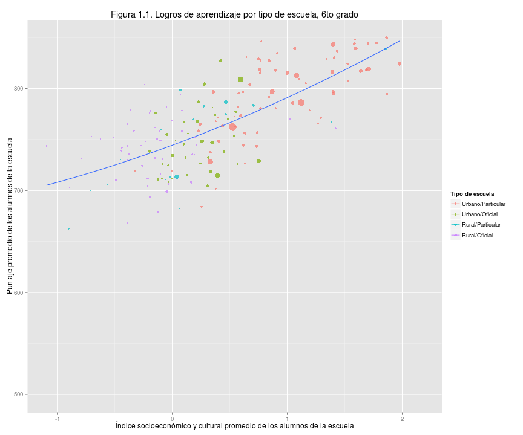 

## URUGUAY

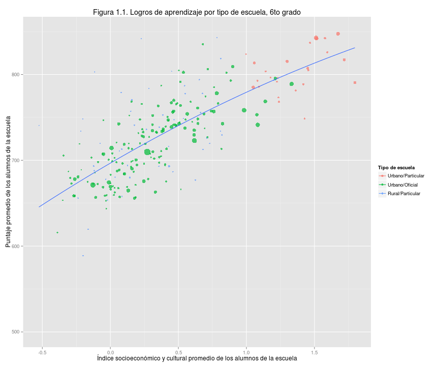 

## ARGENTINA

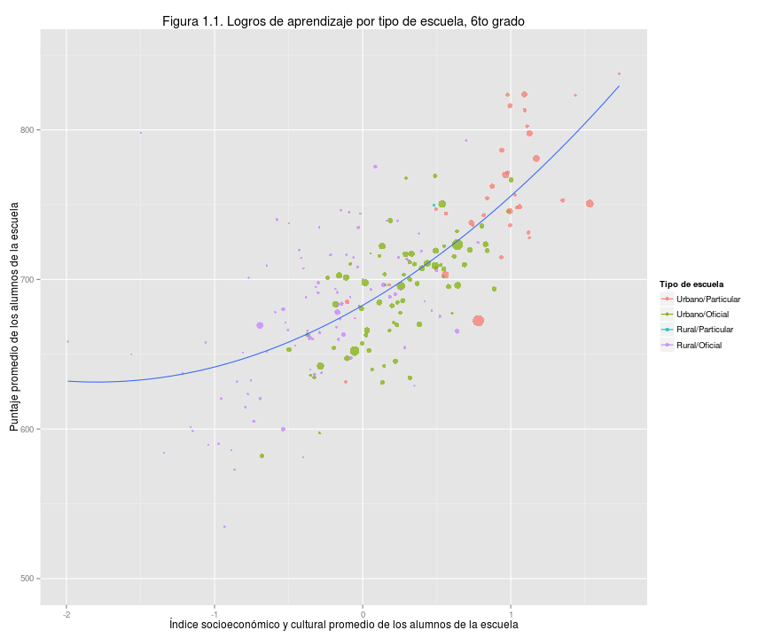 

## BRASIL

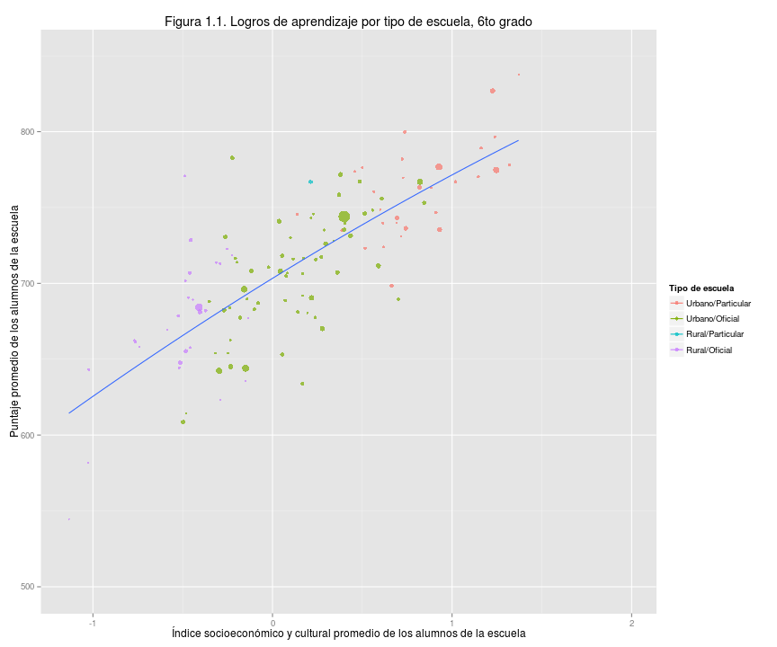 

## PANAMA
 
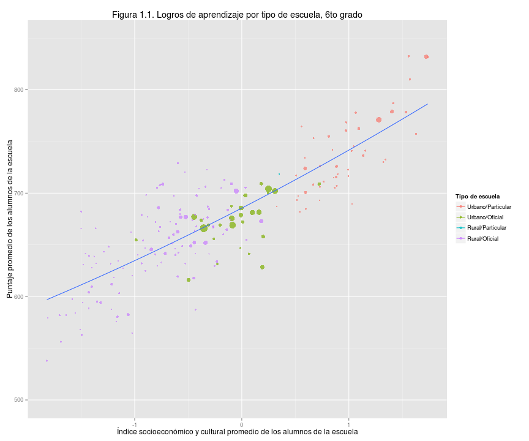 

## MEXICO

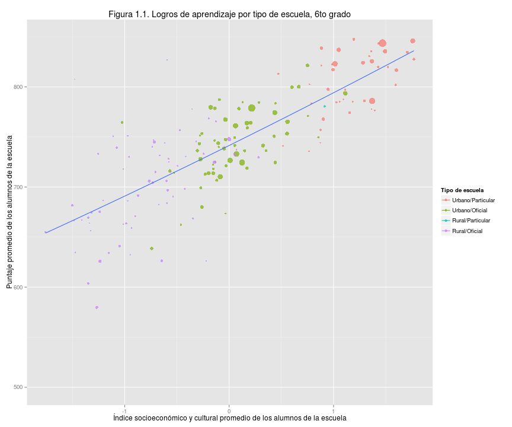 

## COSTA RICA

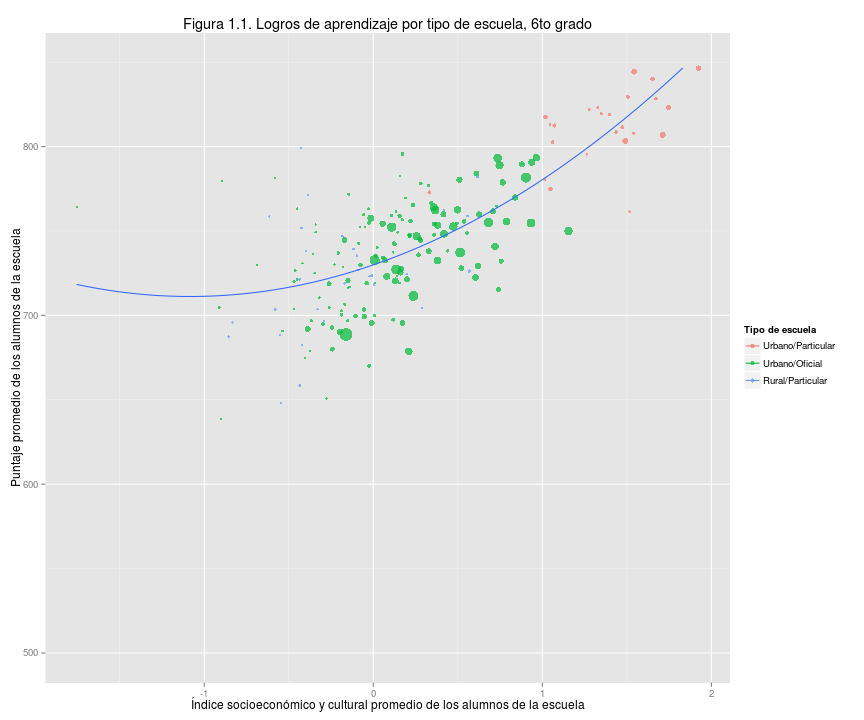 

## COLOMBIA

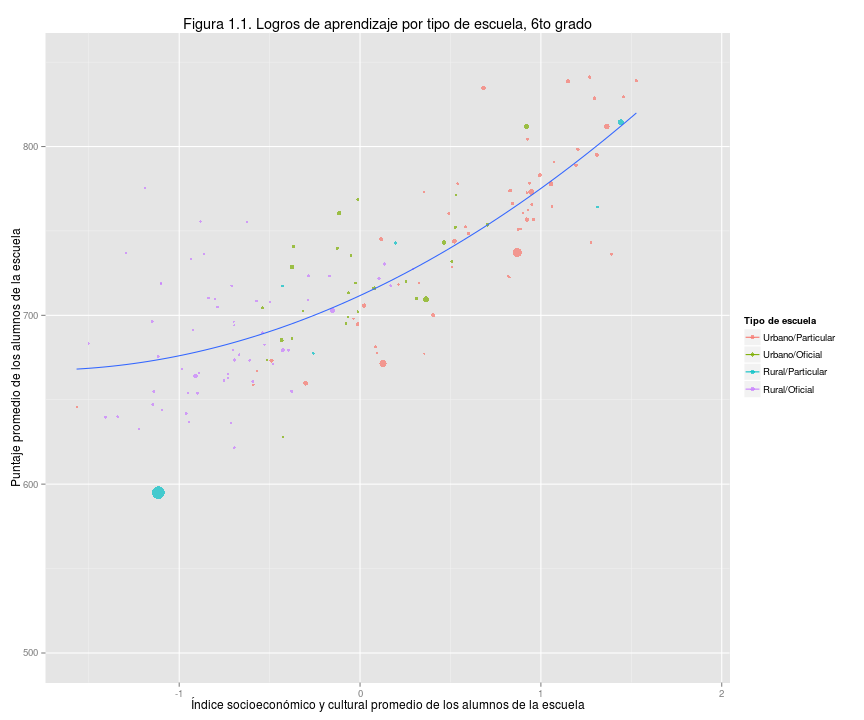 

## PERU

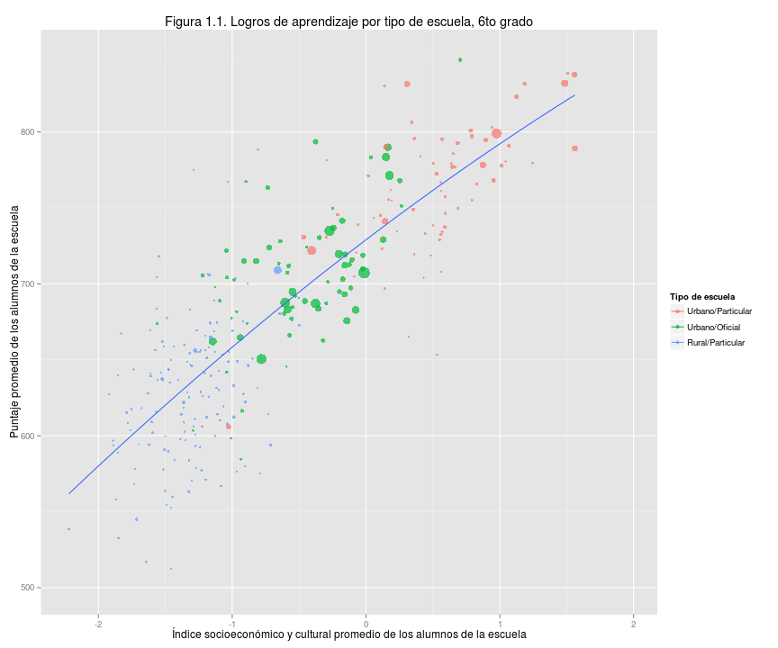 

## ECUADOR

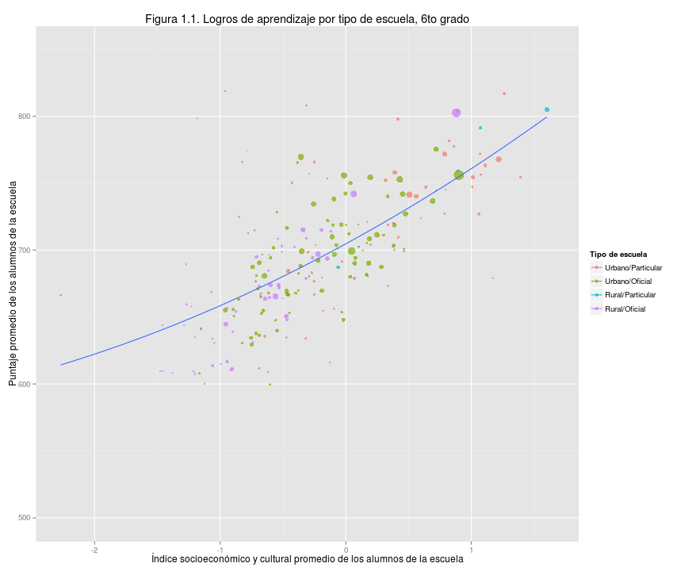 

## REPUBLICA DOMINICANA

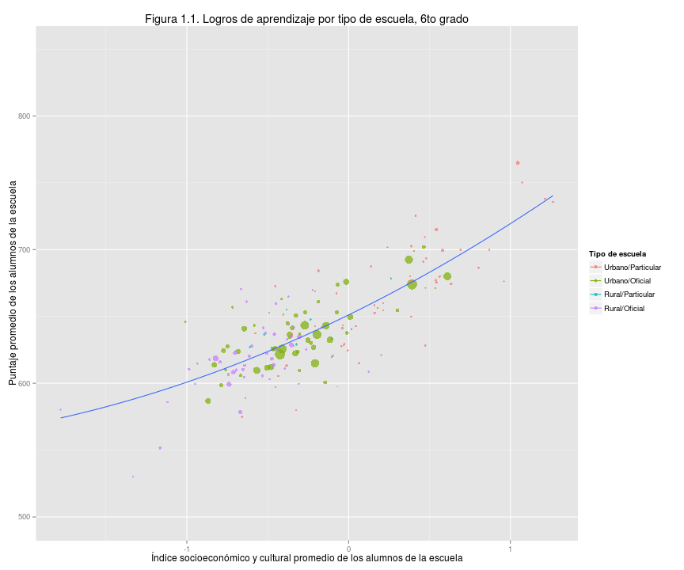 

## PARAGUAY

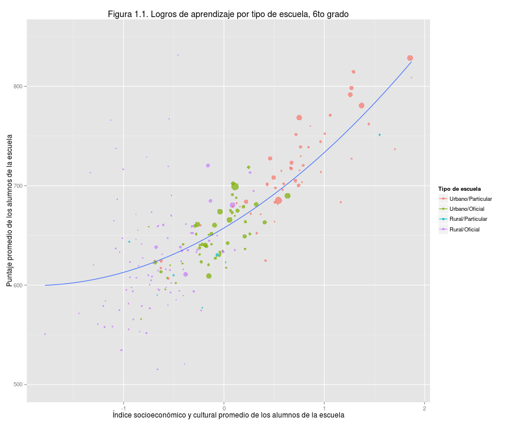 

## GUATEMALA

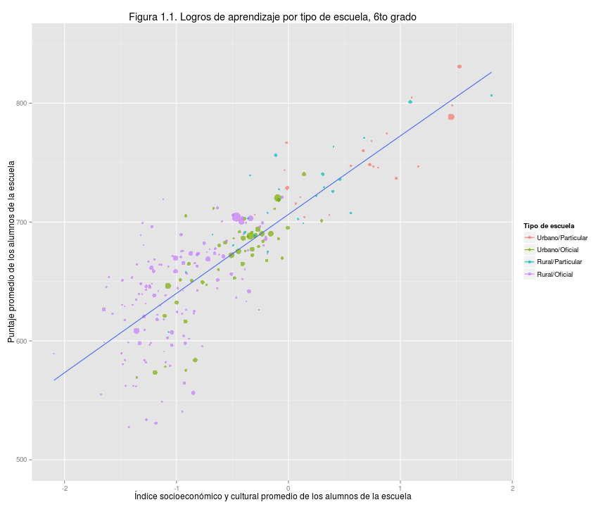 

## HONDURAS

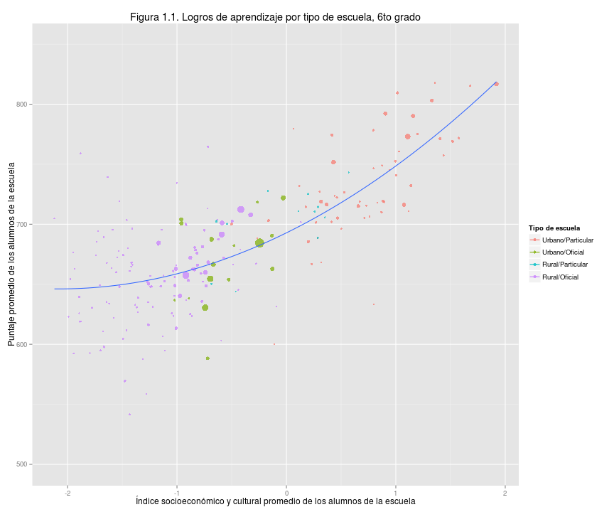 

## NICARAGUA

 
