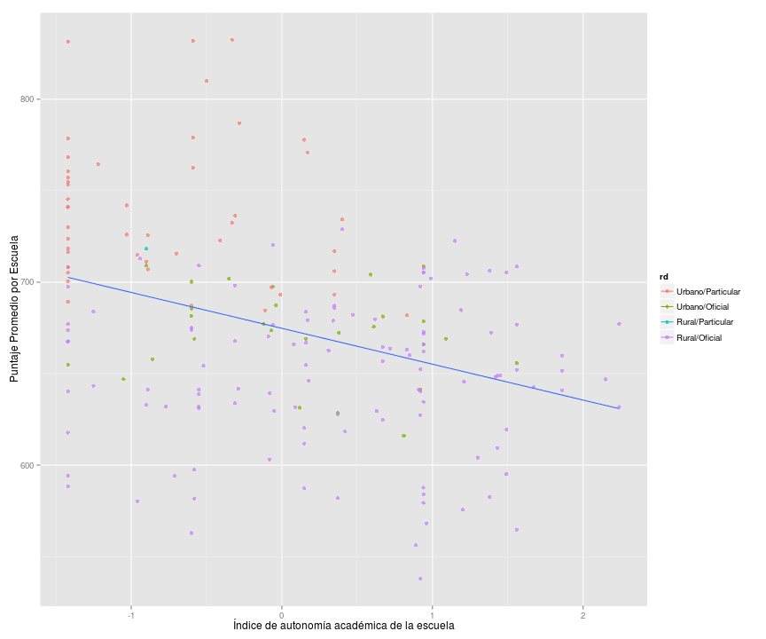
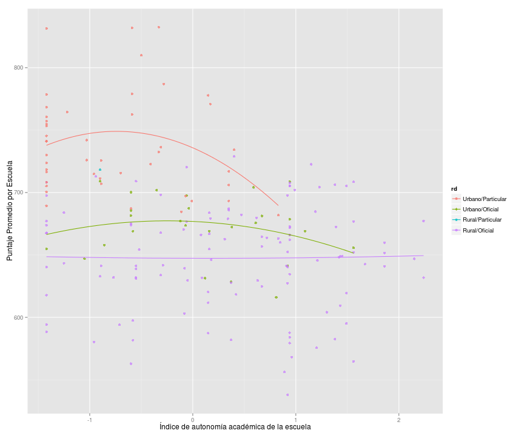

## Presentación de resultados del Tercer Estudio Regional Comparativo y Explicativo (TERCE) del Laboratorio Latinoamericano de Evaluación de la Calidad de la Educación (LLECE)

### 1. Resumen

Hay grandes diferencias de oportunidades para nuestros niños y niñas en material educativa.    Las escuelas particulares mostraron major desempeño que las oficiales, y entre estas oficiales las rurales típicamente no logran el mínimo nivel de desempeño deseado.     [Es importante notar que esta grafica muestra el promedio por escuela y no por estudiante… explicar implicaciones]


 

Sin embargo es importante destacar que hay escuelas oficiales rurales que están logrando desempeño tan bueno como las mejores escuelas oficiales urbanas, e incluso logran desempeño igual al promedio de todos los estudiantes de la region latinoamericana que participaron.   Esto sugiere que esas escuelas pueden aportar lecciones sobre como mejorar el desempeño de otras escuelas de menor desempeño.   

En cuanto al desempeño comparativo, los resultados son consistentes con otras pruebas internacionales en las que ha participado Panama (2006 y 2009): Panama puede y debe mejorar significativamente su desempeño, especialmente tomando en cuenta los recursos disponibles que implica su nivel de ingreso per capita.    


 

### 2. Introduccion 

Es posible evaluar de forma científica, es decir, de forma confinable….   Una cultura que valora información permite aprender y avanzar…

La educación es el gran nivelador… en empleo, aceptación social, valerse por si mismos…

Pruebas estandarizadas pueden ser criticadas desde varios angulos… pero son útiles y mucho mejor que avanzar a oscuras.   

Usar para aprender, no para criticar.   

no se va a poder explicar por region geografica


### 3. Que es TERCE
#### 3.1 En que consiste, quien participa

Llece es un laboratorio latinoamericano con base en chile.  Administra evaluaciones comparativas y explicativas de las cuales el terce [tercer…] es la tercera….

Evaluar logros de aprendizaje usando metodos de ciencia empirica para poder comparar paises, regions y grupos y para intentar entender los factores que explican los resultados.  

La muestra se diseña segun las preguntas de interes para asegurar que la muestra es suficientemente representative para lograr estadisticas confiables.    Hay factores asociados de interes para todos y comparaciones entre grupos de interes para cada pais.  Panama pidio genero, originarios, areas de conocimiento y …

Paises participantes [mapa terce y si es possible del serce y perce]

La evaluación cubrió matemáticas y lectura para 3ero y 6 grado, ciencias para 6to grado y una prueba especial de escritura en 6to grado.   [explicar esa ultima.  No me queda clara.]

#### 3.2 Demografía del terce en panamá y representatividad 

 

 

 

 

 


 


[graficas que indiquen cuantos tomaron la prueba, que genero tenían, edades, tipo de área urbana o rural etc….]

Se encuestaron 3775 estudiantes de sexto grado y 3631 estudiantes de tercer grado.

usar doughnut para ruralidad y oficialidad.  usar pastel para genero y para grupos originarios (3 grupos).  dejar histogramas abajo para edad de estudiantes.  

## 4. Comparacion con America Latina
### 4.1 Puntaje vs ingreso per capita (3er grado, 6to grado)
?????
???

???

### 4.2 Desempeño en logros de aprendizaje
 
   
## 5 Comparacion del desempeño en el Terce (2013?) con el Serce (2006)
### 5.1 Mejora en relación con los resultados serce, por materia
 

 

## 6 Características de los resultados en Panamá
### 6.1 Desempeño por Genero 

Las niñas obtuvieron mejores resultados que los niños en lectura y ciencias en 6to grado.    

Aunque en realidad las niñas obtuvieron mayor puntaje promedio que los niños en todas las áreas de conocimiento y grados, solo lectura y ciencias en 6to grado permiten concluir confiablemente que la diferencia es real.  En los otros casos la diferencia es suficientemente pequeña para los resultados en Panama que no permite afirmar confiablemente que su desempeño es mejor.

 

 

### 6.2 Grupo Originario
 

 


```
## Error in eval(expr, envir, enclos): could not find function "gplot"
```
### 6.3 Tipo de escuela: urbano, rural y particular; mas distrib normal de promedio socioecon de escuelas

## 7 Relacion entre desempeño y factores típicamente asociados al proceso de aprendizaje
## 7.1 Que son factores asociados

Son factores selectos que plausiblemente podrian mostrar relacion con el desempeño.  Esto no significa que son la causa que explica el desempeño, pero sirven para explorar explicaciones plausibles e intentar validarlas

## 7.2 Desempeño según nivel socioeconómico y cultural

 

 


 

 

 

 

 

 
 

 

 

 
