## Presentación de resultados del Tercer Estudio Regional Comparativo y Explicativo (TERCE) del Laboratorio Latinoamericano de Evaluación de la Calidad de la Educación (LLECE)

### 1. Resumen

Hay grandes diferencias de oportunidades para nuestra niñez en materia educativa.   El Tercer Estudio Regional Comparativo y Explicativo (Terce, 2013) está diseñado para evaluar los logros educativos de los estudiantes mediante el puntaje obtenido en preguntas sobre lectura, matemáticas y ciencias.  Este estudio muestra que las diferencias de logros entre nuestros alumnos reflejan en forma marcada sus diferencias socioeconómicas y culturales, es decir, la inequidad.    

Este documento de divulgación es principalmente un llamado a analizar los datos Terce disponibles en la página Web de Meduca y un reto a la voluntad nacional por crear un sistema educativo justo, capaz de brindar igualdad de oportunidades.   

Las escuelas particulares mostraron mejores logros que las oficiales y muchas de nuestras escuelas oficiales no logran un puntaje promedio con el nivel mínimo de aprendizaje considerado adecuado, equivalente a [PUNTAJE NIVEL 1], especialmente entre las escuelas rurales oficiales. La figura 1.1 ilustra la relación estrecha entre aprendizaje y condiciones de vida. Para esto usa el promedio de puntajes y el promedio del índice socioeconómico y cultural de los alumnos de cada escuela.  Este índice se construye con base en respuestas sobre las condiciones de vida de cada alumno: a mayor índice las condiciones son más cómodas. El tamaño de cada punto es proporcional al número de alumnos en la escuela que representa.   

 

Más útil que lamentarnos por resultados débiles será analizarlos para mejorar. Por ejemplo, algunas escuelas oficiales rurales con bajo índice socioeconómico y cultural en la figura logran puntajes superiores al promedio internacional del Terce, equivalente a 700 puntos, e incluso mayores que las escuelas oficiales urbanas.   Estas escuelas podrían aportarnos lecciones importantes para el resto del sistema educativo.   

En el contexto latinoamericano, Panamá obtiene resultados por debajo de lo esperado.  La figura 1.2 confirma la tendencia conocida de que los alumnos de países con mayor producto interno bruto per cápita obtienen mejores puntajes en promedio. La figura muestra que Panamá obtuvo 40 puntos menos de lo esperado para su PIB per cápita.   Estos resultados son consistentes con los resultados obtenidos en evaluaciones internacionales previas en las que ha participado Panamá: Serce 2006, [Sineca 2008] y Pisa 2009. Panamá puede y debe mejorar significativamente sus logros de aprendizaje.    

 

### 2. Introducción 

La educación nacional debe servir como un gran equalizador hacia las mejores oportunidades de bienestar para todos, que renueve en cada generación las posibilidades de realización personal y de un país próspero sostenible.  

Nuestro sistema educativo dista mucho de este ideal.   Afortunadamente es posible evaluar los logros del sistema con métodos científicos que permitan recomendaciones confiables de como mejorar.   Una cultura que valora la información puede aprender de sus propios errores.    

Evaluaciones como el Terce, basadas en pruebas estandarizadas, tienen limitaciones propias del esquema de items, o preguntas que utilizan, y están sujetas a ser perfeccionadas, pero sirven como insumos valiosos para las políticas educativas cuando son analizados en contexto y junto con información relevante apropiada.    

Esta es la segunda divulgación en torno al Terce. Este documento presenta sólo algunos de los aspectos sobresalientes, sin intentar ser exhaustivo, para lograr un documento más conciso y accesible.  Previamente en 2014, Unesco y Meduca divulgaron la comparación de resultados entre el Segundo Estudio Regional Comparativo y Explicativo (Serce, 2006) y el Terce, 2013.   

Con esta divulgación Meduca invita a todos los interesados, especialmente aquellos familiarizados con métodos de evaluación educativa, a iniciar un gran movimiento de exploración de los datos educativos disponibles, especialmente los resultados de las evaluaciones Serce 2006, Sineca 2008, Pisa 2009 y Terce 2013.   

### 3. Terce y la participación de Panamá
#### 3.1 ¿Qué es la evaluación Terce?

El Laboratorio Latinoamericano de Evaluación de la Calidad de la Educación, Llece, es una organización con sede en Chile que  diseña y administra evaluaciones a nivel regional.  Terce es la tercera evaluación.   Cada país revisa y edita los ítems o preguntas de la evaluación para asegurar que son apropiadas para el contexto propio.     

El Terce evaluó 15 países de América Latina, listados en el margen derecho de la figura 1.2, y la región de Nuevo León de México, omitida de la figura porque la información estándar del PIB utilizada sólo incluye países.  La evaluación cubrió las áreas de lectura de tercero y sexto grado, matemáticas de tercero y sexto grado, y ciencias de sexto grado.   También incluyó una nueva prueba de escritura que será sujeto de divulgación posterior.  

La muestra de alumnos y escuelas por país es representativa, aunque la muestra que elaboró Panamá no fue diseñada para comparar algunos aspectos de interés como la comparación de resultados entre provincias o comarcas, por ejemplo.  Comprendemos que en el futuro debemos ampliar los aspectos que puedan ser explorados confiablemente en las evaluaciones educativas del país.    

El Terce también incluye factores potencialmente relacionados con los logros de aprendizaje, conocidos como factores asociados. La evaluación formula preguntas a los alumnos, docentes y hogares de cada alumno sobre el entorno y situación individual para poder explorar el impacto de estos factores.    Aquí solo presentamos una selección de los factores asociados con efectos más interesantes, sin intentar profundizar en sus explicaciones o implicaciones pues esas conclusiones deben ser resultado de un debate académico riguroso más amplio. 

#### 3.2 Características de las escuelas y alumnos participantes de Panamá

187 participaron en la prueba Terce representando cuatro tipos de escuela así:  oficial urbana 27, oficial rural 113, particular urbana 46, particular rural 1.  En el total de escuelas, 3775 estudiantes correspondían a sexto grado y 3631 estudiantes a tercer grado.

 

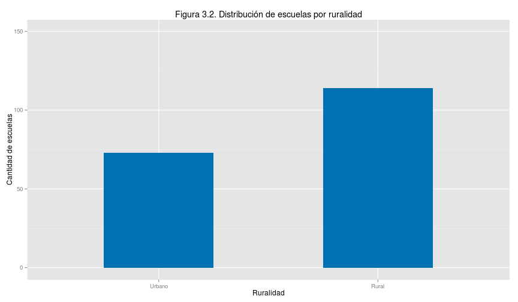 
Las escuelas participantes de Panamá están principalmente concentradas en el promedio del índice socioeconómico y cultural (0.0) de toda la región latinoamericana, en cuanto el índice promedio de sus alumnos.  

 
Las dos figuras siguientes muestran la cantidad de estudiantes participantes por edad en tercer grado y sexto grado.  

[JEV2IBG: supongo que la siguiente grafica es de 6to grado.  falta 3er grado? Incluirla primero]

[JEV2IBG: usar como título "Número de estudiantes de sexto grado por edad"]

 

|                | porcentaje|
|:---------------|----------:|
|10 años o menos |  0.5298013|
|11 años         | 30.6754967|
|12 años         | 46.6490066|
|13 años         |  8.3973510|
|14 años         |  3.0728477|
|15 años o mas   |  1.5894040|
|NA              |  0.0000000|
|NA's            |  9.0860927|

[JEV2IBG: podríamos usar porcentajes en el eje Y en lugar de cantidad?]

 

|     | porcentaje|
|:----|----------:|
|Niña |  46.437086|
|Niño |  44.476821|
|NA's |   9.086093|
[ORGNR PORCENTAJE AFIRMATIVO]% de los alumnos indicó pertenecer a alguna etnia "originaria" y [ORGNR PORCENTAJE N/A]% no contestó o no supo responder.   

[JEV2IBG: podríamos usar porcentajes en el eje Y en lugar de cantidad?]
[JEV2IBG: agregar tílde al término "índigena" en la leyenda del eje X]

 

|     | porcentajes|
|:----|-----------:|
|No   |    71.92053|
|Si   |    11.65563|
|NA's |    16.42384|

## 4. Comparacion con America Latina
### 4.1 Puntaje vs ingreso per capita (3er grado, 6to grado)

Comparar resultados entre países es útil pero no lo principal. Es un error considerar la evaluación Terce como una competencia por el mayor puntaje promedio.   Sus resultados son sólo parte de la evidencia e información de cuánto logran aprender los alumnos.  Su valor principal está en intentar comprender qué acciones se pueden tomar para que la educación le de las mejores oportunidades de vida a los alumnos y países.   

Entre los países participantes Chile obtuvo el mejor resultado seguido de Costa Rica y México.  Costa Rica sirve de ejemplo que un país de escala y ubicación como la nuestra puede obtener mejores resultados.     Las figuras [NO. 3ero PTJ VS PIB/CAP] Y [NO. 6ero PTJ VS PIB/CAP] siguientes muestran que Panamá obtiene resulados inferiores a lo esperado para su producto interno bruto per cápita.  Estos resultados son consistentes con otras pruebas internacionales en las que ha participado Panamá (pruebas Serce 2006 y Pisa 2009). El efecto es más pronunciado para sexto grado que para tercer grado.   Parece razonable esperar que con la prioridad social necesaria, la riqueza nacional nos permita lograr al menos los resultados esperados.   

 

 

### 4.2 Desempeño en logros de aprendizaje

Más relevante en primera instancia es saber si nuestros niños y niñas logran un aprendiza útil para su propio bienestar y la prosperidad de la nación. La evaluación Terce define cuatro niveles de logros de aprendizaje.  El nivel 1 se considera insuficiente preparación y el nivel 4 la mejor preparación educativa para la vida esperada de los participantes.  Corresponden a dominios progresivamente más eficaces del área de conocimiento y están explicados en el apéndice [No. APENDICE NIVELES].  

[22?]% de nuestras niñas y niños muestran un logro de aprendizaje en el nivel inferior, o nivel 1, considerado inadecuado como preparación para su vida.   Para ciencias son [45?]% y para matemáticas [65?]%.   La figura [No. NIVELES] muestra como se comparan los porcentajes de alumnos de Panamá para cada nivel con los del resto de los alumnos de otros países. 

[JEV2IBG: título "Niveles de logros de aprendizaje por área de conocimiento, comparados"]
[JEV2IBG: cambiar la leyenda del eje Y a "Porcentaje de alumnos"]
[JEV2IBG: cambiar la leyenda del eje X a "Niveles de logro de aprendizaje"]
[JEV2IBG: verificar que las leyendas del eje X y Y empiezan con mayúscula]
[JEV2IBG: eliminar del margen derecho la etiqueta "countryp"]
[JEV2IBG: si es posible, usar colores menos intensos para las barras, especialmente el rojo (asusta ;)]

 

## 5 Características de los resultados en Panamá
### 5.1 Logros por Genero 

Las niñas obtuvieron mejores resultados que los niños en lectura de tercer grado, sexto grado y en ciencias de sexto grado. En matemáticas, aunque las niñas obtuvieron mejor resultado, la diferencia es tan pequeña que no permite afirmar que sus logros de aprendizaje son mejores.   

Las figuras [No. PTJ POR GNR] y [No. STD DEV GNR] comparan los puntajes promedio obtenidos por cada género, la primera, y la diferencia entre niños y niñas, la segunda, expresada en desviaciones estándar 

[JEV2IBG: cambiar la leyenda del eje Y a "Puntaje promedio"]
[JEV2IBG: cambiar la leyenda del eje X a "Género"] 
[JEV2IBG: eliminar del margen derecho la etiqueta "DQASIT02"] 

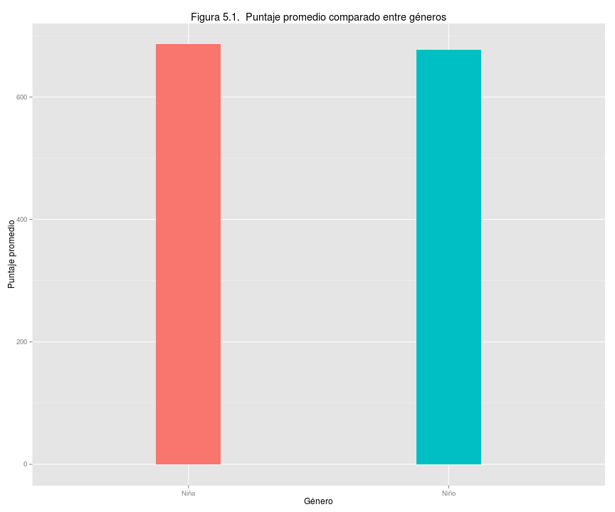 
[JEV2IBG: esta gráfica debería ser una sola barra de valores positivos a favor de las niñas, indicando la diferencia entre el puntaje de niñas menos el de niños expresada en desviaciones estándar]

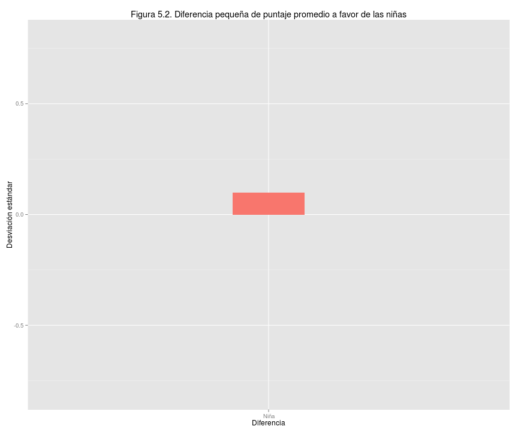 

### 5.2 Logros de grupos originarios

Los alumnos que se reconocen como miembros de etnias originarias logran menor puntaje que los que no se consideran miembros.  Las figuras [No. PTJ POR ETN] y [No. STD DEV ETN] comparan los puntajes promedio y diferencia según si la alumna o alumno se reconoce o no como miembro de grupos originarios.    

[JEV2IBG: título "Puntaje promedio comparado según pertenencia a grupos originarios"]
[JEV2IBG: cambiar la leyenda del eje Y a "Puntaje promedio"]
[JEV2IBG: cambiar "DQA6IT06" en la leyenda del eje X por "Etnia"] 
[JEV2IBG: cambiar las etiquetas en el eje X por "No originarios" y "Originarios"]
[JEV2IBG: eliminar del margen derecho la etiqueta "DQA6IT06"] 
[JEV2IBG: como procesaste aquellos que respondieron N/A]

 

 
Adicionalmente, el índice socioeconómico y cultural muestra menor relación con el puntaje promedio obtenido para alumnos que se consideran miembros de grupos originarios que para aquellos que no.   Esto lo ilustra la figura [No. PTJ VS ISECF ORGN] en la que cada línea muestra la correspondencia entre puntaje promedio obtenido y el índice del alúmno.  La diferencia de puntaje entre alumnos de menor y mayor índices es más pronunciada para alumnos que se declaran no originarios.  

[JEV2IBG: título "Relación entre logros e índice socioeconómico y cultural según etnia"]
[JEV2IBG: cambiar la leyenda del eje Y a "Puntaje promedio"]
[JEV2IBG: cambiar la leyenda del eje X a "Índice socioeconómico y cultural"] 
[JEV2IBG: eliminar del margen derecho la etiqueta "DQA6IT06"] 

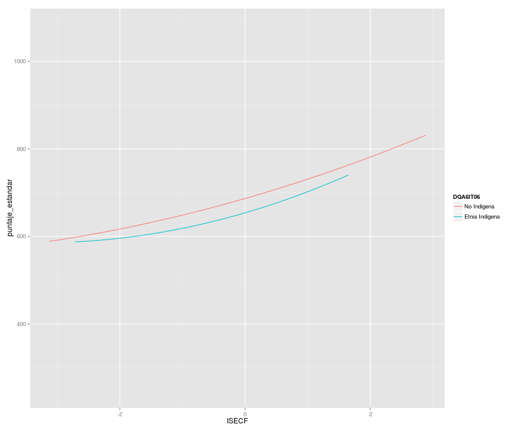 
### 5.3 Logros según tipo de escuela

Las oportunidades de educación y salud muestran un altísimo grado de influencia en el bienestar de un individuo. Cuándo los logros de aprendizaje dependen marcadamente del poder adquisitivo de una persona es difícil argumentar que la sociedad brinda oportunidades justas a todos sus residentes.  En Panamá, la diferencia de logros entre escuelas particulares, escuelas oficiales urbanas y escuelas oficiales rurales es muy marcada.   

Las figuras [No. PTJ VS ISEC 3ero] y [No. PTJ VS ISEC 6to] muestran para cada escuela participante de Panamá el puntaje promedio obtenido por sus alumnos en el eje vertical y el índice socioeconómico y cultural promedio de sus alumnos en el eje horizontal. Las líneas representan el puntaje promedio de alumnos de todos los países, incluyendo Panamá, en la prueba Terce y el puntaje debajo del cual se define el nivel 1 de aprendizaje, considerado inadecuado para las situaciones de vida esperadas. [PORCENTAJE NIVEL 1]% de las niñas y niños obtuvieron puntajes correspondientes al nivel 1.   

 

[JEV2IBG: las 2 figuras aqui son las versiones de 3ero y 6to grado de la figura 1 en el resumen ejecutivo]
[JEV2IBG: Pregunta: las figuras de puntaje vs isec por escuela pueden indcar un solo puntaje para definir el nivel 1 de todas las áreas de conocimiento, o el puntaje que define el nivel 1 cambia de área a área]

Una observación de suma importancia es que hay un grupo de escuelas oficiales rurales cuyos logros promedio son iguales o superiores a los de las escuelas oficiales urbanas a pesar de tener índices socioeconómicos y culturales menores en promedio. Estas escuelas probablemente tienen lecciones que aportar en cuanto a cómo mejorar los logros educativos en las áreas menos favorecidas del país.    

[JEV2IBG: titulo "logros de aprendizaje de escuelas particulares y oficiales, urbanas y rurales, tercer grado]
[JEV2IBG: cambiar la leyenda del eje Y a "Puntaje promedio"]
[JEV2IBG: cambiar la leyenda del eje X a "Índice socioeconómico y cultural"]
[JEV2IBG: intentar incluir los niveles de aprendizaje, o al menos el nivel 1]

[JEV2IBG: titulo "logros de aprendizaje de escuelas particulares y oficiales, urbanas y rurales, sexto grado]
[JEV2IBG: cambiar la leyenda del eje Y a "Puntaje promedio"]
[JEV2IBG: cambiar la leyenda del eje X a "Índice socioeconómico y cultural"]
[JEV2IBG: intentar incluir los niveles de aprendizaje, o al menos el nivel 1]

## 6 Relacion entre desempeño y factores típicamente asociados al proceso de aprendizaje
## 6.1 ¿Qué son factores asociados?

Son características o circumstancias cuantificables que podrían mostrar relación con los logros de aprendizaje.  El que muestren relación no significa por si solo que sea garantía ni causa de los logros, pero sugiere que es conveniente explorar la relación.   

## 6.2 Logros según factores asociados a la escuela

[JEV2IBG: esta grafica la podemos suprimir porque la siguiente cuenta la misma historia en más detalle]

 
Los logros de aprendizaje, evaluados a través de los puntajes Terce, muestran una relación clara con La infraestructura de la escuela.  Esto por si solo no permite concluir que una mejor infraestructura genera mejores logros; por ejemplo, una mejor situación socioeconómica y cultural da la oportunidad de asistir a una mejor escuela tanto en infraestructura como en eficacia, sin que sea claro cual es el factor principal que logra esa eficacia. Comprender la relación entre infraestructura y logros requiere mayor análisis para determinar hasta que punto la infraestructura influye en los logros. 

 
La figura siguiente ilustra que no se ve una relación clara entre la violencia del entorno escolar y los logros de aprendizaje.   

 
Tampoco se ve una relación clara entre el capital social en el entorno escolar y los logros de aprendizaje. 

 
Sí se nota una relación entre la autonimía administrativa de la escuela y los logros de aprendizaje.  [JEV2IBG: creo que en esta figura el signo del indice de autonomiase invirtio: pensaria que las escuelas particulares tienen mas autonomia.  Sera un indice de "falta de autonomia"?]

 
Hay algún grado de relación entre la autonomía académica y los logros de aprendizaje.   [JEV2IBG: tambien pienso que se invirtio el signo del indice de autonomia academica]

 
Hay relación clara entre la calidad de ambiente laboral en la escuela (Director) y los logros de aprendizaje. 

### 6.3 Factores Asociados de Profesores

#### 6.3.1 Índices

 
 
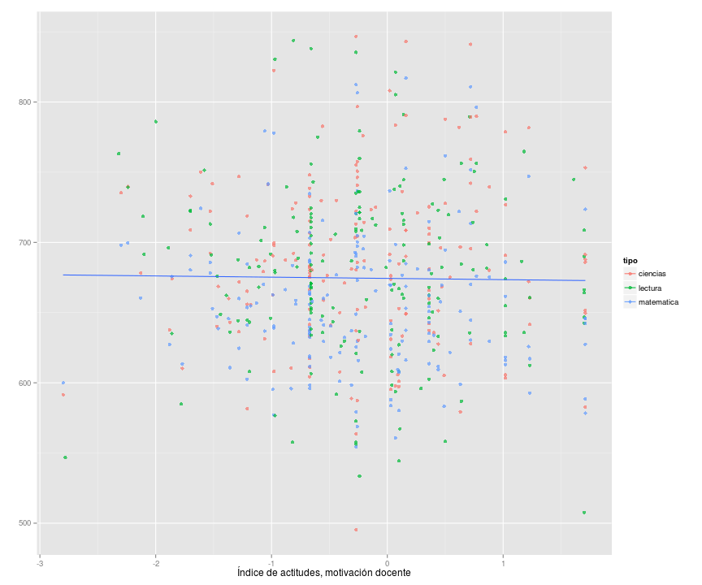 
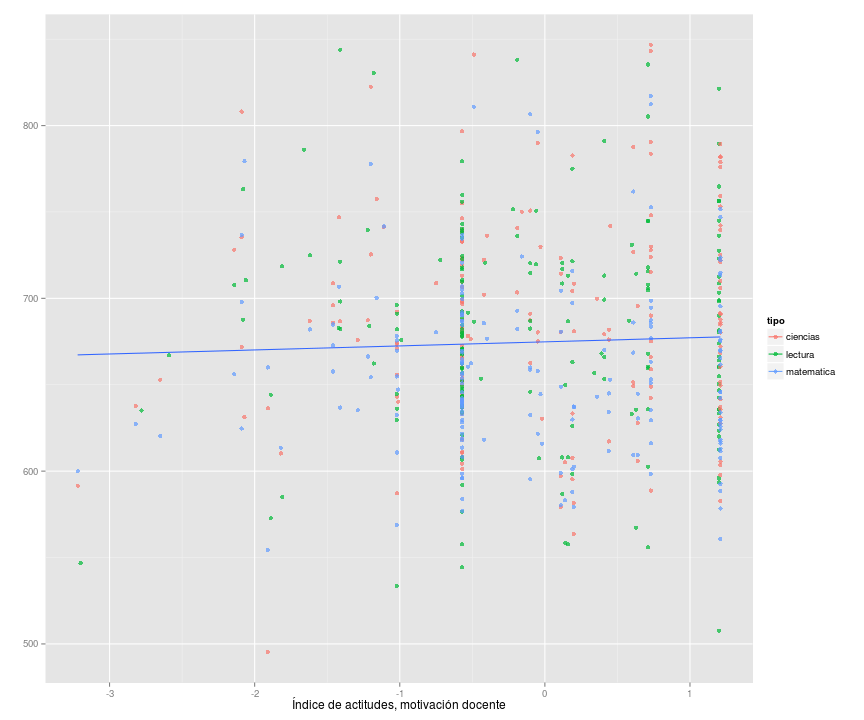 
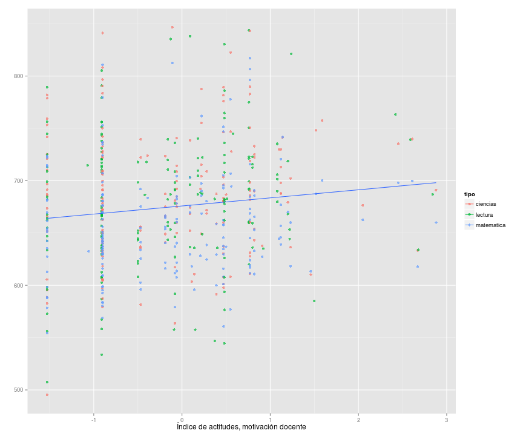 
 
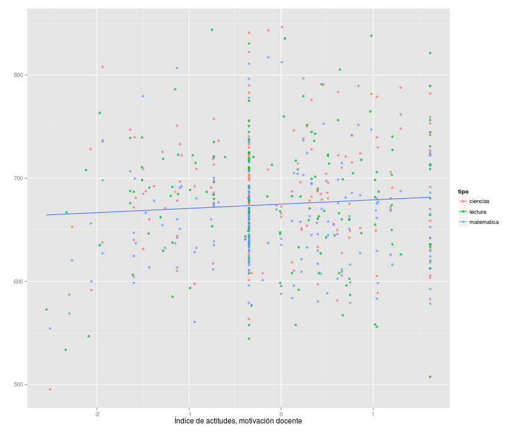 
 

#### 6.3.2 Datos de Profesores
 

 

 

 

 

 

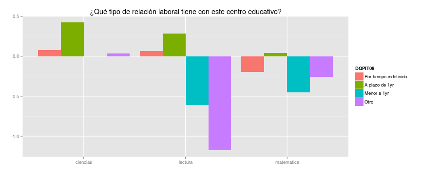 

 

 

 

 

 

 

### 6.4 Factores Asociados Familia

#### 6.4.1 Indices

 
 
 
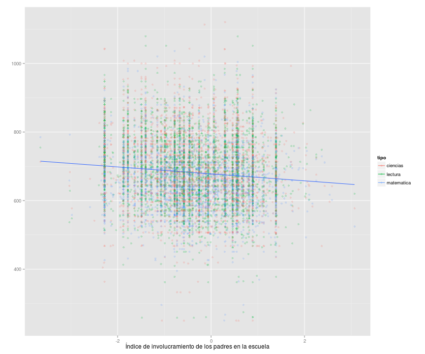 
 
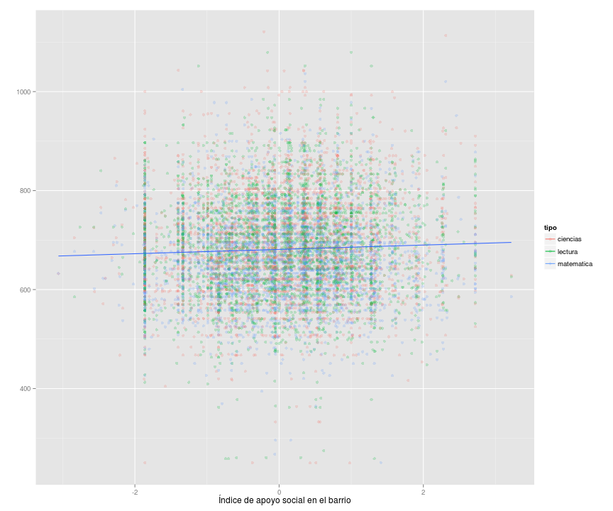 
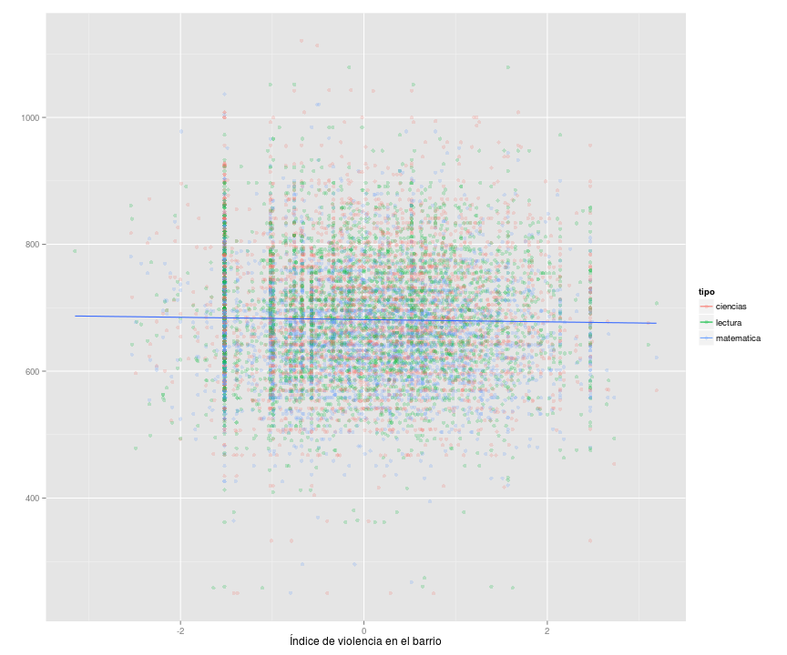 

#### 6.4.2 Características de interés en las familias

 

Estos siguientes factores estan muy asociados al indice sociocultural.

 
 
 
 
 
 
 

 

 

 

 

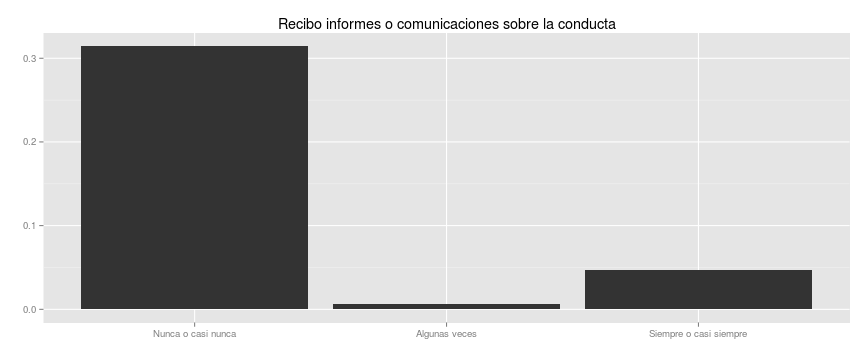 

 

 

 
