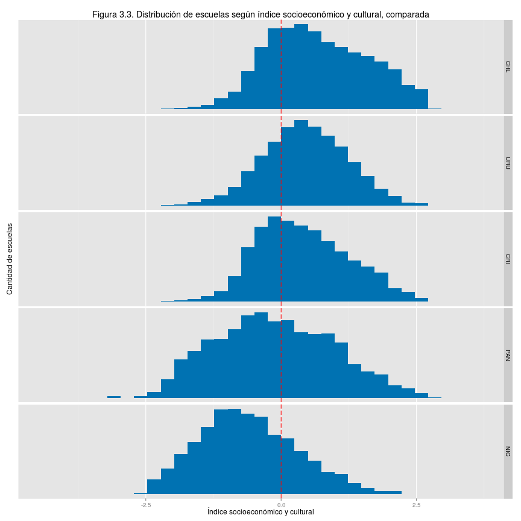
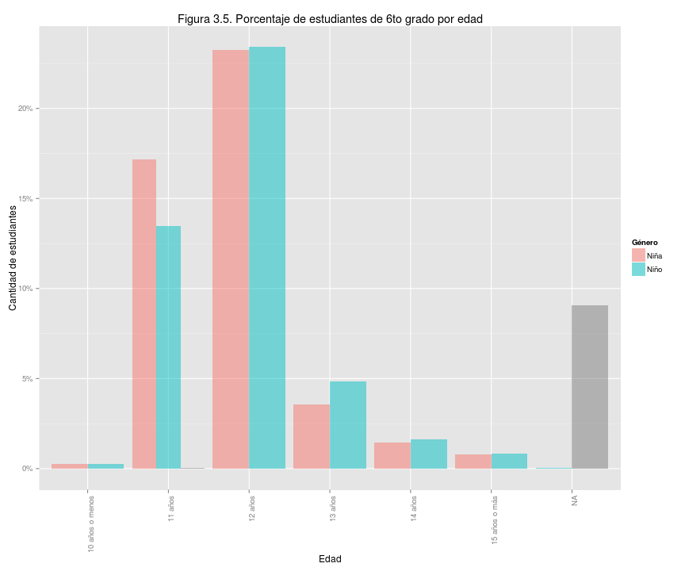
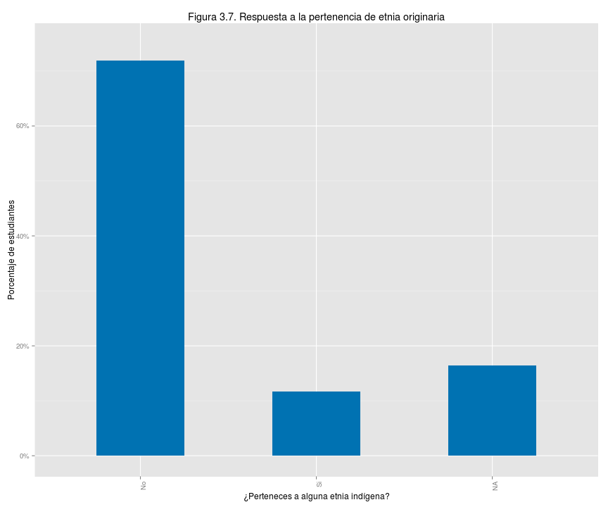
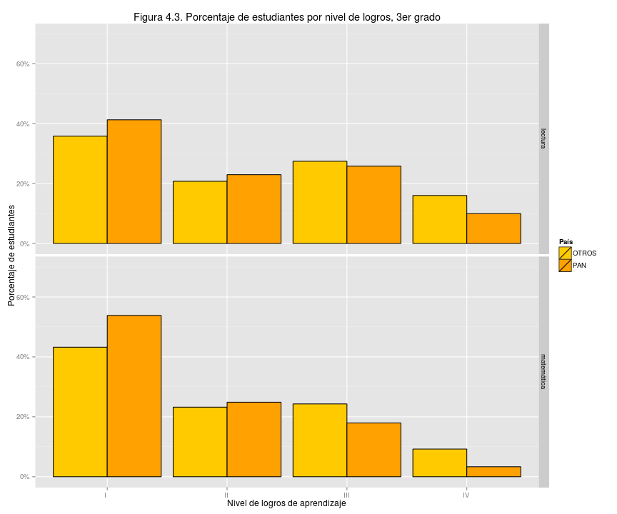
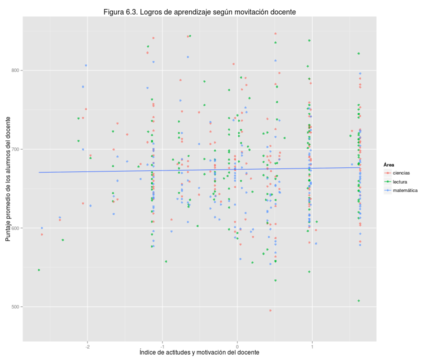
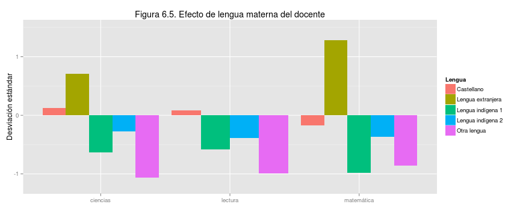

## Presentación de resultados de Panamá en el Tercer Estudio Regional Comparativo y Explicativo (TERCE) del Laboratorio Latinoamericano de Evaluación de la Calidad de la Educación (LLECE)

### 1. Resumen

Hay grandes diferencias de oportunidades para nuestra niñez en materia educativa.   El Tercer Estudio Regional Comparativo y Explicativo (Terce, 2013) está diseñado para evaluar los logros educativos de los estudiantes mediante el puntaje obtenido en preguntas sobre lenguaje, matemáticas y ciencias.  Ese estudio muestra que las diferencias de logros entre nuestros alumnos reflejan en forma marcada sus diferencias socioeconómicas y culturales, es decir, la inequidad.    

Este documento de divulgación es principalmente un llamado público a analizar los datos Terce disponibles en la página Web de Meduca y un reto a la voluntad nacional por crear un sistema educativo justo, capaz de brindar igualdad de oportunidades para todos.   

En el Terce las escuelas particulares mostraron mejores logros que las oficiales.  De nuestras escuelas oficiales, muchas muestran niveles de aprendizaje poco adecuados para la vida esperada de sus alumnos, especialmente entre las rurales. Esta divulgación se enfocará en explorar el efecto de factores del entorno que pueden incidir en los resultados educativos.  

Las diferencias de logros y su estrecha relación con las condiciones de vida se pueden ver en la figura 1.1 por ejemplo. Cada pequeño círculo representa el puntaje promedio y el promedio del índice socioeconómico y cultural de los alumnos de una escuela. A mayor índice, más cómoda la situación de vida.  El tamaño de cada círculo es proporcional al número de alumnos en la escuela.  

 

Más importante que lamentar las debilidadeds observadas en estos logros es enfocarnos en oportunidades de mejora. Por ejemplo, algunas escuelas oficiales rurales con bajo índice socioeconómico y cultural lograron puntajes superiores al promedio internacional de 700 puntos en el Terce y superiores al de las escuelas oficiales urbanas.   Estas escuelas tienen lecciones importantes para nuestro sistema educativo.  Enfocarnos mejorar es el mensaje que desea plantar este documento.   

En el contexto latinoamericano, Panamá obtuvo resultados por debajo de lo esperado para sus recursos.  La figura 1.2 confirma la tendencia conocida de que los alumnos de países con mayor producto interno bruto (PIB) per cápita obtienen mejores logros. Panamá obtuvo 39 puntos por debajo de la línea que modela los logros según el PIB per cápita de los países.   Estos resultados son similares a los que obtuvimos en evaluaciones internacionales previas: Serce 2006, Sineca 2008 y Pisa 2009. Es decir, Panamá puede y debe mejorar significativamente sus logros de aprendizaje.      

 

### 2. Introducción 

La educación nacional debe servir como un gran equalizador hacia las mejores oportunidades de bienestar para todos, que renueve en cada generación las posibilidades de realización personal y de un país próspero sostenible.  

Nuestro sistema educativo dista mucho de este ideal.   Afortunadamente es posible evaluar los logros del sistema con métodos científicos que permitan recomendaciones confiables de cómo mejorar.   Una cultura que valora la información puede aprender de sus propios errores.    

Evaluaciones como el Terce tienen limitaciones propias del esquema de ítems, o preguntas que utilizan, y habrá que perfeccionar los métodos de evaluación.  Sin embargo el Terce y otras evaluaciones estandarizadas son insumos valiosos de política educativa, especialmente cuando se analizan con conocimiento íntimo del contexto local.    

Esta es la segunda divulgación en torno al Terce y nuestro objetivo es mostrar la relación entre los logros obtenidos y ciertos factores de contexto que pueden ayudar a comprender la dinámica educativa, sin intentar ser exhaustivos.  Previamente, en 2014, Unesco y Meduca divulgaron la comparación de resultados entre el Segundo Estudio Regional Comparativo y Explicativo, o Serce 2006, y el Terce 2013.   

Con esta divulgación Meduca invita a todos los interesados, especialmente aquellos familiarizados con métodos de análisis de evaluaciones educativas, a iniciar un gran movimiento de exploración de los datos educativos disponibles, especialmente los resultados de las evaluaciones Serce 2006, Sineca 2008, Pisa 2009 y Terce 2013.   

### 3. Terce y la participación de Panamá

El Laboratorio Latinoamericano de Evaluación de la Calidad de la Educación, Llece, es una organización con sede en Chile que  diseña y administra evaluaciones a nivel regional.  Terce es la tercera evaluación.   Cada país revisa y edita los ítems o preguntas de la evaluación para asegurar que terminan siendo apropiadas para su contexto nacional.     

El Terce evaluó 15 países de América Latina, indicados en la figura 1.2 de países, y a la región de Nuevo León de México.  El estudio valuó lectura de tercero y sexto grado, escritura de tercero y sexto grado, matemáticas de tercero y sexto grado, y ciencias de sexto grado.  Los resultados de escritura de Panamá serán sujeto de una divulgación posterior.   

La muestra de alumnos por país es representativa hasta donde se interese cada país.  Por ejemplo, la muestra que gestionó Panamá permite comparar al sector oficial y particular, a los resultados por género y otros aspectos, pero no permite comparaciones confiables entre provincias o comarcas.  Comprendemos que en el futuro debemos ampliar los aspectos que puedan ser explorados robustamente en las evaluaciones educativas del país.    

El Terce incluyó cuestionarios a los alumnos, docentes y hogares de cada alumno sobre su entorno y situación individual para poder explorar el impacto de ciertos factores que podrían mostrar relación con los logros de aprendizaje, conocidos como factores asociados. Por ser conciso, este documento sólo incluyó algunos de los varios factores disponibles con el fin de abrir el tema a debate, sin intentar profundizar en sus implicaciones pues esas conclusiones deben ser resultado de un debate académico riguroso. 

187 escuelas participaron en la prueba Terce representando cuatro tipos:  oficial urbana 27, oficial rural 113, particular urbana 46y particular rural 1.  En ellas participaron 3631 estudiantes de tercer grado y 3775 estudiantes de sexto grado.

 

 
Las escuelas de Panamá representan condiciones típicas de América Latina como muestra la figura 3.3 que compara nuestra situación con la de cuatro países de interés.  La distribución de nuestras escuelas según el índice socioeconómico y cultural promedio de sus alumnos se concentra cerca del valor promedio de la región, representado por el valor 0.0 del índice. 

 

Las edades de los participantes de tercero y sexto grado muestran que un grupo importante de ellos está sobre la edad esperada para su grado.    

 

 

Las figuras 3.6 y 3.7 muestran las respuestas de los alumnos a las preguntas sobre el género al que pertenecen y si pertenecen a una etnia originaria de Panamá.  No se logró respuesta válida de un número pequeño pero importante de esos alumnos.   

 

 

## 4. Comparación con América Latina

Comparar resultados entre países es útil pero no lo principal. El Terce no es una competencia por el mayor puntaje promedio sino un esfuerzo por comprender la dinámica educativa para tomar acción.  Los comentarios siguientes toman ese punto de vista. 

Entre los países participantes Chile obtuvo el mejor resultado seguido de Costa Rica y México, como muestran las figuras 4.1 y 4.2 para tercero y sexto grado respectivamente. La figura 4.2 es la figura 1.2 repetida aquí por conveniencia.  Panamá obtiene resultados de 34 o 39 puntos por debajo de lo esperado, en tercero y sexto grado respectivamente, para su PIB per cápita.  Esta tendencia también se notó en las evaluaciones Serce 2006 y Pisa 2009. 

Costa Rica sirve como ejemplo de que un país de escala y ubicación similar a la nuestra puede obtener mejores logros.  Con esta observación y nuestra riqueza nacional parece razonable confiar que podemos mejorar resultados si le damos la prioridad social necesaria a nuestra educación.   

 
 

Más relevante que nuestra posición relativa es saber si nuestros niños y niñas logran un aprendiza útil para su propio bienestar y la prosperidad de la nación. La evaluación Terce define cuatro niveles de logros de aprendizaje.  El nivel 1 se considera poca  preparación para la vida esperada de los participantes y el nivel 4 la mejor preparación.  Corresponden a un dominio progresivamente más eficaz del área de conocimiento de interés.  

La definición de los niveles se basa en una escala de habilidades y conocimientos por área de conocimiento y grado, y asociada a rangos de puntajes por area y grado.  La publicación "Primera entrega de resultados terce" de la Unesco, Oficina Regional de Santiago, diciembre 2014, disponible en el sitio web llece.org contiene la descripcion de los niveles (capítulo 2, niveles de desempeño SERCE) y es igual a la del Serce 2006 por comparabilidad. 

Salvo en lecutra de sexto grado, cerca de 40% de nuestras niñas y niños obtienen logros de aprendizaje de nivel 1 y en matemáticas de sexto grado es más del 60%.  Las figuras 4.3 y 4.4 muestran los porcentajes de alumnos de Panamá en cada nivel comparados con los del resto de los otros países. Este es, quizás, la información más relevante sobre nuestra situación.   

 

 

## 5 Resultados según género, etnia originaria y nivel socioeconómico y cultural

Las niñas obtuvieron ligeramente mejores resultados que los niños en lectura de tercero y sexto grado, matemáticas de tercero y sexto grado y ciencias de sexto grado, pero la ventaja no es clara.   La figura 5.1 compara los logros combinando las tres áreas de conocimiento.  

 

Los alumnos que se reconocen como miembros de etnias originarias logran menor puntaje que los que no se consideran miembros.  La figuras 5.3 compara los logros combinando las tres áreas de conocimiento y la diferencia es clara.      

 

Otro aspecto importante de equidad o falta de ella tiene relación con las condiciones de vida.  La educación y la salud son determinantes para el bienestar de un individuo. Cuando los logros de aprendizaje dependen marcadamente del nivel socioeconómico y cultural de una persona es difícil argumentar que la sociedad brinda oportunidades por igual.  Este es el caso de Panamá.     

Las figuras 5.5 y 5.6 muestran el puntaje promedio, combinando todas las áreas de conocimiento, obtenido por los alumnos de nuestras escuelas y el índice socioeconómico y cultural promedio de esos alumnos.  La figura 5.6 es la misma figura 1.1 repetida aquí por conveniencia.  El puntaje promedio internacional en el Terce fue 700 puntos para todas las áreas de conocimiento. 

La línea azul en estas figuras muestra que los logros reflejan en forma apreciable las diferencias socioeconómicas y culturales que se vive en las escuelas. A la vez, conviene notar que un grupo de escuelas oficiales rurales obtuvieron logros superiores al promedio internacional e incluso algunas superan en sexto grado las escuelas oficiales urbanas a pesar de tener índices socioeconómicos y culturales apreciablemente menores. Estas escuelas deben convertirse en sujeto de estudio y fuente de lecciones aprendidas.   

 

 

## 6 Otros factores asociados de interés

Los factores asociados son características o circumstancias cuantificables que podrían mostrar relación con los logros de aprendizaje.  Para ser conciso, este documento muestra sólo una selección de factores que pueden resultar de interés, dejando fuera otros que seguramente también serán de interés y que deben ser explorados en estudios posteriores.   

El que un factor muestre relación con los logros de aprendizaje no es prueba de que el factor sea la causa de los logros o que los garantice.   A modo de ejemplo, una mejor situación socioeconómica y cultural da la oportunidad de asistir a una mejor escuela tanto en infraestructura como en eficacia, sin que sea claro cuál de esos tres factores es el mayor responsable por los logros de aprendizaje observados.  En forma similar, varios de los factores explorados en esta sección tienen relación potencial con el índice socioeconómico y cultural.   Las relaciones observadas deberán pasar por un debate académico más extenso para llegar a conclusiones confiables.  

La figura 6.1 muestra el efecto del índice de infraestructura de la escuela, construido con base en cuestionarios al respecto. La relación es marcada: a mejor infraestructura mayor puntaje promedio de las escuelas.   Por supuesto, este es uno de los factores que puede estar reflejando el índice socioeconómico y cultural de los alumnos de las escuelas.   

 
La figura 6.2 sí muestra relación entre la autonomía administrativa de la escuela y los logros de aprendizaje de sus alumnos.  En este caso, el índice de autonomía actúa como un ranking: a menor índice mayor autonomía.   

 

Curiosamente, los resultados del Terce muestran poca relación entre un índice de actitudes y motivación de docentes y los logros de aprendizajes.  La figura 6.3 muestra que aunque el índice varía desde valores -2 a +2, el puntaje promedio entre todas las áreas de conocimiento se mantiene cerca de 670 puntos, como indíca la línea azul.  Es decir, el índice hace poca diferencia.  Esta observación seguramente será sujeto de mayor validación y análisis.   

 
La edad de los docentes parece hacer una diferencia en los logros de aprendizaje.    

 
La lengua [MATERNA] del docente también paree tener relación con los logros de aprendizaje y el efecto positivo es muy pronunciado en matemáticas cuando la lengua [MATERNA] es extranjera.  Este es uno de los efectos más significativos entre los distintos factores.  La siguiente figura 6.5 ilustra el efecto de la lengua [MATERNA] para las tres áreas de conocimiento indicadas. En evaluación de aprendizaje, el efecto se expresa típicamente como desviaciones estándar del puntaje promedio; en este caso el promedio obtenido por los alumnos de Panamá.  Esta desviación es una medida estándar de la diferencia estadística.   

 
La jornada completa también parece tener un efecto positivo importante en el logro de los aprendizajes.   

 
El nivel educativo del docente tiene un efecto positivo.   [AVERIGUAR SIGNIFICADO DE VALORES]

 
Los incentivos económicos al docente muestran un efecto positivo en los logros de aprendizaje.  

 

Las actividades recreativas con la familia también muestran un efecto positivo. En este caso los círculos en la figura corresponden al puntaje de un alumno en un área de conocimiento. [CONFIRMAR SI ES RANKING O MEDICION] 

 
El uso de computador educativo parece favorable para logros de aprendizaje.  Los círculos corresponden al puntaje de un alumno en un área de conocimiento.  [VERIFICAR QUE NO ES UN RANKING]

 

