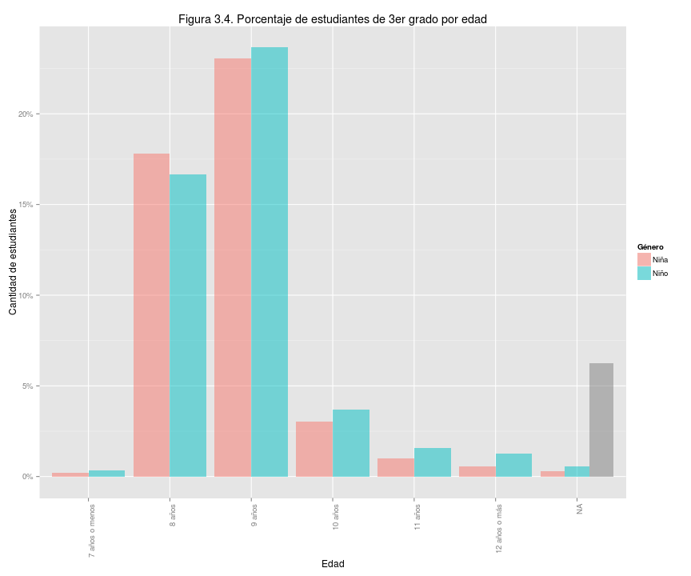
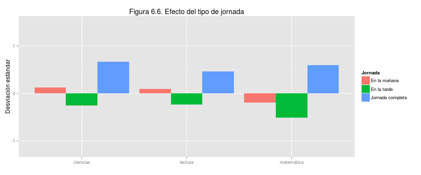
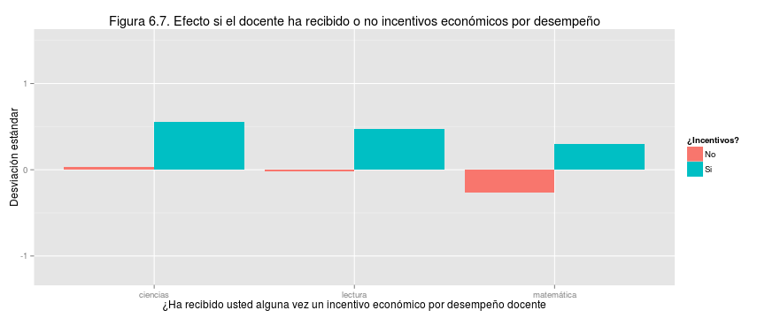

## Presentación de resultados de Panamá en el Tercer Estudio Regional Comparativo y Explicativo (TERCE) del Laboratorio Latinoamericano de Evaluación de la Calidad de la Educación (LLECE)

### 1. Resumen

Hay grandes diferencias de oportunidades para nuestra niñez en materia educativa.   El Tercer Estudio Regional Comparativo y Explicativo (Terce, 2013) está diseñado para evaluar los logros educativos de los estudiantes mediante el puntaje obtenido en preguntas sobre lenguaje, matemáticas y ciencias.  Este estudio muestra que las diferencias de logros entre nuestros alumnos reflejan en forma marcada sus diferencias socioeconómicas y culturales, es decir, la inequidad.    

Este documento de divulgación es principalmente un llamado público a analizar los datos Terce disponibles en la página Web de Meduca y un reto a la voluntad nacional por crear un sistema educativo justo, capaz de brindar igualdad de oportunidades para todos.   

En el Terce las escuelas particulares mostraron mejores logros que las oficiales.  De nuestras escuelas oficiales, muchas muestran niveles de aprendizaje poco adecuados para la vida esperada de sus alumnos, especialmente entre las rurales. Esta divulgación se enfocará en explorar el efecto de factores del entorno que pueden incidir en los resultados educativos.  

Las diferencias de logros y su estrecha relación con las condiciones de vida se pueden ver en la figura 1.1 por ejemplo. Cada pequeño círculo representa el puntaje promedio y el índice socioeconómico y cultural promedio de los alumnos de una escuela. A mayor índice, más cómoda la situación de vida.  El tamaño de cada círculo es proporcional al número de alumnos en la escuela.  

 

Más importante que lamentar las debilidadeds observadas en estos logros es enfocarnos en oportunidades de mejora. Este es un mensaje central de este documento.  Por ejemplo, algunas escuelas oficiales rurales con bajo índice socioeconómico y cultural lograron puntajes superiores al promedio internacional de 700 puntos en el Terce y superiores al de las escuelas oficiales urbanas.   Estas escuelas tienen lecciones importantes para nuestro sistema educativo.     

En el contexto latinoamericano, Panamá obtuvo resultados por debajo de lo esperado para sus recursos.  La figura 1.2 confirma la tendencia conocida de que los alumnos de países con mayor producto interno bruto (PIB) per cápita obtienen mejores logros. Panamá obtuvo 39 puntos por debajo de la línea que modela los logros según el PIB per cápita de los países.   Estos resultados son similares a los que obtuvimos en evaluaciones internacionales previas: Serce 2006 y Pisa 2009. Es decir, Panamá puede y debe mejorar significativamente sus logros de aprendizaje.      

 

### 2. Introducción 

La educación nacional debe servir como un gran equalizador hacia las mejores oportunidades de bienestar para todos, que renueve en cada generación las posibilidades de realización personal y de un país próspero sostenible.  

Nuestro sistema educativo dista mucho de este ideal.   Afortunadamente es posible evaluar los logros del sistema con métodos científicos que permitan recomendaciones confiables de cómo mejorar.   Una cultura que valora la información puede aprender de sus propios errores.    

Evaluaciones como el Terce tienen limitaciones propias del esquema de ítems, o preguntas que utilizan, y habrá que perfeccionar los métodos de evaluación a disposición de Panamá.  Sin embargo el Terce y otras evaluaciones estandarizadas son insumos valiosos de política educativa, especialmente cuando se analizan con conocimiento íntimo del contexto local.    

Esta es la segunda divulgación en torno al Terce y nuestro objetivo es mostrar la relación entre los logros obtenidos y ciertos factores de contexto que pueden ayudar a comprender la dinámica educativa, sin intentar ser exhaustivos.  Previamente, a fines de 2014, Unesco y Meduca divulgaron la comparación de resultados entre el Segundo Estudio Regional Comparativo y Explicativo, o Serce 2006, y el Terce 2013.   

Con esta divulgación Meduca invita a todos los interesados, especialmente aquellos familiarizados con métodos de análisis de evaluaciones educativas, a iniciar un gran movimiento de exploración de los datos educativos disponibles, como son los resultados de las evaluaciones Serce 2006, Sineca 2008, Pisa 2009 y Terce 2013.   

### 3. Terce y la participación de Panamá

**Muestra evaluada.** El Laboratorio Latinoamericano de Evaluación de la Calidad de la Educación, Llece, es una red de sistemas de evaluación educativa con sede en Chile coordinado por la Unesco que  diseña y administra evaluaciones a nivel regional.  El Terce es la tercera evaluación.   Cada país revisa y edita los ítems o preguntas de la evaluación para asegurar que terminan siendo apropiadas para su contexto nacional.     

El Terce evaluó 15 países de América Latina indicados en la figura 1.2 y la región de Nuevo León de México, que no aparece en esa figura de países.  El estudio evaluó lectura de tercero y sexto grado, escritura de tercero y sexto grado, matemáticas de tercero y sexto grado, y ciencias de sexto grado.  Los resultados de escritura de Panamá serán sujeto de una divulgación posterior.   

La muestra de alumnos por país es representativa hasta donde se interese cada país.  Por ejemplo, la muestra que gestionó Panamá permite comparar al sector oficial y particular, a los resultados por género y a otros aspectos, pero no permite comparaciones confiables entre provincias o comarcas.  Comprendemos que en el futuro debemos ampliar los aspectos que puedan ser explorados robustamente en las evaluaciones educativas del país.    

El Terce incluyó cuestionarios a los alumnos, docentes, directores de escuela y hogares de cada alumno sobre su entorno y situación para poder explorar el impacto de ciertos factores que podrían mostrar relación con los logros de aprendizaje, conocidos como factores asociados. Por ser conciso, este documento sólo presenta algunos de los varios factores asociados disponibles con el fin de abrir el tema a debate, sin intentar profundizar en más implicaciones pues las conclusiones finales deben ser resultado de un debate académico riguroso. 

Un total de 187 escuelas participaron en la prueba Terce representando cuatro tipos:  oficial urbana 27, oficial rural 113, particular urbana 46 y particular rural 1.  En ellas participaron 3,631 estudiantes de tercer grado y 3,775 estudiantes de sexto grado.

 

 
**Condición socioeconómica y cultural de las escuelas.** Las escuelas de Panamá representan condiciones típicas de América Latina como muestra la figura 3.3 que compara nuestra situación con la de cuatro países de interés.  La distribución de nuestras escuelas según el índice socioeconómico y cultural promedio de sus alumnos se concentra cerca del valor promedio de la región, representado por el valor 0.0 del índice socioeconómico y cultural. 

 

**Edad, género y etnia.** Las edades de los participantes de tercero y sexto grado muestran que un grupo importante de ellos está sobre la edad esperada para su grado.    

 

 

Las figuras 3.6 y 3.7 muestran las respuestas de los alumnos a las preguntas sobre el género al que pertenecen y si pertenecen a una etnia originaria de Panamá.  No se logró respuesta válida de un número pequeño pero importante de esos alumnos.   

 

 

## 4. Comparación con América Latina

**Logros según PIB per cápita.** Comparar resultados entre países es útil pero no lo principal. El Terce no es una competencia por el mayor puntaje promedio sino un esfuerzo por comprender la dinámica educativa para tomar acción.  Los comentarios siguientes toman ese punto de vista. 

Entre los países participantes Chile obtuvo el mejor resultado seguido de Costa Rica y México, como muestran las figuras 4.1 y 4.2 para tercero y sexto grado respectivamente. La figura 4.2 es la figura 1.2 repetida aquí por conveniencia.  Panamá obtiene resultados de 34 o 39 puntos por debajo de lo esperado, en tercero y sexto grado respectivamente, para su PIB per cápita.  Esta tendencia también se notó en las evaluaciones previas Serce 2006 y Pisa 2009. 

Costa Rica sirve como ejemplo de que un país de escala y ubicación similar a la nuestra puede obtener mejores logros.  Con esta observación y nuestra riqueza nacional parece razonable confiar que podemos mejorar resultados si le damos la prioridad social necesaria a nuestra educación.   

 

 

**Logros de aprendizaje.** Más relevante que nuestra posición relativa es saber si lo que nuestros niños y niñas logran aprender es útil para su propio bienestar y la prosperidad de la nación. La evaluación Terce define cuatro niveles de logros de aprendizaje.  El nivel 1 se considera poca  preparación para la vida esperada de los participantes y el nivel 4 la mejor preparación.  Corresponden a un dominio progresivamente más eficaz del área de conocimiento de interés.  

La definición de los niveles, con sus rangos de puntajes correspondientes, se basa en una escala de habilidades y saberes por área de conocimiento y grado.  La descripción de los niveles está disponible en el sitio web llece.org en la publicación *Primera entrega de resultados terce* de la Unesco, Oficina Regional de Santiago, Chile, diciembre 2014, capítulo 2, niveles de desempeño SERCE, y es igual a la del Serce 2006 por comparabilidad. 

Salvo en lectura de sexto grado, cerca de 40% de nuestras niñas y niños obtienen logros de aprendizaje de nivel 1 y en matemáticas de sexto grado es más del 60%.  Las figuras 4.3 y 4.4 muestran los porcentajes de alumnos de Panamá en cada nivel comparados con los del resto de alumnos. Ésta es, quizás, la información más relevante sobre nuestra situación.   

 

 

## 5 Resultados según género, etnia originaria y nivel socioeconómico y cultural

**Logros según género y etnia.** Las niñas obtuvieron resultados ligeramente mejores que los niños en lectura de tercero y sexto grado, matemáticas de tercero y sexto grado y ciencias de sexto grado, pero la ventaja no es clara.   La figura 5.1 compara los logros combinando las tres áreas de conocimiento.  Los datos excluyen alumnos para los cuales no se pudo obtener respuesta de género válida.     

 

Los alumnos que se reconocen como miembros de etnias originarias logran menor puntaje que los que no se consideran miembros.  La figura 5.2 compara los logros combinando las tres áreas de conocimiento y la diferencia es clara.   Los datos excluyen alumnos para los cuales no se pudo obtener respuesta de etnia originaria válida.    

 

**Logros según condición de escuelas.** Otro aspecto importante de equidad o falta de ella tiene relación con las condiciones de vida.  La educación y la salud son determinantes para el bienestar de un individuo. Cuando los logros de aprendizaje dependen marcadamente del nivel socioeconómico y cultural de una persona es difícil argumentar que la sociedad brinda oportunidades por igual.  Este es el caso de Panamá.     

Las figuras 5.3 y 5.4 muestran el puntaje promedio, combinando todas las áreas de conocimiento, obtenido por los alumnos de nuestras escuelas y el índice socioeconómico y cultural promedio de esos alumnos.  La figura 5.4 es la misma figura 1.1 repetida aquí por conveniencia.  El puntaje promedio internacional en el Terce fue 700 puntos para todas las áreas de conocimiento. 

La línea azul en estas figuras muestra que los logros reflejan en forma apreciable las diferencias socioeconómicas y culturales que se vive en las escuelas. A la vez, conviene notar que un grupo de escuelas oficiales rurales obtuvieron logros superiores al promedio internacional e incluso algunas superaron en sexto grado a las escuelas oficiales urbanas a pesar de tener índices socioeconómicos y culturales apreciablemente menores. Estas escuelas deben convertirse en sujeto de estudio y fuente de lecciones aprendidas.   

 

 

## 6 Otros factores asociados de interés

**Importancia de cautela con los resultados.** Los factores asociados son características o circumstancias cuantificables que podrían mostrar una relación significativa con los logros de aprendizaje.  La información sobre factores fue recopilada durante el Terce usando cuestionarios a los alumnos, docentes, directores de escuelas y familias involucradas. Este documento sólo incluye algunos de los muchos factores que se pueden y deben explorar.  La intención es provocar un debate nacional, no crear una enciclopedia de factores asociados.     

El que un factor muestre relación con los logros de aprendizaje no prueba que sea la causa o síntoma de esos logros.   A modo de ejemplo, una mejor situación socioeconómica y cultural da la oportunidad de asistir a una mejor escuela, con mejor  infraestructura y más eficacia, sin que sea claro cuáles de estos tres factores merece más crédito por los aprendizajes logrados.  El lector debe tener presente que muchos de los factores explorados en esta sección tienen relación potencial con el índice socioeconómico y cultural, por tanto juzgar su importancia requerirá un debate académico más extenso y riguroso.  

**Infraestructura y autonomía.** En las figuras siguientes sobre el entorno escolar, los puntos dentro de la figura representan escuelas y sus tamaños esta vez no son proporcionales al número de alumnos en la escuela.   Las líneas ilustran un modelo líneal de relación entre logros y el factor de interés.  La figura 6.1 muestra el efecto del índice de infraestructura de la escuela. La relación es marcada: a mejor infraestructura mayor puntaje promedio de las escuelas.   Por supuesto, este es uno de los factores que puede estar reflejando el índice socioeconómico y cultural de los alumnos de las escuelas.   

 
La autonomía administrativa de la escuela muestra relación con los logros de aprendizaje de sus alumnos.  El índice en la figura 6.2 procede de un ranking pero expresado con promedio 0: a menor índice mayor autonomía. Así, las escuelas particulares, de mayor autonomía, aparecen en el extremo izquierdo de la figura con los índices más bajos.   

 

**Motivación y edad docente.** En las dos figuras siguientes los puntos corresponden a docentes de sexto grado y muestran el promedio obtenido por sus estudiantes y una característica del profesor: motivación en la figura 6.3 y edad en la figura 6.4. , El color del punto indica el área de conocimiento.  

Curiosamente, se ve poca relación entre la motivación docente y los logros de aprendizajes.  Por ejemplo, en la figura 6.3 el valor de puntaje en la línea que modela la relación logro-motivación no varía mucho de 670 puntos, aunque el índice varía de -2 a +2. Esta observación seguramente será sujeto de mayor validación y análisis.   

 
La edad de los docentes sí parece hacer una diferencia en los logros de aprendizaje.    

 
**Efecto de factores asociados.** Las figuras 6.5 a 6.8 siguientes ilustran el efecto de ciertas características de interés relacionadas con docentes de sexto grado y las jornadas a su disposición.  Por ejemplo, podríamos explorar si el subgrupo de alumnos cuyos docentes tiene alta formación obtienen mayores logros de aprendizaje.  El efecto de esa alta formación consiste en notar el puntaje promedio de ese subgrupo de alumnos y restarle el puntaje promedio del grupo total de alumnos de Panamá en el Terce.  Cuando este efecto es positivo y de suficiente magnitud se entiende que el subgrupo obtiene mejores resultados que el promedio del grupo total.  

Para simplificar, el promedio del grupo total está representado en las figuras por el valor 0 en el eje vertical y la magnitud del efecto, o diferencia entre promedios, se expresa en desviaciones estándar, que es una medida conocida de diferencias estadísticas.  Es importante tomar en cuenta que las características ilustradas por las distintas figuras pueden tener dependencias no evidentes entre si y que las categorías comparadas en una misma figura pueden reflejar otras dinámicas subyacentes como la naturaleza de escuelas particulares versus oficiales.  Los resultados en las figuras deben sirvir como punto de partida para investigar con rigurosidad sus implicaciones o explicaciones en lugar de ser interpretados como conclusiones.    

**Lengua materna del docente.** Empecemos con la figura 6.5.  La lengua materna del docente parece tener relación con los logros de aprendizaje.  Cuando la lengua materna es extranjera el efecto es positivo y muy elevado en matemáticas.  Éste es uno de los efectos más significativos entre los distintos factores, pero es importante advertir que el efecto no es prueba de que esa característica del docente sea la causa o garantía de los mejores resultados de matemática obtenidos por sus alumnos.  

 
**Jornada escolar.** La jornada completa también tiene un efecto positivo importante en el logro de los aprendizajes, aunque menor que la lengua materna del docente.   

 

**Incentivos económicos.** Los incentivos económicos por desempeño para el docente muestran un efecto positivo en los logros de aprendizaje, aunque un poco menor que la jornada única.  

 
**Nivel de formación docente.** La especialización del docente más allá de la educación terciaria muestra un efecto positivo, aunque menor que los incentivos por desempeño al docente.  Los niveles de formación docente corresponden a la clasificación internacional normalizada de la educación del Instituto de Estadística de la Unesco.   

 
**Recreación con la familia.** En las dos últimas figuras, los puntos corresponden a alumnos.  Cada punto indica el puntaje obtenido en el área de conocimiento que indica su color y el valor correspondiente al alumno del índice de interés.   

Las actividades recreativas con la familia muestran un efecto positivo, como ilustra la línea que modela la relación logros-actividades.  Es decir, a mayor índice de actividades recreativas con la familia mayor puntaje obtienen los alumnos correspondientes.  

 
**Uso de computadora para fines educativos.** Finalmente, el uso de computadora para fines educativos también muestra un efecto positivo, como ilustra la línea que modela la relación logros-uso, aunque el efecto parece menos marcado que el de las actividades recreativas.  Como mencionamos previamente, debemos notar que estos dos factores, las actividades recreativas y el uso de computadoras, tienen relación potencial con el índice socioeconómico y cultural de los alumnos.   

 

**Invitación al debate nacional.** Existen muchos otros factores y datos de interés en la base de datos de resultados del Terce.  El objetivo principal de este documento ha sido provocar un debate nacional sobre la eficacia de nuestra educación y su impacto potencial en la equidad social.  Aspiramos a contribuir con esto a una cultura de información autocrítica, capaz de aprender con base en evidencias y alcanzar un bienestar sostenible para todo el país.   
