## Presentación de resultados del Tercer Estudio Regional Comparativo y Explicativo (TERCE) del Laboratorio Latinoamericano de Evaluación de la Calidad de la Educación (LLECE)

### 1. Resumen

Hay grandes diferencias de oportunidades para nuestra niñez en materia educativa.   La prueba Terce está diseñada para evaluar mediante el puntaje obtenido los logros educativos de los estudiantes.    

Las diferencias de logros educativos desafortunadamente reflejan en forma marcada las diferencias socioeconómicas y culturales, representada en la prueba Terce por un índice socioeconómico  y cultural que sintetiza factores materiales y culturales del alumno y su entorno.  Idealmente, nuestro sistema educativo debería darle las mismas oportunidades de aprendizaje a nuestras niñas y niños independientemente de su nivel socioeconómico y cultural.    

Las escuelas particulares mostraron mayor desempeño que las oficiales; y entre las oficiales, muchas no logran el mínimo nivel de desempeño adecuado, especialmente entre las rurales.     

[JEV2IBG: favor intentar incluir líneas que muestren el promedio y los cambios entre un nivel de aprendizaje y otro]
[JEV2IBG: la grafica debe tener como titulo "logros de aprendizaje de escuelas particulares y oficiales, urbanas y rurales]
[JEV2IBG: es importante y buena práctica que cada figura tenga un número (ej. "Figura 1.1") para facilitar referencias]  [JEV2IBG: Además, si la línea con número de figura permite texto explicativo, me gustaría saber, para agregarlo]

 

A pesar de las grandes diferencias, algunas escuelas oficiales rurales con bajo índice socioeconómico y cultural logran resultados superiores al promedio internacional e iguales al de las mejores escuelas oficiales urbanas.   Esas escuelas podrían aportarnos lecciones sobre como mejorar el desempeño de otras escuelas.   

En cuanto al desempeño comparativo, la figura siguiente [para sexto grado] es representativa y confirma la tendencia conocida de que países con mayor ingreso per cápita obtienen mejores puntajes promedio; sin embargo Panamá obtiene resultados por debajo de lo esperado.  Estos resultados son consistentes con otras pruebas internacionales en las que ha participado Panamá (pruebas Serce 2006 y Pisa 2009). Panamá puede y debe mejorar significativamente su desempeño.    

[JEV2IBG: cambiar el título de la figura por "Puntaje promedio según producto (PIB) per cápita por país, sexto grado"]
[JEV2IBG: corregir la P mayúscula de "país" en el título]
[JEV2IBG: cambiar la leyenda del eje X por "Producto (PIB) per cápita"]  
[JEV2IBG: agregar tílde en "Capita" en la leyenda del eje X]

 

### 2. Introduccion 

La educación es el gran nivelador… en empleo, aceptación social, valerse por si mismos…

Es posible evaluar de forma científica, es decir, de forma confinable….   Una cultura que valora información permite aprender y avanzar…

Terce cubre extensamente la región de América Latina, con pocas excepciones.  No incluye al Caribe...

Pruebas estandarizadas pueden ser criticadas desde varios angulos… pero son útiles y mucho mejor que avanzar a oscuras.   

Usar para aprender, no para criticar.   

no se va a poder explicar por region geografica

Minimizamos las interpretaciones porque las mismas necesitan estudios y validaciones rigurosas.  Más bien esta divulgación es una invitación a todos los especialistas e interesados a anaizar los resultados disponibles, con la responsabilidad de rigor implicita en el estudio y divulgación de resultados sociales.   

Esta es la segunda divulgación en torno al Terce.   Previamente, en diciembre 2014, Unesco y Meduca [VERIFICAR] divulgaron aspectos sobresalientes de la comparación de resultados entre el Serce, 2006, y el Terce, 2013. Por supuesto, tanto los resultados sujeto de esta divulgación como los anteriores del Terce (2013), Pisa (2009), Sineca ([2008?]) y Serce (2006) deben continuar bajo análisis para mayor comprensión y divulgación.   

 

### 3. La prueba Terce y participación de Panamá
#### 3.1 Qué es la evaluación Terce

Llece es un laboratorio latinoamericano con base en chile.  Administra evaluaciones comparativas y explicativas de las cuales el terce [tercer…] es la tercera….

Evaluar logros de aprendizaje usando metodos de ciencia empirica para poder comparar paises, regions y grupos y para intentar entender los factores que explican los resultados.  

La muestra se diseña segun las preguntas de interes para asegurar que la muestra es suficientemente representative para lograr estadisticas confiables.    Hay factores asociados de interes para todos y comparaciones entre grupos de interes para cada pais.  Panama pidio genero, originarios, areas de conocimiento y …

Todos los países ded América Latina participaron con la excepción de Cuba[, y otros?].   También participó el estado de Nuevo León, México, como en la prueba Serce 2006.  

La evaluación cubrió matemáticas y lectura para 3ero y 6 grado, ciencias para 6to grado y una prueba especial de escritura en 6to grado.   [JEV2JEV: averiguar de esa ultima.  No me queda clara.]

#### 3.2 Características de las escuelas y alumnos participantes de Panamá

[NUMERO DE ESCUELAS] participaron en la prueba Terce representando cuatro tipos de escuela así:  oficial urbana [No. OFC URB], oficial rural [No. OFC RRL], particular urbana [No. PRT URB], particular rural [No. PRT RRL].  En el total de escuelas, 3775 estudiantes correspondían a sexto grado y 3631 estudiantes a tercer grado.

[JEV2IBG: usar cómo título "Distribución de escuelas por sector escolar"]
[JEV2IBG: usar color azul para las barras en lugar de negro]
[JEV2IBG: intentar barras más angostas en relación con el ancho de la figura: pienso que se ve "pesada"]
[JEV2IBG: cambiar etiqueta de las barras por "Oficial" y "Particular", en lugar de "Publico" y "Privado"]
[JEV2IBG: cambiar "dependencia" por "Sector escolar". Notar que por consistencia empieza con mayúscula]

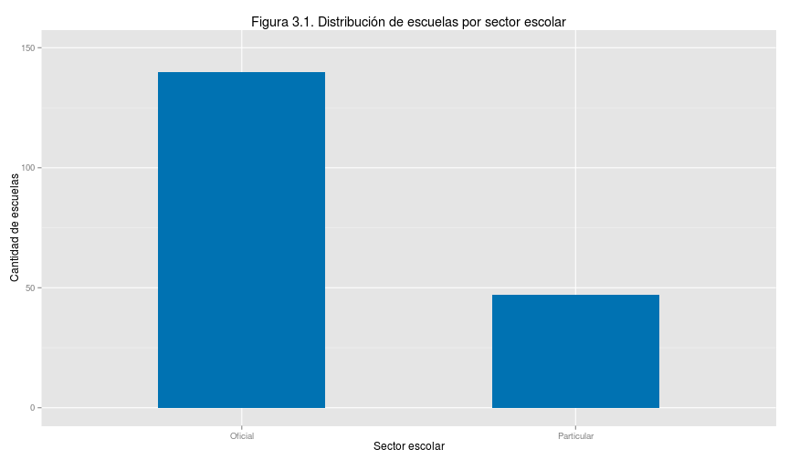 

[JEV2IBG: usar cómo título "Distribución de escuelas por ruralidad]
[JEV2IBG: En la siguiente gráfica usar mayúscula inicial en "ruralidad"]
[JEV2IBG: usar color azul para las barras en lugar de negro]
[JEV2IBG: intentar barras más angostas en relación con el ancho de la figura: pienso que se ve "pesada"]

 
Las escuelas participantes de Panamá están principalmente concentradas en el promedio del índice socioeconómico y cultural (0.0) de toda la región latinoamericana, en cuanto el índice promedio de sus alumnos.  

[JEV2IBG: En la siguiente gráfica (distribucion isec por pais) mostrar solo CHL, PAN, NIC, para simplificar]
[JEV2IBG: Usar título "Concentración de escuelas (distribución) según índice socioeconómico y cultural para tres países de la prueba.] 
[JEV2IBG: cambiar "ISECF" en la leyenda por "Índice socioeconómico y cultural"]

 
Las dos figuras siguientes muestran la cantidad de estudiantes participantes por edad en tercer grado y sexto grado.  

[JEV2IBG: supongo que la siguiente grafica es de 6to grado.  falta 3er grado? Incluirla primero]

[JEV2IBG: usar como título "Número de estudiantes de sexto grado por edad"]
[JEV2IBG: cambiar en la leyenda del eje X "DQA6IT01" por "Edad"]
[JEV2IBG: eliminar en la leyenda del margen derecho la etiqueta "DQA6IT01"]

 
[GENERO PORCENTAJE FEM]% de los alumnos indicó ser niña y  [GENERO PORCENTAJE N/A]% no contestó o no supo responder.    

[JEV2IBG: en los datos salen cuantos son realmente niñas y niños?   ...los lectores se preguntarán porqué no sabemos la cifra exacta si son estudiantes de Meduca.]
[JEV2IBG: incluir título "Respuesta a la pertenencia de género"]
[JEV2IBG: podríamos usar porcentajes en el eje Y en lugar de cantidad?]
[JEV2IBG: usar color azul para las barras en lugar de negro]
[JEV2IBG: intentar barras más angostas en relación con el ancho de la figura: pienso que se ve "pesada"]

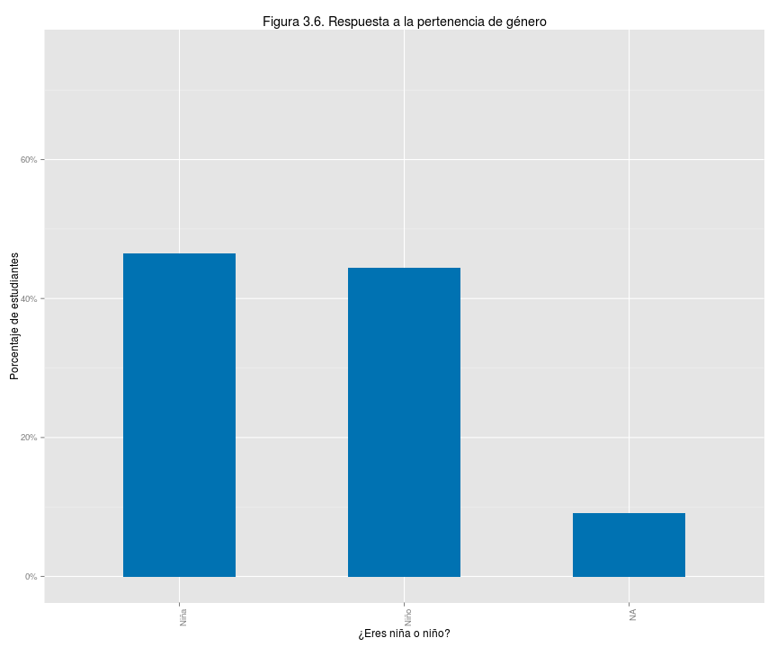 
[ORGNR PORCENTAJE AFIRMATIVO]% de los alumnos indicó pertenecer a alguna etnia "originaria" y [ORGNR PORCENTAJE N/A]% no contestó o no supo responder.   

[JEV2IBG: incluir título "Respuesta a la pertenencia de etnia originaria"]
[JEV2IBG: podríamos usar porcentajes en el eje Y en lugar de cantidad?]
[JEV2IBG: agregar tílde al término "índigena" en la leyenda del eje X]
[JEV2IBG: usar color azul para las barras en lugar de negro]
[JEV2IBG: intentar barras más angostas en relación con el ancho de la figura: pienso que se ve "pesada"]

 

## 4. Comparacion con America Latina
### 4.1 Puntaje vs ingreso per capita (3er grado, 6to grado)

Comparar resultados entre países es útil pero no lo principal. Es un error considerar la evaluación Terce como una competencia por el mayor puntaje promedio.   Sus resultados son sólo parte de la evidencia e información de cuánto logran aprender los alumnos.  Su valor principal está en intentar comprender qué acciones se pueden tomar para que la educación le de las mejores oportunidades de vida a los alumnos y países.   

Entre los países participantes Chile obtuvo el mejor resultado seguido de Costa Rica y México.  Costa Rica sirve de ejemplo que un país de escala y ubicación como la nuestra puede obtener mejores resultados.     Las figuras [NO. 3ero PTJ VS PIB/CAP] Y [NO. 6ero PTJ VS PIB/CAP] siguientes muestran que Panamá obtiene resulados inferiores a lo esperado para su producto interno bruto per cápita.  Estos resultados son consistentes con otras pruebas internacionales en las que ha participado Panamá (pruebas Serce 2006 y Pisa 2009). El efecto es más pronunciado para sexto grado que para tercer grado.   Parece razonable esperar que con la prioridad social necesaria, la riqueza nacional nos permita lograr al menos los resultados esperados.   

[JEV2IBG: Repetir la figura 2 arriba pero para los resultados de tercer grado primero]
[JEV2IBG: título "Puntaje promedio según producto (PIB) per cápita por país, tercer grado"]
[JEV2IBG: verificar p minúscula y tílde en "país" en el título]
[JEV2IBG: verificar que la leyenda del eje X dice "Producto (PIB) per cápita" y tílde en "cápita"]  

[JEV2IBG: Repetir la figura 2 (sexto grado)]
[JEV2IBG: título "Puntaje promedio según producto (PIB) per cápita por país, sexto grado"]
[JEV2IBG: verificar p minúscula y tílde en "país" en el título]
[JEV2IBG: verificar que la leyenda del eje X dice "Producto (PIB) per cápita" y tílde en "cápita"]  

### 4.2 Desempeño en logros de aprendizaje

Más relevante en primera instancia es saber si nuestros niños y niñas logran un aprendiza útil para su propio bienestar y la prosperidad de la nación. La evaluación Terce define cuatro niveles de logros de aprendizaje.  El nivel 1 se considera insuficiente preparación y el nivel 4 la mejor preparación educativa para la vida esperada de los participantes.  Corresponden a dominios progresivamente más eficaces del área de conocimiento y están explicados en el apéndice [No. APENDICE NIVELES].  

[22?]% de nuestras niñas y niños muestran un logro de aprendizaje en el nivel inferior, o nivel 1, considerado inadecuado como preparación para su vida.   Para ciencias son [45?]% y para matemáticas [65?]%.   La figura [No. NIVELES] muestra como se comparan los porcentajes de alumnos de Panamá para cada nivel con los del resto de los alumnos de otros países. 

[JEV2IBG: título "Niveles de logros de aprendizaje por área de conocimiento, comparados"]
[JEV2IBG: cambiar la leyenda del eje Y a "Porcentaje de alumnos"]
[JEV2IBG: cambiar la leyenda del eje X a "Niveles de logro de aprendizaje"]
[JEV2IBG: verificar que las leyendas del eje X y Y empiezan con mayúscula]
[JEV2IBG: eliminar del margen derecho la etiqueta "countryp"]
[JEV2IBG: si es posible, usar colores menos intensos para las barras, especialmente el rojo (asusta ;)]

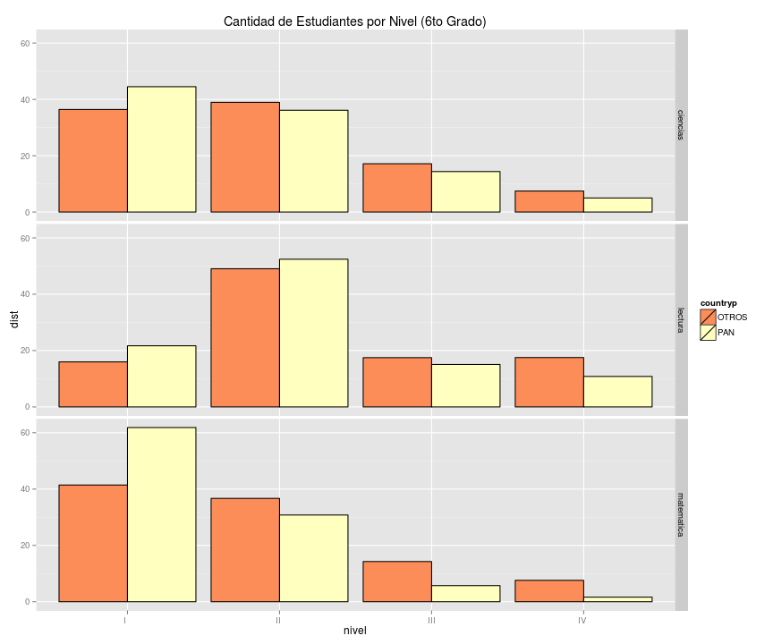 
   
## 5 Comparacion del desempeño en el Terce (2013?) con el Serce (2006)
### 5.1 Mejora en relación con los resultados serce, por materia

[JEV2IBG: Al final, Gina dice que este informe debe ser solo del Terce.  Incluí texto referente al serce en la introducción.  Por tanto Eliminaremos esta seccion y correremos las secciones 6 en adelante.]    

 

 

## 6 Características de los resultados en Panamá
### 6.1 Logros por Genero 

Las niñas obtuvieron mejores resultados que los niños en lectura de tercer grado, sexto grado y en ciencias de sexto grado. En matemáticas, aunque las niñas obtuvieron mejor resultado, la diferencia es tan pequeña que no permite afirmar que sus logros de aprendizaje son mejores.   

Las figuras [No. PTJ POR GNR] y [No. STD DEV GNR] comparan los puntajes promedio obtenidos por cada género, la primera, y la diferencia entre niños y niñas, la segunda, expresada en desviaciones estándar 

[JEV2IBG: La figura de desviacion estandar quisiera conversarla, porque la comparacion deberia ser una sola barra.  La barra indicaría la diferencia entre los puntajes de cada género expresado en desviaciones estandar.]
[JEV2IBG: como procesaste aquellos que respondieron N/A]

[JEV2IBG: título "Puntaje promedio comparado entre géneros"]
[JEV2IBG: cambiar la leyenda del eje Y a "Puntaje promedio"]
[JEV2IBG: cambiar la leyenda del eje X a "Género"] 
[JEV2IBG: eliminar del margen derecho la etiqueta "DQASIT02"] 

 
[JEV2IBG: título "Diferencia diminuta de puntaje promedio a favor de las niñas"]
[JEV2IBG: esta gráfica debería ser una sola barra de valores positivos a favor de las niñas, indicando la diferencia entre el puntaje de niñas menos el de niños expresada en desviaciones estándar]
[JEV2IBG: cambiar la leyenda del eje Y a "Desviaciones estandar"]
[JEV2IBG: cambiar la leyenda del eje X a "Diferencia"] 
[JEV2IBG: eliminar del margen derecho la etiqueta "DQASIT02"] 

 

### 6.2 Logros de grupos originarios

Los alumnos que se reconocen como miembros de etnias originarias logran menor puntaje que los que no se consideran miembros.  Las figuras [No. PTJ POR ETN] y [No. STD DEV ETN] comparan los puntajes promedio y diferencia según si la alumna o alumno se reconoce o no como miembro de grupos originarios.    

[JEV2IBG: título "Puntaje promedio comparado según pertenencia a grupos originarios"]
[JEV2IBG: cambiar la leyenda del eje Y a "Puntaje promedio"]
[JEV2IBG: cambiar "DQA6IT06" en la leyenda del eje X por "Etnia"] 
[JEV2IBG: cambiar las etiquetas en el eje X por "No originarios" y "Originarios"]
[JEV2IBG: eliminar del margen derecho la etiqueta "DQA6IT06"] 
[JEV2IBG: como procesaste aquellos que respondieron N/A]

 
[JEV2IBG: título "Diferencia de puntaje promedio desfavorece a los grupos originarios"]
[JEV2IBG: esta gráfica debería ser una sola barra de valores negativos en contra  de los grupos originarios, indicando la diferencia entre el puntaje de originarios menos el de los no originarios expresada en desviaciones estándar]
[JEV2IBG: cambiar la leyenda del eje Y a "Desviaciones estandar"]
[JEV2IBG: cambiar la leyenda del eje X a "Diferencia"] 
[JEV2IBG: eliminar del margen derecho la etiqueta "DQA6IT06"] 

 
Adicionalmente, el índice socioeconómico y cultural muestra menor relación con el puntaje promedio obtenido para alumnos que se consideran miembros de grupos originarios que para aquellos que no.   Esto lo ilustra la figura [No. PTJ VS ISECF ORGN] en la que cada línea muestra la correspondencia entre puntaje promedio obtenido y el índice del alúmno.  La diferencia de puntaje entre alumnos de menor y mayor índices es más pronunciada para alumnos que se declaran no originarios.  

[JEV2IBG: título "Relación entre logros e índice socioeconómico y cultural según etnia"]
[JEV2IBG: cambiar la leyenda del eje Y a "Puntaje promedio"]
[JEV2IBG: cambiar la leyenda del eje X a "Índice socioeconómico y cultural"] 
[JEV2IBG: eliminar del margen derecho la etiqueta "DQA6IT06"] 

 
### 6.3 Logros según tipo de escuela

Las oportunidades de educación y salud muestran un altísimo grado de influencia en el bienestar de un individuo. Cuándo los logros de aprendizaje dependen marcadamente del poder adquisitivo de una persona es difícil argumentar que la sociedad brinda oportunidades justas a todos sus residentes.  En Panamá, la diferencia de logros entre escuelas particulares, escuelas oficiales urbanas y escuelas oficiales rurales es muy marcada.   

Las figuras [No. PTJ VS ISEC 3ero] y [No. PTJ VS ISEC 6to] muestran para cada escuela participante de Panamá el puntaje promedio obtenido por sus alumnos en el eje vertical y el índice socioeconómico y cultural promedio de sus alumnos en el eje horizontal. Las líneas representan el puntaje promedio de alumnos de todos los países, incluyendo Panamá, en la prueba Terce y el puntaje debajo del cual se define el nivel 1 de aprendizaje, considerado inadecuado para las situaciones de vida esperadas. [PORCENTAJE NIVEL 1]% de las niñas y niños obtuvieron puntajes correspondientes al nivel 1.   

[JEV2IBG: las 2 figuras aqui son las versiones de 3ero y 6to grado de la figura 1 en el resumen ejecutivo]
[JEV2IBG: Pregunta: las figuras de puntaje vs isec por escuela pueden indcar un solo puntaje para definir el nivel 1 de todas las áreas de conocimiento, o el puntaje que define el nivel 1 cambia de área a área]

Una observación de suma importancia es que hay un grupo de escuelas oficiales rurales cuyos logros promedio son iguales o superiores a los de las escuelas oficiales urbanas a pesar de tener índices socioeconómicos y culturales menores en promedio. Estas escuelas probablemente tienen lecciones que aportar en cuanto a cómo mejorar los logros educativos en las áreas menos favorecidas del país.    

[JEV2IBG: titulo "logros de aprendizaje de escuelas particulares y oficiales, urbanas y rurales, tercer grado]
[JEV2IBG: cambiar la leyenda del eje Y a "Puntaje promedio"]
[JEV2IBG: cambiar la leyenda del eje X a "Índice socioeconómico y cultural"]
[JEV2IBG: intentar incluir los niveles de aprendizaje, o al menos el nivel 1]

[JEV2IBG: titulo "logros de aprendizaje de escuelas particulares y oficiales, urbanas y rurales, sexto grado]
[JEV2IBG: cambiar la leyenda del eje Y a "Puntaje promedio"]
[JEV2IBG: cambiar la leyenda del eje X a "Índice socioeconómico y cultural"]
[JEV2IBG: intentar incluir los niveles de aprendizaje, o al menos el nivel 1]

## 7 Relacion entre desempeño y factores típicamente asociados al proceso de aprendizaje
## 7.1 Que son factores asociados

Son factores selectos que plausiblemente podrian mostrar relación con los logros de aprendizaje.  El que muestren relación no significa por si solo que sea garantía ni incluso causa de los logros; pero sugiere que es conveniente explorar la relación.   

## 7.2 Logros según nivel socioeconómico y cultural

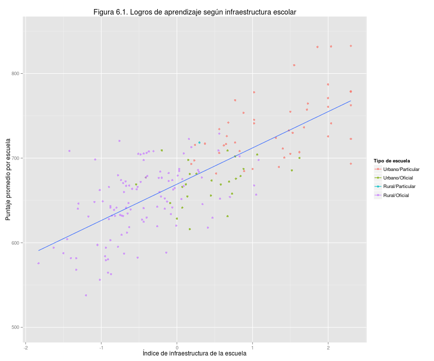 

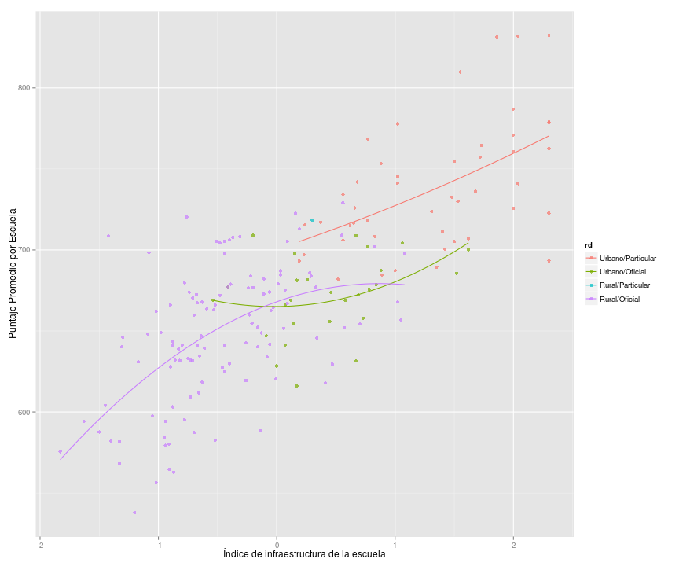 

 

 

 

 

 

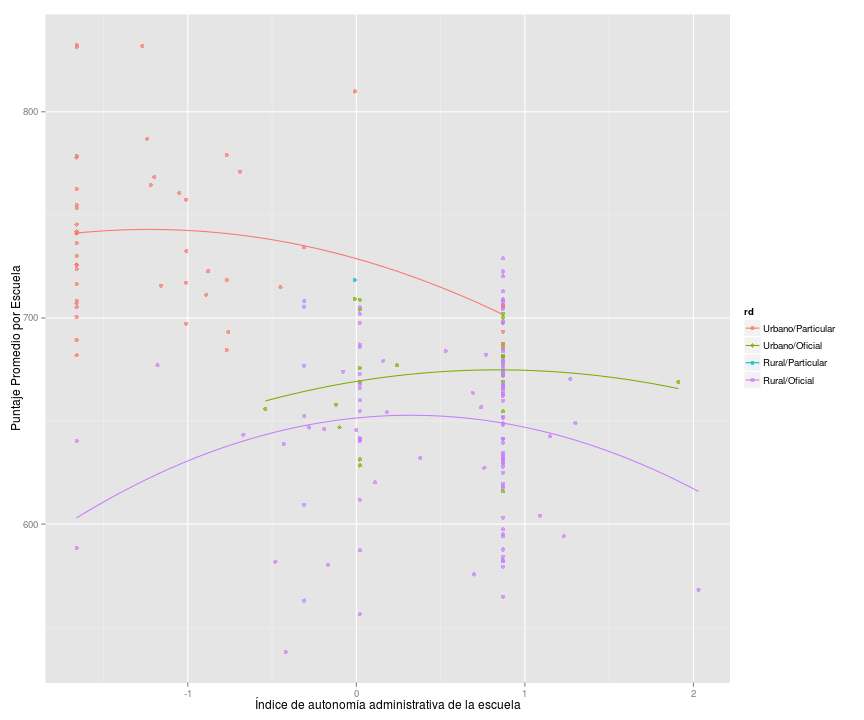 
 

 

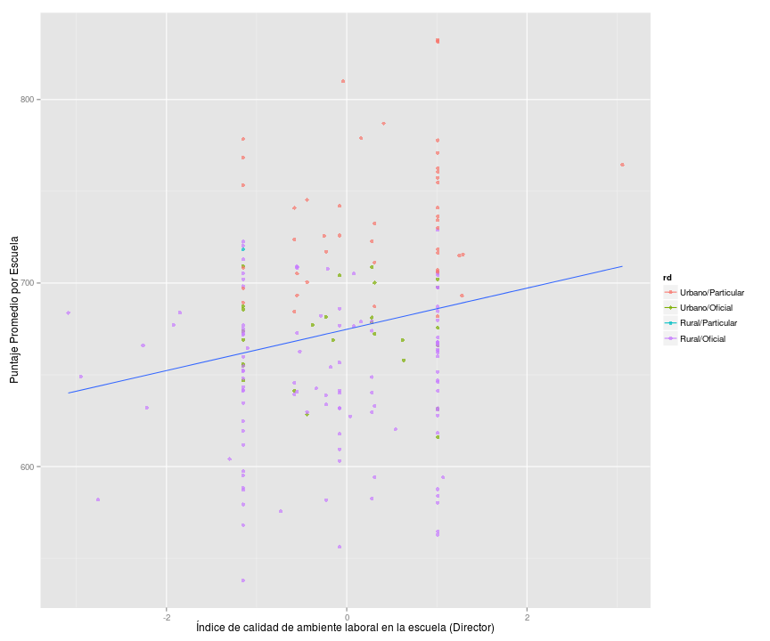 

 

### Factores Asociados de Profesores

#### Indices

 
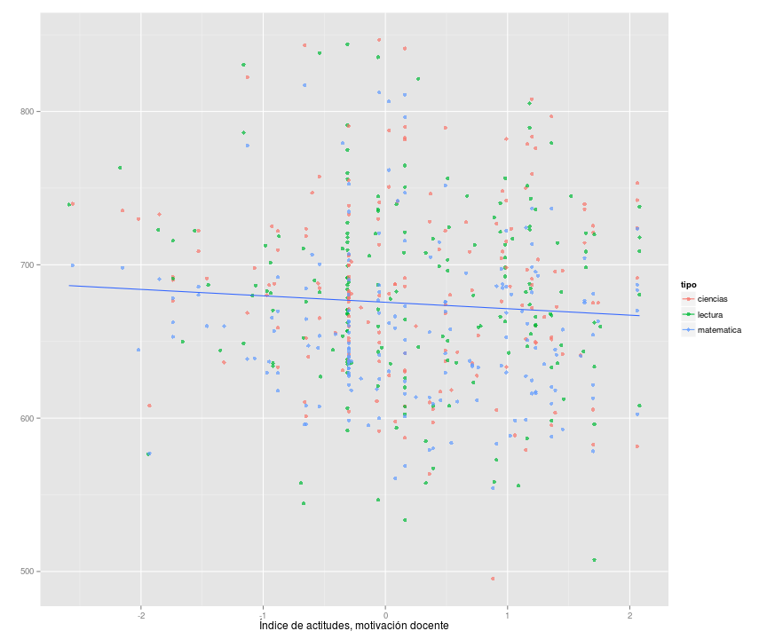 
 
 
 
 
 
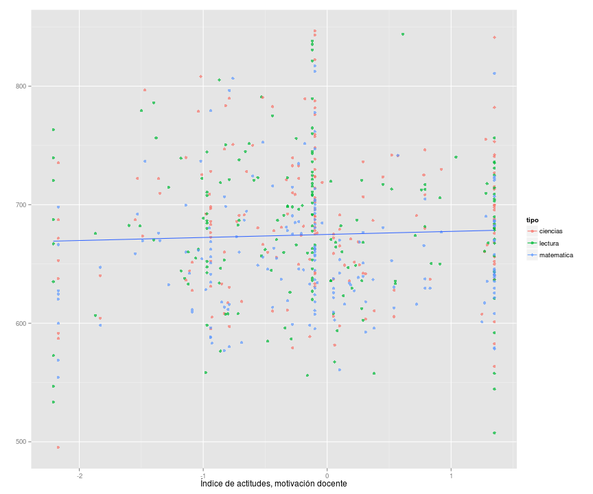 

#### Datos de Profesores
 

 

 

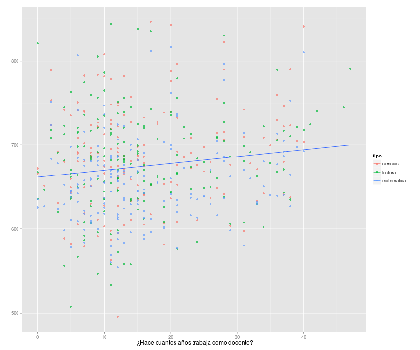 

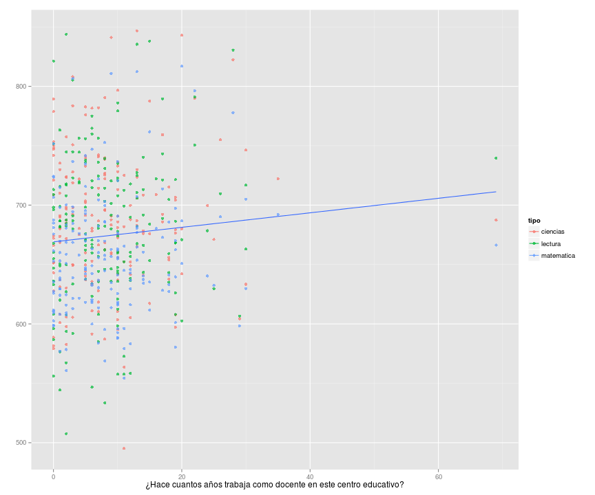 

 

 

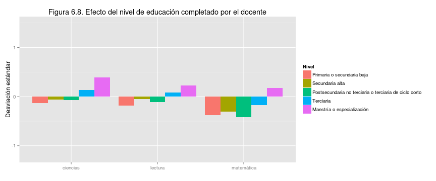 

 

 

 

 

 

### Factores Asociados Familia

#### Indices

 
 
 
 
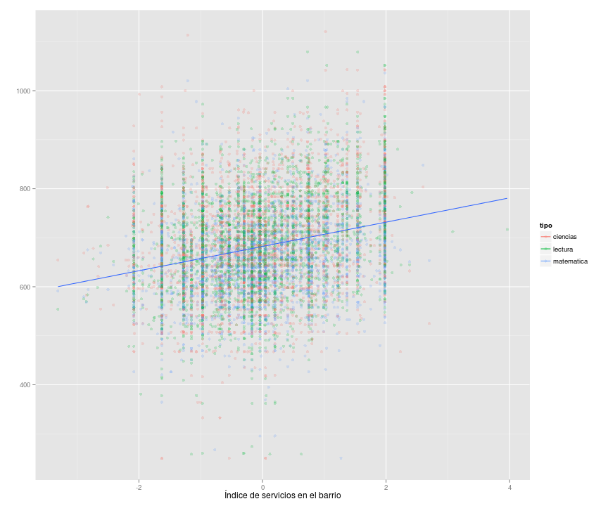 
 
 

#### Factores Asociados

 

Estos siguientes factores estan muy asociados al indice sociocultural.

 
 
 
 
 
 
 

 

 

 

 

 

 

 

 
