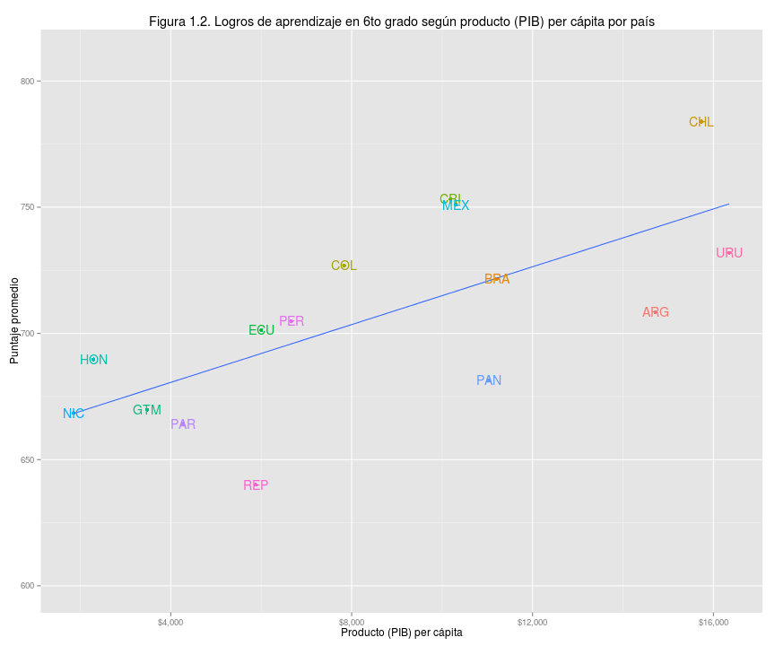
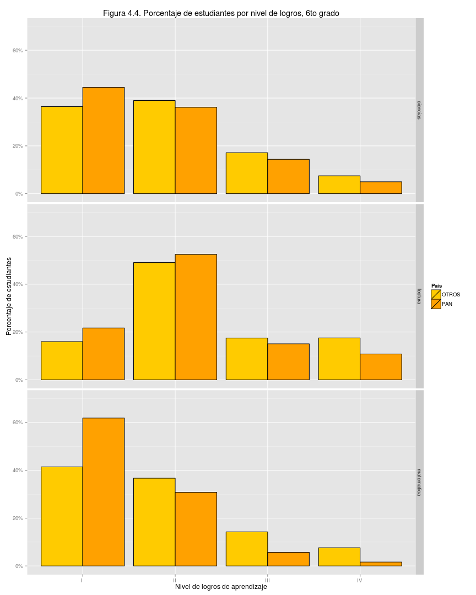
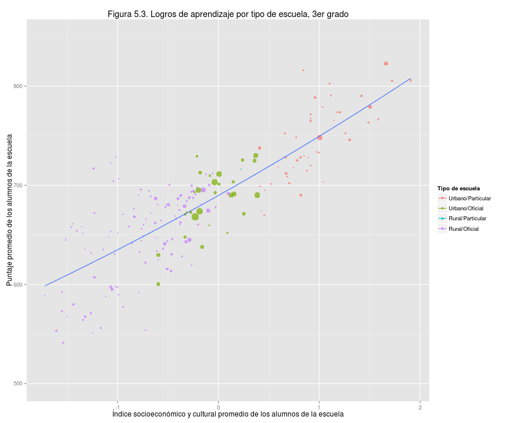
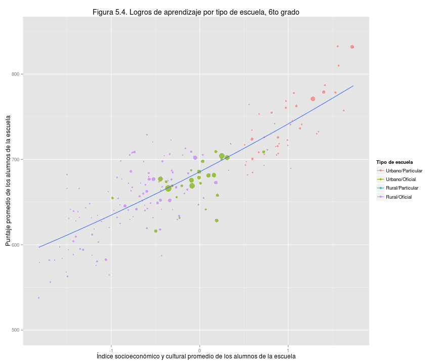
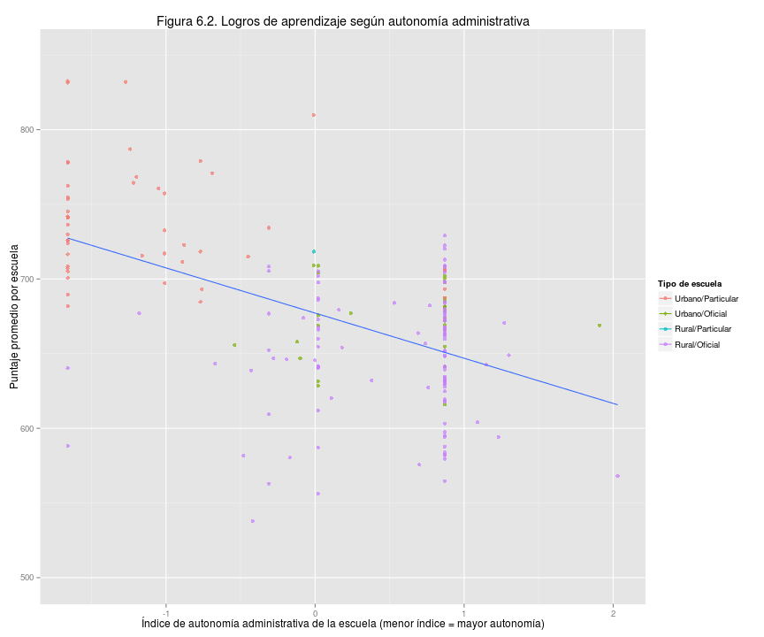
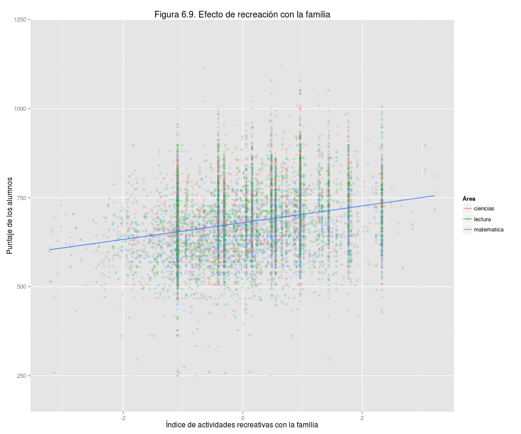

## Presentación de resultados del Tercer Estudio Regional Comparativo y Explicativo (TERCE) del Laboratorio Latinoamericano de Evaluación de la Calidad de la Educación (LLECE)

### 1. Resumen

Hay grandes diferencias de oportunidades para nuestra niñez en materia educativa.   El Tercer Estudio Regional Comparativo y Explicativo (Terce, 2013) está diseñado para evaluar los logros educativos de los estudiantes mediante el puntaje obtenido en preguntas sobre lectura, matemáticas y ciencias.  Este estudio muestra que las diferencias de logros entre nuestros alumnos reflejan en forma marcada sus diferencias socioeconómicas y culturales, es decir, la inequidad.    

Este documento de divulgación es principalmente un llamado a analizar los datos Terce disponibles en la página Web de Meduca y un reto a la voluntad nacional por crear un sistema educativo justo, capaz de brindar igualdad de oportunidades.   

En el Terce las escuelas particulares mostraron mejores logros que las oficiales.  De hecho muchas de nuestras escuelas oficiales muestran niveles de aprendizaje poco adecuados para la vida esperada de sus alumnos, especialmente entre las escuelas rurales oficiales. Las diferencias de logros y la estrecha relación con las condiciones de vida se pueden ver en la figura 1.1 por ejemplo. El centro de cada círculo representa el promedio de puntajes y el promedio del índice socioeconómico y cultural de los alumnos de una escuela. El tamaño del círculo es proporcional al número de alumnos en la escuela. El índice se construye con base en respuestas a cuestionarios sobre las condiciones de vida de cada alumno: a mayor índice las condiciones son más cómodas.    

 

Más importante que lamentarnos por los resultados pobres que podamos observar es enfocarnos en oportunidades de mejora. Por ejemplo, algunas escuelas oficiales rurales con bajo índice socioeconómico y cultural lograron puntajes superiores al promedio internacional del Terce, equivalente a 700 puntos, e incluso mayores que las escuelas oficiales urbanas.   Estas escuelas podrían aportarnos lecciones importantes para el resto del sistema educativo.  Este enfoque representa la aspiración de este análisis y su divulgación.   

En el contexto latinoamericano, Panamá obtiene resultados por debajo de lo esperado.  La figura 1.2 confirma la tendencia conocida de que los alumnos de países con mayor producto interno bruto (PIB) per cápita obtienen mejores puntajes en promedio. Panamá obtuvo 40 puntos menos de lo esperado para su PIB per cápita, usando como referencia la línea que representa la relación típica entre logros y PIB per cápita en la figura.   Estos resultados son consistentes con los resultados que obtuvimos en evaluaciones internacionales previas: Serce 2006, Sineca 2008 y Pisa 2009. Es decir, Panamá puede y debe mejorar significativamente sus logros de aprendizaje.      

 

### 2. Introducción 

La educación nacional debe servir como un gran equalizador hacia las mejores oportunidades de bienestar para todos, que renueve en cada generación las posibilidades de realización personal y de un país próspero sostenible.  

Nuestro sistema educativo dista mucho de este ideal.   Afortunadamente es posible evaluar los logros del sistema con métodos científicos que permitan recomendaciones confiables de como mejorar.   Una cultura que valora la información puede aprender de sus propios errores.    

Evaluaciones como el Terce, basadas en pruebas estandarizadas, tienen limitaciones propias del esquema de items, o preguntas que utilizan, y están sujetas a ser perfeccionadas, pero sirven como insumos valiosos para las políticas educativas cuando son analizados en contexto y junto con información relevante apropiada.    

Esta es la segunda divulgación en torno al Terce. Este documento presenta sólo algunos de los aspectos sobresalientes para lograr un documento más conciso y accesible, sin intentar ser exhaustivo.  Previamente, en 2014, Unesco y Meduca divulgaron la comparación de resultados entre el Segundo Estudio Regional Comparativo y Explicativo, o Serce 2006, y el Terce 2013.   

Con esta divulgación Meduca invita a todos los interesados, especialmente aquellos familiarizados con métodos de evaluación educativa, a iniciar un gran movimiento de exploración de los datos educativos disponibles, especialmente los resultados de las evaluaciones Serce 2006, Sineca 2008, Pisa 2009 y Terce 2013.   

### 3. Terce y la participación de Panamá

El Laboratorio Latinoamericano de Evaluación de la Calidad de la Educación, Llece, es una organización con sede en Chile que  diseña y administra evaluaciones a nivel regional.  Terce es la tercera evaluación.   Cada país revisa y edita los items o preguntas de la evaluación para asegurar que son apropiadas para su contexto nacional.     

El Terce evaluó 15 países de América Latina, listados en el margen derecho de la figura 1.2, y a la región de Nuevo León de México, omitida de la figura 1.2 porque la información estándar del PIB utilizada sólo incluye PIB de países.  El Terce cubrió las áreas de lectura de tercero y sexto grado, escritura de tercero y sexto grado, matemáticas de tercero y sexto grado, y ciencias de sexto grado.  Los resultados de escritura serán sujeto de una divulgación posterior.   

La muestra de alumnos y escuelas por país es representativa.  La muestra que elaboró Panamá no permite comparar resultados entre provincias o comarcas, por ejemplo, pero sí entre el sector oficial y particular, por ejemplo.  Comprendemos que en el futuro debemos ampliar los aspectos que puedan ser explorados confiablemente en las evaluaciones educativas del país.    

El Terce incluyó cuestionarios a los alumnos, docentes y hogares de cada alumno sobre su entorno y situación individual para poder explorar el impacto de ciertos factores que podrían mostrar relación con los logros de aprendizaje, conocidos como factores asociados. Para ser conciso, este documento sólo muestra una selección de los factores asociados y su efecto, sin intentar profundizar en sus implicaciones pues esas conclusiones deben ser resultado de un debate académico riguroso. 

187 escuelas participaron en la prueba Terce representando cuatro tipos:  oficial urbana 27, oficial rural 113, particular urbana 46, particular rural 1.  En el total de escuelas, 3775 estudiantes correspondían a sexto grado y 3631 estudiantes a tercer grado.

 

 
Las escuelas de Panamá representan el caso típico de América Latina en cuanto a condiciones de vida.  Por ejemplo, la figura 3.3 compara nuestra situación con la de cuatro países de interés.  La distribución de nuestras escuelas según el índice socioeconómico y cultural promedio de sus alumnos se concentra alrededor del promedio de la región, es decir, en torno al valor 0.0 del índice. 

 

Las edades de los participantes de tercero y sexto grado muestran un grupo importante sobre la edad esperada para el grado.    

 

 

Las figuras 3.6 y 3.7 muestran las respuestas a las preguntas de a qué genero pertenecen y si pertenecen a una etnia originaria de Panamá.  

 

 

## 4. Comparación con América Latina

Comparar resultados entre países es útil pero no lo principal. El Terce no es una competencia por el mayor puntaje promedio.  Su valor principal está en comprender la dinámica educativa para tomar acción.   

Entre los países participantes Chile obtuvo el mejor resultado seguido de Costa Rica y México, como muestran las figuras 4.1 y 4.2 para tercero y sexto grado respectivamente. La figura 4.2 es la figura 1.2, repetida aquí por conveniencia.  Panamá obtiene resulados inferiores a lo esperado para su PIB per cápita y estos resultados son consistentes con los que obtuvimos en las evaluaciones Serce 2006 y Pisa 2009. El efecto es más pronunciado para sexto grado que para tercer grado.   En esas figuras, Costa Rica sirve como ejemplo de que un país de escala y ubicación similar a la nuestra puede obtener mejores resultados.     Por tanto parece razonable confiar que con nuestra riqueza nacional podemos lograr mejores resultados, siempre y cuando le demos la prioridad social necesaria.   

 
 

Más relevante en primera instancia es saber si nuestros niños y niñas logran un aprendiza útil para su propio bienestar y la prosperidad de la nación. La evaluación Terce define cuatro niveles de logros de aprendizaje.  El nivel 1 se considera poca  preparación para la vida esperada de los participantes y el nivel 4 la mejor preparación.  Corresponden a un dominio progresivamente más eficaz del área de conocimiento de interés y están explicados en el apéndice 1.  

Salvo en lecutra de sexto grado, más de 40% de nuestras niñas y niños no pasan del nivel 1 de logros de aprendizaje, y en matemáticas de sexto grado esa cifra excede 60%.  Las figuras 4.3 y 4.4 muestran como se comparan los porcentajes de alumnos de Panamá para cada grado y área de conocimiento con los del resto de los alumnos de otros países. 

 

 

## 5 Resultados según género, etnia originaria y nivel socioeconómico y cultural

Las niñas obtuvieron ligeramente mejores resultados que los niños en lectura de tercer grado, sexto grado y en ciencias de sexto grado. En matemáticas, las niñas también obtuvieron mejor resultados pero la diferencia es muy pequeña.   [NO TOMA EN CUENTA LOS QUE CONTESTARON N/A??] 

La figura 5.1 compara los puntajes promedio obtenidos por cada género combinando todas las tres áreas de conocimiento.  La figura 5.2 muestra la diferencia en promedios de las niñas comparadas con los niños expresada en desviaciones estándar, una medida común de diferencia estadística.  La diferencia positiva, es decir a favor de las niñas, es pequeña.    

 

 

Los alumnos que se reconocen como miembros de etnias originarias logran menor puntaje que los que no se consideran miembros.  La figuras 5.3 compara los puntajes promedio combinando las tres áreas de conocimiento de los alumnos que se consideran de grupos originarios y de los que no.  La figura 5.4 muestra la diferencia en promedios de los dos grupos, expresado en desviaciones estandar.   La diferencia negativa es importante y en contra de los grupos originarios.       

 

 

Las oportunidades de educación y salud muestran un altísimo grado de influencia en el bienestar de un individuo. Cuándo los logros de aprendizaje dependen marcadamente del poder adquisitivo de una persona es difícil argumentar que la sociedad brinda oportunidades justas a todos sus residentes.  En Panamá, la diferencia de logros entre escuelas particulares, escuelas oficiales urbanas y escuelas oficiales rurales es muy marcada.   

Las figuras 5.5 y 5.6 muestran para cada escuela participante de Panamá el puntaje promedio obtenido por sus alumnos combinando todas las áreas de conocimiento y el índice socioeconómico y cultural promedio de sus alumnos. El puntaje promedio entre todos los alumnos es 700 puntos para todas las áreas de conocimiento.  La figura 5.6 es la misma figura 1.1, repetida aquí por conveniencia.  

Conviene notar que un grupo de escuelas oficiales rurales obtuvieron logros promedio iguales o superiores a los de las escuelas oficiales urbanas a pesar de tener índices socioeconómicos y culturales menores en promedio. Estas escuelas probablemente tienen lecciones que aportar para mejorar la educación en las áreas menos favorecidas del país.    

 

 

## 6 Relacion entre logros de aprendizaje y factores asociados seleccionados

Los factores asociados son características o circumstancias cuantificables que podrían mostrar relación con los logros de aprendizaje.  Para ser conciso, este documento muestra sólo una selección de factores que pueden resultar de interés, dejando fuera otros que seguramente también serán de interés y que deben ser explorados en estudios posteriores.   

El que un factor muestre relación con los logros de aprendizaje no es prueba de que el factor sea la causa de los logros o que los garantice.   A modo de ejemplo, una mejor situación socioeconómica y cultural da la oportunidad de asistir a una mejor escuela tanto en infraestructura como en eficacia, sin que sea claro cuál de esos tres factores es el mayor responsable por los logros de aprendizaje observados.  En forma similar, varios de los factores explorados en esta sección tienen relación potencial con el índice socioeconómico y cultural.   Las relaciones observadas deberán pasar por un debate académico más extenso para llegar a conclusiones confiables.  

La figura 6.1 muestra el efecto del índice de infraestructura de la escuela, construido con base en cuestionarios al respecto. La relación es marcada: a mejor infraestructura mayor puntaje promedio de las escuelas.   Por supuesto, este es uno de los factores que puede estar reflejando el índice socioeconómico y cultural de los alumnos de las escuelas.   

 
La figura 6.2 sí muestra relación entre la autonomía administrativa de la escuela y los logros de aprendizaje de sus alumnos.  En este caso, el índice de autonomía actúa como un ranking: a menor índice mayor autonomía.   

 

Curiosamente, los resultados del Terce muestran poca relación entre un índice de actitudes y motivación de docentes y los logros de aprendizajes.  La figura 6.3 muestra que aunque el índice varía desde valores -2 a +2, el puntaje promedio entre todas las áreas de conocimiento se mantiene cerca de 670 puntos, como indíca la línea azul.  Es decir, el índice hace poca diferencia.  Esta observación seguramente será sujeto de mayor validación y análisis.   

 
La edad de los docentes parece hacer una diferencia en los logros de aprendizaje.    

 
La lengua [MATERNA] del docente también paree tener relación con los logros de aprendizaje y el efecto positivo es muy pronunciado en matemáticas cuando la lengua [MATERNA] es extranjera.  Este es uno de los efectos más significativos entre los distintos factores.  La siguiente figura 6.5 ilustra el efecto de la lengua [MATERNA] para las tres áreas de conocimiento indicadas. En evaluación de aprendizaje, el efecto se expresa típicamente como desviaciones estándar del puntaje promedio; en este caso el promedio obtenido por los alumnos de Panamá.  Esta desviación es una medida estándar de la diferencia estadística.   

 
La jornada completa también parece tener un efecto positivo importante en el logro de los aprendizajes.   

 
El nivel educativo del docente tiene un efecto positivo.   [AVERIGUAR SIGNIFICADO DE VALORES]

 
Los incentivos económicos al docente muestran un efecto positivo en los logros de aprendizaje.  

 

Las actividades recreativas con la familia también muestran un efecto positivo. En este caso los círculos en la figura corresponden al puntaje de un alumno en un área de conocimiento. [CONFIRMAR SI ES RANKING O MEDICION] 

 
El uso de computador educativo parece favorable para logros de aprendizaje.  Los círculos corresponden al puntaje de un alumno en un área de conocimiento.  [VERIFICAR QUE NO ES UN RANKING]

 
## Apéndice 1.  Niveles de logros educativos por área y grado		

[TRANSCRIBIR DE LA INFORMACION TERCE]
